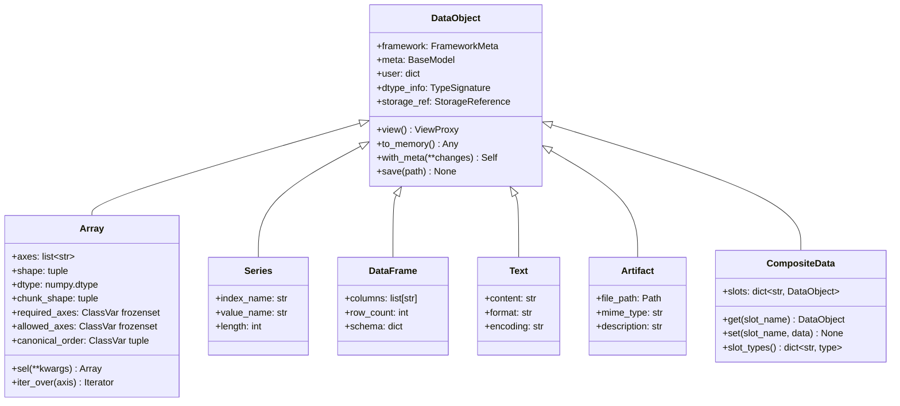
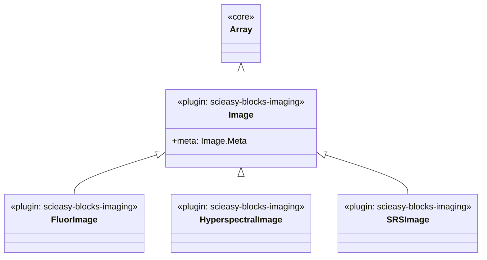
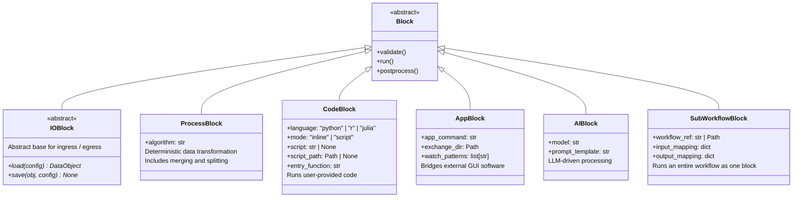

# SciEasy — Architecture Document

> **Status**: Draft v0.2
> **Last updated**: 2026-04-05

---

## 1. Problem statement

Modern biomedical research increasingly generates multi-modal datasets — RNA/DNA sequencing, LC-MS metabolomics, spatial transcriptomics, immunofluorescence microscopy, SRS imaging, mass spectrometry imaging, and more. Each modality demands its own processing software, programming language, and data format. Researchers face two compounding problems:

1. **Fragmented processing**: tools are scattered across R scripts, Python notebooks, standalone GUI applications (ElMAVEN, Fiji, napari), and command-line pipelines. Exchanging intermediate results between these environments is manual, error-prone, and poorly documented.
2. **High barrier for non-developers**: researchers without strong programming backgrounds cannot efficiently chain together complex multi-step analyses, let alone integrate data across modalities.

## 2. Vision

A **modality-agnostic, building-block workflow framework** where:

- Every processing step is encapsulated as a **Block** with standardised inputs and outputs.
- All data flows through a small set of **base data types** that are extensible via inheritance.
- Users compose workflows visually by wiring blocks together on a canvas — no code required for standard pipelines.
- Existing tools are **included, not replaced**: users can embed R/Python scripts, launch GUI applications, or call CLI tools as blocks within the same workflow.
- Multiple data modalities coexist in a **single workflow graph**, enabling true cross-modal fusion analysis.
- The framework is **AI-native**: AI can generate blocks, synthesise workflows, and optimise parameters at runtime.

### 2.1 Design principles

| Principle | Implication |
|---|---|
| **Inclusive** | Never ask users to migrate. Wrap existing tools as blocks. |
| **Composable** | Small, single-purpose blocks that combine into complex workflows. |
| **Type-safe** | Port-level type checking prevents invalid connections at design time. |
| **Lazy by default** | Data objects hold references, not payloads. 100 GB datasets stay on disk until a block requests a specific slice. |
| **Checkpoint everything** | Workflow state is serialisable. Pause, resume, and recover from any point. |
| **Community-extensible** | Abstract base classes + plugin registry via Python entry-points (ADR-025). Anyone can publish a block package with `pip install`. Block SDK scaffolding and test harness lower the barrier for external developers (ADR-026). |

---

## 3. Layered architecture overview

The system is organised into six horizontal layers, from bottom to top. Each layer depends only on the layers below it.

```
┌─────────────────────────────────────────────────────────────┐
│  Layer 6: Frontend (bundled into Python wheel; ADR-024)     │
│  ReactFlow canvas · block palette · monitoring dashboard    │
├─────────────────────────────────────────────────────────────┤
│  Layer 5: API + SPA serving                                 │
│  FastAPI REST · WebSocket · SSE · SPA fallback middleware   │
├─────────────────────────────────────────────────────────────┤
│  Layer 4: AI services                                       │
│  Block generation · workflow synthesis · param optimisation  │
├─────────────────────────────────────────────────────────────┤
│  Layer 3: Execution engine                                  │
│  DAG scheduler · process lifecycle · resource management    │
├─────────────────────────────────────────────────────────────┤
│  Layer 2: Block system                                      │
│  Port typing · block registry · state machine · runners     │
├─────────────────────────────────────────────────────────────┤
│  Layer 1: Data foundation                                   │
│  Type hierarchy · storage backends · lazy loading · lineage │
├─────────────────────────────────────────────────────────────┤
│  Plugin ecosystem (cross-cutting; ADR-025, ADR-026)         │
│  Entry-points protocol · PackageInfo · Block SDK ·          │
│  Community blocks · custom types · external adapters ·      │
│  BlockTestHarness · scieasy init-block-package scaffolding  │
└─────────────────────────────────────────────────────────────┘
```

---

## 4. Layer 1 — Data foundation

### 4.1 Base type hierarchy

All data flowing between blocks is wrapped in a `DataObject` subclass. **The core ships exactly seven types** (ADR-027 D2): the abstract `DataObject` root plus six primitives. **Domain subtypes — `Image`, `Spectrum`, `PeakTable`, `AnnData`, and everything similar — do not live in core.** They are provided by plugin packages via the `scieasy.types` entry-point group (ADR-025) and registered at startup (main process) and at worker subprocess startup (ADR-027 D11).



The diagram above is the **complete** core type surface. There are no `Image`, `MSImage`, `Spectrum`, `PeakTable`, `AnnData`, or `SpatialData` classes in core. These are plugin-provided extensions.

**Plugin-provided extension inset (illustrative, not in core)**: the `scieasy-blocks-imaging` package registers its own hierarchy rooted at `Array`, visible to the core `TypeRegistry` after entry-point scan:



Other plugin packages (`scieasy-blocks-spectral`, `scieasy-blocks-msi`, `scieasy-blocks-singlecell`, `scieasy-blocks-spatial-omics`) follow the same pattern — each subclasses one of the six core primitives and registers via `scieasy.types` entry points. The core diagram never grows as new modalities are added.

**Why `CompositeData` exists**: Many real-world scientific data structures are inherently multi-modal containers rather than single-type objects. AnnData (single-cell, provided by `scieasy-blocks-singlecell`) bundles a matrix (`.X` → Array), observation metadata (`.obs` → DataFrame), variable metadata (`.var` → DataFrame), and unstructured annotations (`.uns` → Artifact). SpatialData (provided by `scieasy-blocks-spatial-omics`) combines images, coordinate tables, and region annotations. Forcing these into single-parent inheritance (e.g. AnnData as a DataFrame) loses critical structural semantics.

`CompositeData` models these as a named collection of heterogeneous `DataObject` slots:

```python
class CompositeData(DataObject):
    """A named collection of heterogeneous DataObjects."""

    def __init__(self, slots: dict[str, DataObject] = None, **kwargs):
        super().__init__(**kwargs)
        self._slots = slots or {}

    def get(self, slot_name: str) -> DataObject:
        """Retrieve a named slot (e.g. anndata.get('X') → Array)."""
        return self._slots[slot_name]

    def set(self, slot_name: str, data: DataObject) -> None:
        """Set or replace a named slot."""
        self._slots[slot_name] = data

    def slot_types(self) -> dict[str, type]:
        """Return {slot_name: DataObject subclass} for port constraint checking."""
        return {k: type(v) for k, v in self._slots.items()}

    @property
    def slot_names(self) -> list[str]:
        return list(self._slots.keys())
```

Plugin-provided composite subclasses declare their expected slot structure. For example (in `scieasy-blocks-singlecell`):

```python
# scieasy_blocks_singlecell/types/anndata.py
from scieasy.core.types.composite import CompositeData
from scieasy.core.types.array import Array
from scieasy.core.types.dataframe import DataFrame
from scieasy.core.types.artifact import Artifact

class AnnData(CompositeData):
    """Single-cell data: expression matrix + cell/gene metadata."""
    expected_slots = {
        "X": Array,           # expression matrix (cells × genes)
        "obs": DataFrame,     # cell-level metadata
        "var": DataFrame,     # gene-level metadata
        "uns": Artifact,      # unstructured annotations
    }

# scieasy_blocks_spatial_omics/types/spatialdata.py
class SpatialData(CompositeData):
    """Spatial omics data: images + coordinates + annotations."""
    expected_slots = {
        "images": Array,
        "points": DataFrame,
        "shapes": DataFrame,
        "table": AnnData,     # CompositeData can nest CompositeData
    }
```

Neither class lives in the core package.

**Named axes on `Array` — instance-level with class-level schema (ADR-027 D1)**: Each `Array` instance carries its own `axes: list[str]`. Subclasses declare three ClassVar constraints:

- `required_axes: frozenset[str]` — axes every instance of this class must have
- `allowed_axes: frozenset[str] | None` — axes this class accepts; `None` means any
- `canonical_order: tuple[str, ...]` — preferred ordering for reorder operations

The base `Array` class leaves all three empty/None (accepts anything). Subclasses tighten as needed. The 6D axis alphabet for scientific imaging is:

| Axis | Meaning | Notes |
|---|---|---|
| `t` | time (frames, timestamps) | |
| `z` | depth / focal plane | |
| `c` | discrete channel (DAPI, GFP, brightfield) | unordered labels, not values |
| `lambda` | continuous spectral dimension | ordered numeric values in nm, cm⁻¹, or m/z |
| `y` | vertical spatial | |
| `x` | horizontal spatial | |

`c` and `lambda` are deliberately distinct — `c` is a discrete label set, `lambda` is a continuous physical quantity. Blocks can require one or the other via constraint helpers (`has_axes("y","x","c")` vs `has_axes("y","x","lambda")`). The two may coexist in a single instance for rare multichannel + hyperspectral setups. The canonical order follows OME convention with spectral inserted between channel and spatial.

`Array` instances are constructed with an explicit `axes` argument:

```python
# Built-in 2D image (in plugin package, not core)
img_2d = Image(axes=["y", "x"], shape=(512, 512), dtype=np.uint16)

# 5D fluorescence stack: 10 time points, 30 z-planes, 4 channels, 512×512
img_5d = FluorImage(
    axes=["t", "z", "c", "y", "x"],
    shape=(10, 30, 4, 512, 512),
    dtype=np.uint16,
)

# 6D hyperspectral time-course: time × depth × 128 wavelengths × spatial
img_6d = HyperspectralImage(
    axes=["t", "z", "lambda", "y", "x"],
    shape=(10, 30, 128, 512, 512),
    dtype=np.float32,
)
```

Plugin-provided subclasses declare their schema at class level. For example (in `scieasy-blocks-imaging`):

```python
class Image(Array):
    required_axes   = frozenset({"y", "x"})
    allowed_axes    = frozenset({"t", "z", "c", "lambda", "y", "x"})
    canonical_order = ("t", "z", "c", "lambda", "y", "x")

class FluorImage(Image):
    required_axes = frozenset({"y", "x", "c"})   # channel mandatory

class HyperspectralImage(Image):
    required_axes = frozenset({"y", "x", "lambda"})

class SRSImage(Image):
    required_axes = frozenset({"y", "x", "lambda"})
    # same as HyperspectralImage structurally; distinct for domain semantics

# (MSImage moves to scieasy-blocks-msi in a separate plugin.)
```

Axis validation runs in the `Array.__init__` via `_validate_axes()`: the instance's `axes` must be a superset of `required_axes` and (if specified) a subset of `allowed_axes`, and must not contain duplicates. Instances can be reordered to `canonical_order` via a helper method on `Array`.

`TypeSignature.from_type(cls)` (ADR-027 D1) additionally records `required_axes` so port compatibility checks enforce "incoming instance must have at least the target port type's required axes".

Named axes serve four purposes: (1) port constraints can require specific axes instead of just ndim checks (see `scieasy.utils.constraints.has_axes`); (2) `Array.iter_over(axis)` and `Array.sel(**kwargs)` let blocks slice along named axes without manual positional indexing; (3) `scieasy.utils.axis_iter.iterate_over_axes(source, operates_on, func)` lets blocks process high-dim Arrays one slice at a time (section 4.5); (4) visualisation blocks can auto-assign axes to plot dimensions without config.

**Key fields on `DataObject` — stratified metadata (ADR-027 D5)**:

Every `DataObject` has three metadata slots:

- `framework: FrameworkMeta` — immutable framework-managed fields (created_at, object_id, source origin description, optional lineage_id, optional derived_from parent object_id). Block authors do not mutate this; the framework manages it.
- `meta: BaseModel` — **typed Pydantic BaseModel** declared per subtype. For example, `FluorImage.Meta` may declare `pixel_size: PhysicalQuantity`, `channels: list[ChannelInfo]`, `objective: str | None`, `acquisition_date: datetime | None`. The base `DataObject.meta` type is an empty `BaseModel`; subtypes override with their own typed model.
- `user: dict[str, Any]` — free-form dict escape hatch. Framework never interprets these fields; they round-trip as JSON through the Pydantic serialiser.
- `dtype_info: TypeSignature` — used by the port system for connection validation. Encodes the class MRO chain so that a `FluorImage` matches any port accepting `Image`, `Array`, or `DataObject`. For `CompositeData`, the signature additionally encodes the slot structure so ports can require specific named slots of specific types. For `Array` subtypes, it also encodes `required_axes`.
- `storage_ref: StorageReference | None` — pointer to the backing store (Zarr path, Parquet file, plain file path). For `CompositeData`, this is a directory containing one storage ref per slot. The object itself is lightweight — typically a few KB regardless of the underlying data size.

Block authors read metadata via `img.meta.pixel_size` (typed attribute access with IDE autocompletion) and update it with the immutable helper `img.with_meta(pixel_size=new_value)`, which returns a new instance. Example:

```python
from scieasy.core.units import PhysicalQuantity as Q

img = FluorImage(
    axes=["z", "c", "y", "x"],
    shape=(30, 4, 512, 512),
    dtype=np.uint16,
    meta=FluorImage.Meta(
        pixel_size=Q(0.108, "um"),
        channels=[
            ChannelInfo(name="DAPI", excitation_nm=405, emission_nm=460),
            ChannelInfo(name="GFP",  excitation_nm=488, emission_nm=525),
            ...
        ],
        objective="Plan Apo 60× 1.40 NA",
    ),
)

# Read (typed, autocomplete-friendly)
if img.meta.pixel_size < Q(0.2, "um"):
    # super-resolution path
    ...

# Write (immutable update)
resampled = img.with_meta(pixel_size=Q(0.216, "um"))
```

The free-dict `DataObject.metadata` property remains as a backward-compatibility shim returning `self.user` with a `DeprecationWarning`; it is removed after Phase 11.

### 4.2 Storage backends

Each base type maps to an optimal storage backend:

| Base type | Primary backend | Rationale |
|---|---|---|
| `Array` | **Zarr** (chunked, compressed, cloud-compatible) | Handles 100 GB+ MSI and hyperspectral data. Supports partial reads via chunk indexing. |
| `Series` | **Zarr** or **Parquet** (single-column) | Small enough to fit in memory for most cases; Zarr for very long series. |
| `DataFrame` | **Apache Arrow / Parquet** | Columnar format enables efficient filtering and aggregation. Memory-mappable via Arrow. |
| `Text` | **Filesystem** (plain text / JSON) | Trivially small. Stored as files for easy external access. |
| `Artifact` | **Filesystem** (original format preserved) | PDFs, images, reports. Kept as-is for interoperability. |
| `CompositeData` | **Directory of slot backends** | Each slot stored using the backend appropriate to its type. A manifest JSON maps slot names to storage refs. |

### 4.3 Lazy loading via ViewProxy

Blocks never receive raw data directly. Instead, the engine injects a `ViewProxy` that mediates access:

```python
class ViewProxy:
    """Lazy accessor that loads data on demand from the storage backend."""

    def __init__(self, storage_ref: StorageReference, dtype_info: TypeSignature):
        self._ref = storage_ref
        self._dtype = dtype_info
        self._cache = None

    def slice(self, *args) -> np.ndarray:
        """Read a specific slice from the backing store (Zarr chunk-aware)."""
        ...

    def to_memory(self) -> Any:
        """Load full data into memory. Use with caution on large datasets."""
        ...

    def iter_chunks(self, chunk_size: int) -> Iterator:
        """Iterate over data in fixed-size chunks for batch processing."""
        ...

    @property
    def shape(self) -> tuple:
        """Shape without loading data (read from Zarr/.zarray metadata)."""
        ...
```

When a block's `run()` is called, input ports deliver `ViewProxy` instances. Blocks that need the full array call `to_memory()`; blocks that can operate chunk-wise use `iter_chunks()` or `slice()`. This keeps memory usage bounded even for enormous datasets.

### 4.4 Data lineage

Every block execution produces a **lineage record**:

```
LineageRecord:
    input_hashes:  [hash(input_0), hash(input_1), ...]
    block_id:      "cellpose_segment_v2"
    block_config:  { diameter: 30, model: "cyto2", ... }
    block_version: "0.3.1"
    output_hashes: [hash(output_0)]
    timestamp:     "2026-04-02T14:32:00Z"
    duration_ms:   4521
    environment:   { python: "3.11.8", key_packages: { cellpose: "3.0.1", ... } }
    termination:   "completed"              # "completed" | "cancelled" | "error" | "skipped"
    partial_output_refs: null               # StorageReference list for partial outputs (if any)
    termination_detail:  null               # human-readable reason (error message, skip reason, etc.)
```

Records are stored in a local SQLite database within the project workspace. They form a provenance graph that supports reproducibility audits, debugging, and AI-driven parameter comparison.

Lineage records are written for **all terminal states**, not just successful completions. A cancelled block produces a record with `termination: "cancelled"` and `output_hashes: []`. A skipped block produces a record with `termination: "skipped"` and `termination_detail` pointing to the upstream block that caused the skip. This ensures the provenance graph is complete — every block execution attempt is traceable, including failures and cancellations.

### 4.5 Axis-iteration and broadcast utilities

Two sibling utilities live in `scieasy.utils` for working with named-axis Arrays. They cover different but related concerns:

- **`scieasy.utils.axis_iter.iterate_over_axes(source, operates_on, func)`** (ADR-027 D3) — iterate a single Array over all its extra (non-`operates_on`) axes, applying `func` to each slice and stacking results back. This is the common case for 5D/6D imaging blocks: "I know how to process `(y, x)`, please loop over everything else".
- **`scieasy.utils.broadcast.broadcast_apply(source, target, func, over_axes)`** — project a lower-dimensional object onto a higher-dimensional one along named axes. This is the cross-modal case: "apply a 2D cell mask `(y, x)` to every channel of a 3D MSI dataset `(y, x, mz)`", or "apply a baseline curve to each spectrum in a batch".

Neither utility is automatic broadcasting at the type system or port level — block authors decide when and how to use them. Shape alignment does not guarantee semantic alignment (e.g. an IF image and an MSI image must be spatially registered before broadcasting makes sense), so the framework provides the mechanisms and the block encodes the domain logic.

#### 4.5.1 `iterate_over_axes` — the 80% case (ADR-027 D3)

```python
# scieasy/utils/axis_iter.py

def iterate_over_axes(
    source: Array,
    operates_on: set[str],
    func: Callable[[np.ndarray, dict[str, int]], np.ndarray],
) -> Array:
    """Iterate func over all axes in source NOT in operates_on.

    For each combination of the non-operates_on axes, func receives:
      - slice_data: numpy array containing only the operates_on dimensions
      - slice_coord: dict mapping extra-axis name to current integer index

    Results are stacked back into a new instance of source's concrete class
    with axes, shape, and metadata (framework/meta/user) preserved per
    ADR-027 D5 inheritance rules.

    Raises BroadcastError if slice outputs have inconsistent shapes or if
    operates_on is not a subset of source.axes.
    """
    ...
```

Memory: O(one slice + one output slice) regardless of the number of extra-axis combinations. Serial by design — block-internal parallelism is not the framework's business per ADR-027 D8 and D13.

**Typical usage** (in a plugin-provided imaging block):

```python
from scieasy.utils.axis_iter import iterate_over_axes
from scieasy.utils.constraints import has_axes
from scieasy_blocks_imaging.types import Image

class GaussianDenoise(ProcessBlock):
    input_ports  = [InputPort(name="image", accepted_types=[Image],
                              constraint=has_axes("y", "x"))]
    output_ports = [OutputPort(name="denoised", accepted_types=[Image])]

    def process_item(self, item: Image, config, state=None) -> Image:
        from scipy.ndimage import gaussian_filter
        sigma = config.get("sigma", 1.0)

        def _denoise(slice_2d, coord):
            return gaussian_filter(slice_2d, sigma=sigma)

        return iterate_over_axes(item, operates_on={"y", "x"}, func=_denoise)
```

A 5D `(t, z, c, y, x)` input is handled correctly with zero additional code: `iterate_over_axes` iterates `t × z × c` and feeds each 2D slice to `_denoise`. Block authors never write manual index-tuple arithmetic. ADR-027 D5 governs metadata inheritance: the output preserves `axes`, `meta` (by reference, since Pydantic models are frozen), `user` (shallow copy), and gets a new `framework` with `derived_from=item.framework.object_id`.

#### 4.5.2 `broadcast_apply` — the cross-modal case

```python
# scieasy/utils/broadcast.py

def broadcast_apply(
    source: Array,            # lower-dim, e.g. mask (y, x)
    target: Array,            # higher-dim, e.g. MSI (y, x, mz)
    func: Callable,           # applied per-slice: func(source_data, target_slice) → result
    over_axes: list[str],     # target axes to iterate over, e.g. ["mz"]
) -> list:
    """
    Apply a lower-dim Array to a higher-dim Array along named axes.

    Iterates over `over_axes` in the target, extracting slices that share
    the remaining axes with source, and calls `func` on each pair.

    Raises BroadcastError if source axes are not a subset of
    target axes minus over_axes.
    """
    shared = set(target.axes) - set(over_axes)
    if not shared.issubset(set(source.axes)):
        raise BroadcastError(
            f"Cannot broadcast: source axes {source.axes} do not cover "
            f"shared axes {shared} (target axes {target.axes} minus over_axes {over_axes})"
        )

    results = []
    for idx in iter_axis_slices(target, over_axes):
        target_slice = target.slice(idx)       # (y, x) at this m/z value
        results.append(func(source, target_slice))
    return results
```

**Usage in a block** (plugin-provided, cross-modal MSI analysis):

```python
from scieasy_blocks_imaging.types import Image
from scieasy_blocks_msi.types import MSImage
from scieasy.core.types.dataframe import DataFrame

class ApplyMaskToMSI(ProcessBlock):
    name = "Apply mask to MSI"
    input_ports = [
        InputPort(name="mask", accepted_types=[Image]),
        InputPort(name="msi", accepted_types=[MSImage]),
    ]
    output_ports = [OutputPort(name="cell_spectra", accepted_types=[DataFrame])]

    def run(self, inputs, config):
        mask = inputs["mask"]
        msi = inputs["msi"]

        # Block author decides over_axes — this is domain knowledge
        per_channel = broadcast_apply(
            source=mask, target=msi,
            func=self._extract_cell_means,
            over_axes=["mz"],
        )
        # Assemble into cell × m/z DataFrame
        return {"cell_spectra": stack_to_dataframe(per_channel, msi.mz_axis)}
```

Both utilities are axis-name-aware (not position-based), integrate with `ViewProxy` for chunked iteration on large datasets, and raise clear errors when axes don't align. Neither is required — they are conveniences for common patterns. Blocks that need finer control write manual loops over `Array.iter_over(axis)` or `Array.sel(**kwargs)` directly (both added by ADR-027 D4 with Level 1 laziness and metadata preservation).

---

## 5. Layer 2 — Block system

### 5.1 Block base class

```python
from abc import ABC, abstractmethod
from enum import Enum

class BlockState(Enum):
    IDLE = "idle"
    READY = "ready"
    RUNNING = "running"
    PAUSED = "paused"       # waiting for user (interactive/external)
    DONE = "done"
    ERROR = "error"
    CANCELLED = "cancelled" # user explicitly requested termination (ADR-018)
    SKIPPED = "skipped"     # upstream did not produce required output (ADR-018)

class ExecutionMode(Enum):
    AUTO = "auto"           # pure computation, no user intervention
    INTERACTIVE = "interactive"  # requires user action (e.g. napari review)
    EXTERNAL = "external"   # delegates to external application

class Block(ABC):
    """Abstract base class for all blocks."""

    # --- Class-level declarations (overridden by subclasses) ---
    name: str = "Unnamed Block"
    description: str = ""
    version: str = "0.1.0"
    input_ports: list[InputPort] = []
    output_ports: list[OutputPort] = []
    execution_mode: ExecutionMode = ExecutionMode.AUTO
    terminate_grace_sec: float = 5.0       # grace period before SIGKILL (ADR-019)

    def __init__(self, config: dict = None):
        self.config = BlockConfig(config or {})
        self.state = BlockState.IDLE

    def validate(self, inputs: dict[str, ViewProxy]) -> bool:
        """Check that inputs are compatible before execution.
        Called by the engine before run(). Return False to abort."""
        return True

    @abstractmethod
    def run(self, inputs: dict[str, Collection], config: BlockConfig) -> dict[str, Collection]:
        """Core execution logic. Must return a dict mapping output port names to Collections.

        IMPORTANT: This method always executes inside an isolated subprocess,
        never in the engine process (ADR-017). The engine serialises
        StorageReference pointers to the subprocess; the subprocess
        reconstructs Collection instances from storage and calls run().
        Block authors do not need to handle serialisation — the subprocess
        wrapper is transparent.
        """
        ...

    def postprocess(self, outputs: dict[str, DataObject]) -> dict[str, DataObject]:
        """Optional hook for cleanup, logging, or output transformation."""
        return outputs
```

**State machine** (ADR-018): the eight states and their valid transitions:

```
IDLE      → { READY, SKIPPED, ERROR }
READY     → { RUNNING, SKIPPED, ERROR }
RUNNING   → { DONE, PAUSED, ERROR, CANCELLED }
PAUSED    → { RUNNING, ERROR, CANCELLED }
DONE      → { IDLE }
ERROR     → { IDLE }
CANCELLED → { IDLE }
SKIPPED   → { IDLE }
```

`DONE`, `ERROR`, `CANCELLED`, and `SKIPPED` are terminal states for a single workflow execution. Transitioning back to `IDLE` is only valid when the workflow is reset for a new run.

**State diagram:**

```
                          ┌──────────────────────────────────────────────┐
                          │               WORKFLOW RESET                  │
                          │  (only when starting a new run of the same   │
                          │   workflow — all blocks return to IDLE)       │
                          └──┬─────┬─────────┬───────────┬──────────────┘
                             │     │         │           │
                             ▼     ▼         ▼           ▼
          ┌───────────── IDLE ◄── DONE    ERROR ──► IDLE
          │                │                ▲
          │                ▼                │
          │    ┌──── READY ────────────► ERROR
          │    │       │                    ▲
          │    │       ▼                    │
          │    │   RUNNING ──────┬───── ERROR
          │    │       │        │          ▲
          │    │       ▼        │          │
          │    │   PAUSED ──────┤───── ERROR
          │    │       │        │
          │    │       │        ▼
          │    │       │      DONE ──────► IDLE
          │    │       │
          │    │       │    (user cancels)
          │    │       └─────────────► CANCELLED ──► IDLE
          │    │                            ▲
          │    │                            │
          │    │       (user cancels        │
          │    │        while RUNNING) ─────┘
          │    │
          │    │    (upstream failed/cancelled,
          │    │     required inputs unsatisfiable)
          │    └──────────────────────► SKIPPED ────► IDLE
          │                                ▲
          └────────────────────────────────┘
              (upstream failed/cancelled
               before block left IDLE)
```

**`CANCELLED`**: the user explicitly requested termination of this block. The block's subprocess is killed via `ProcessHandle.terminate()` (ADR-019). No output is produced. Downstream blocks that depend on this block's output are marked `SKIPPED`.

**`SKIPPED`**: this block cannot execute because a required upstream block did not produce output (due to `ERROR`, `CANCELLED`, or itself being `SKIPPED`). The skip reason is recorded and traces back to the root-cause block. Propagation is automatic and deterministic — the scheduler does not distinguish between `ERROR` and `CANCELLED` when propagating; it only checks whether required inputs can be satisfied.

**Subprocess isolation** (ADR-017): all blocks execute in isolated subprocesses. The engine process is a pure orchestrator that never executes block logic directly. This provides:
- **Reliable cancellation**: any block can be terminated at any time via OS-level process signals.
- **Crash isolation**: a segfault, OOM, or memory leak in a block only kills its subprocess.
- **Hang protection**: a deadlocked block does not freeze the engine.

Block authors do not need to change their code. The framework handles serialisation of `StorageReference` and reconstruction of `ViewProxy` transparently in the subprocess worker. Cross-process overhead is limited to process startup (~50–200ms) + reference serialisation (~KB), not data copying — the underlying data stays in storage (Zarr/Parquet/filesystem). Since ADR-027 D11, the worker subprocess additionally calls `TypeRegistry.scan()` at startup so plugin-provided domain types (e.g. `Image`, `FluorImage`) can be resolved from the incoming `type_chain` metadata.

**ProcessBlock lifecycle hooks — `setup` and `teardown` (ADR-027 D7)**: `ProcessBlock` extends the `Block` base with two optional hooks around the per-run iteration:

```python
class ProcessBlock(Block):
    def setup(self, config: BlockConfig) -> Any:
        """Called once per run() before iterating the input Collection.
        Return value is passed to process_item() as `state`.
        Default: returns None.
        Use for: loading ML models, opening DB connections, compiling
        regexes — anything expensive that should be amortised across items."""
        return None

    def teardown(self, state: Any) -> None:
        """Called once per run() in a finally block, even on error.
        Default: no-op.
        Use for: releasing resources (close files, free GPU memory)."""
        pass

    def process_item(
        self,
        item: DataObject,
        config: BlockConfig,
        state: Any = None,
    ) -> DataObject:
        raise NotImplementedError

    def run(self, inputs, config):
        primary = next(iter(inputs.values()))
        state = self.setup(config)
        try:
            if isinstance(primary, Collection):
                results = []
                for item in primary:
                    result = self.process_item(item, config, state)
                    result = self._auto_flush(result)
                    results.append(result)
                output_name = self.output_ports[0].name if self.output_ports else "output"
                return {output_name: Collection(results, item_type=primary.item_type)}
            else:
                result = self.process_item(primary, config, state)
                output_name = self.output_ports[0].name if self.output_ports else "output"
                return {output_name: result}
        finally:
            self.teardown(state)
```

Key properties:

- `setup` receives **only** the config. It does not see `inputs`. Data-driven initialisation belongs inside `process_item` (lazy init + cache on `state`).
- `setup` is called **inside the worker subprocess**, after `TypeRegistry.scan()` and input reconstruction. The returned state object lives for the lifetime of one `run()` call and is garbage-collected with the subprocess.
- `teardown` is called in a `finally` block so it runs even when `process_item` raises. Use it for `torch.cuda.empty_cache()`, `conn.close()`, and similar cleanup.
- Blocks that do not need setup ignore the hooks entirely — the defaults are no-ops, fully backward-compatible with any existing 2-arg `process_item(self, item, config)` override. The new `state` parameter defaults to `None`, so existing overrides continue to work.
- Cellpose and similar GPU workloads should use `setup` to load the model once per Collection and override `run()` in Tier 2 style to exploit the library's own batched `eval([...], batch_size=N)` API. See §5.3 for the full pattern.

### 5.2 Port system

```python
class Port:
    """Connection endpoint on a block."""
    name: str
    accepted_types: list[type]  # e.g. [Image, Array] — accepts Image or any Array subclass
    description: str = ""
    required: bool = True

class InputPort(Port):
    default: DataObject | None = None   # optional default value

    # --- Runtime constraint (optional) ---
    constraint: Callable[[DataObject], bool] | None = None
    constraint_description: str = ""    # human-readable, shown in UI tooltip

class OutputPort(Port):
    pass
```

**Two-phase connection validation**:

1. **Design-time (fast)**: when the user draws a connection in ReactFlow, the frontend checks whether the source port's output type is in the target port's `accepted_types`, accounting for inheritance. Invalid connections are visually rejected. This check is purely structural — it only considers the class hierarchy.

2. **Pre-execution (precise)**: before a block runs, the engine calls the optional `constraint` function on each input, passing the **Collection** (ADR-020). Constraint functions that need per-item checks should iterate over the Collection. This catches semantic mismatches that type alone cannot express.

Example constraints (ADR-020: constraints receive Collection):

```python
# A 2D convolution block needs all images to have spatial axes
InputPort(
    name="images",
    accepted_types=[Image],
    constraint=lambda col: all(
        img.axes is not None and {"y", "x"}.issubset(set(img.axes))
        for img in col
    ),
    constraint_description="All images must have spatial axes (y, x)",
)

# A broadcast block needs all masks to be 2D spatial
InputPort(
    name="masks",
    accepted_types=[Image],
    constraint=lambda col: all(
        img.axes is not None and set(img.axes) == {"y", "x"}
        for img in col
    ),
    constraint_description="All masks must be 2D spatial (y, x) for broadcasting over target channels",
)

# A merge block needs two DataFrames with at least one shared column
InputPort(
    name="right",
    accepted_types=[DataFrame],
    constraint=lambda col: all(
        len(set(df.columns) & set(self._left_columns)) > 0
        for df in col
    ),
    constraint_description="Must share at least one column with the left input",
)

# A port that accepts CompositeData with a required slot structure
InputPort(
    name="spatial_data",
    accepted_types=[CompositeData],
    constraint=lambda col: all(
        "images" in cd.slot_names and "table" in cd.slot_names
        for cd in col
    ),
    constraint_description="Must contain 'images' (Array) and 'table' slots",
)
```

When a constraint fails, the engine reports the `constraint_description` to the user via WebSocket, and the block transitions to `ERROR` state with a clear diagnostic.

#### Variadic ports (ADR-029)

Most blocks declare a **static** port list — a fixed set of `InputPort` / `OutputPort` instances on the class. Three block categories support **variadic** (per-instance) port counts: `AIBlock`, `CodeBlock`, and `AppBlock`. Variadic blocks allow users to add or remove ports at design time via a `[+]` / `[−]` editor on the canvas node and in the Bottom Panel Config tab.

**Class-level declarations** control variadic behaviour:

```python
class Block(ABC):
    # Static blocks leave these at defaults:
    variadic_inputs: ClassVar[bool] = False
    variadic_outputs: ClassVar[bool] = False
    allowed_input_types: ClassVar[list[type]] = [DataObject]   # no constraint
    allowed_output_types: ClassVar[list[type]] = [DataObject]
```

- `variadic_inputs` / `variadic_outputs` — enable per-instance port addition on input / output side. `BlockSpec` carries these flags; the frontend renders `[+]` buttons only when `True`.
- `allowed_input_types` / `allowed_output_types` — constrain the type dropdown in the port editor. A `FijiBlock` that declares `allowed_input_types = [Image, DataFrame, ROI]` prevents users from wiring incompatible types (e.g. `Text`) into its variadic ports.

**Per-instance port storage** (ADR-029 D1): variadic port lists are stored in `self.config["input_ports"]` and `self.config["output_ports"]` as JSON-serialisable dicts:

```python
config["input_ports"] = [
    {"name": "images_branch_a", "types": ["Image"]},
    {"name": "images_branch_b", "types": ["Image"]},
    {"name": "metadata",        "types": ["DataFrame"]},
]
```

This reuses the existing config serialisation path — the workflow YAML `nodes[].config` carries the port list alongside other parameters. No new persistence layer is needed.

**GUI injection** (ADR-029 D12): base classes that enable variadic mode declare the port editor fields in their `config_schema`. Through ADR-030 MRO merge, these fields are automatically injected into every subclass's config form — block authors do not add them manually.

**`get_effective_*_ports()` override**: when a variadic block has user-declared ports in config, `get_effective_input_ports()` / `get_effective_output_ports()` construct `InputPort` / `OutputPort` instances from the config dicts and return them instead of the static `ClassVar` list. The validator and scheduler see the per-instance port list transparently.

**Multiple same-type ports** (ADR-029 D13): a variadic block may have several ports of the same type — for example, two `Image` input ports receiving `Collection[Image]` from two parallel branches. Each port carries its own Collection independently; the block's `run()` receives them as separate keys in the input dict.

**CodeBlock auto-inference** (ADR-029 D7): for `CodeBlock` in Python script mode, `introspect.py` parses the function signature and auto-populates the variadic port list. Type annotations map to port types; untyped parameters default to `DataObject`. R, Julia, and inline mode use the manual port editor.

**Example — variadic `AppBlock`**:

```python
class FijiBlock(AppBlock):
    name = "Fiji"
    variadic_inputs: ClassVar[bool] = True
    variadic_outputs: ClassVar[bool] = True
    allowed_input_types: ClassVar[list[type]] = [Image, DataFrame, ROI]
    allowed_output_types: ClassVar[list[type]] = [Image, DataFrame, Artifact]

    # config_schema for app-specific fields only;
    # variadic port editor fields are injected via MRO merge from AppBlock base.
    config_schema: ClassVar[dict[str, Any]] = {
        "type": "object",
        "properties": {
            "macro": {"type": "string", "title": "ImageJ Macro", "ui_priority": 2},
        },
    }
```

**No impact on engine or worker**: the scheduler routes by edge/port-name (unchanged), the worker subprocess reconstructs each port's Collection via `type_chain` (unchanged), and Collection homogeneity is enforced per-port (unchanged).

### 5.3 Block categories

The framework defines five concrete block categories plus one meta-category for composition. All other functionality is achieved through subclassing.



#### IOBlock

Handles all data ingress and egress. **`IOBlock` is an abstract base class** (ADR-028 §D2) with two abstract methods — `load(config) -> DataObject` and `save(obj, config) -> None` — and a default `run()` that dispatches to one of them based on the subclass's `direction: ClassVar[str]`. Concrete IO blocks subclass `IOBlock` and implement `load()` (for input-only blocks) or `save()` (for output-only blocks). The previous "single block type with a `direction` flag plus a `FormatAdapter` registry" pattern (the deleted `scieasy.blocks.io.adapters` package and `adapter_registry.py`) is gone.

Core ships **two concrete IO blocks** that together cover all six core `DataObject` types (`Array`, `DataFrame`, `Series`, `Text`, `Artifact`, `CompositeData`):

- **`LoadData`** at `src/scieasy/blocks/io/loaders/load_data.py` — input-only. Implements `load()` by dispatching to one of six private module-level `_load_*` functions selected by the `core_type` config enum (ADR-028 Addendum 1 §C9).
- **`SaveData`** at `src/scieasy/blocks/io/savers/save_data.py` — output-only. Mirrors `LoadData` with six private `_save_*` dispatch functions.

Both classes use the **dynamic-port mechanism** (ADR-028 Addendum 1 §C5): they declare a `dynamic_ports: ClassVar[dict[str, Any] | None]` descriptor mapping the `core_type` config field to a per-`enum`-value list of `accepted_types`, and override `get_effective_input_ports()` / `get_effective_output_ports()` so the validator and the frontend palette see the *narrowed* type for the configured `core_type`. The static `output_ports` declaration uses the broad `[DataObject]` upper bound for backward-compatible registration; the per-instance override is what the runtime and the GUI actually consume.

Plugin packages ship additional concrete `IOBlock` subclasses for domain-specific formats — for example, `LoadImage` in `scieasy-blocks-imaging` absorbs the old `tiff_adapter` logic into a private `_load_tif()` function, and `LoadMSRawFile` in `scieasy-blocks-lcms` absorbs `mzxml_adapter`. Plugin IO blocks register through the existing `scieasy.blocks` entry-point group; the previously planned dedicated `scieasy.adapters` entry-point group has been removed (ADR-025 §6 superseded by ADR-028 §D4).

#### ProcessBlock

The workhorse for data transformation. Covers:

- Single-input transforms (denoise, baseline correction, normalisation, segmentation).
- Multi-input operations (merge, register, concatenate, cross-modal fusion).
- Splitting / filtering (subset by condition, train/test split).

Each `ProcessBlock` subclass declares its input/output ports with specific type constraints. For example, a `CellposeSegment` block accepts `Image` on input and produces `Image` (mask) + `DataFrame` (cell properties) on output.

#### CodeBlock

Enables zero-friction integration of existing scripts. Supports two execution modes (inline, script) with automatic Collection unpack/repack (ADR-020-Add4).

##### Execution modes

**Inline mode** — for short scripts and quick operations:

The user writes code directly in the block's config panel. Input data is injected as variables matching port names; output variables are captured automatically.

```python
# Inline mode: user writes this in the config panel
# Variables `input_0` and `input_1` are auto-injected from input ports
merged = input_0.merge(input_1, on="cell_id")
output_0 = merged[merged["confidence"] > 0.8]
```

**Script mode** — for existing analysis scripts and complex pipelines:

The user points the block at an existing `.py`, `.R`, or `.jl` file (local path or Git repository). The script communicates with the framework through a **convention-based entry function**:

```python
# User's existing script: my_analysis.py
# Can import any libraries, define helper functions, span hundreds of lines.

import numpy as np
from scipy.signal import savgol_filter
from my_lab_utils import custom_baseline  # user's own modules work fine

def configure() -> dict:
    """Optional: declare config schema for the block's UI form."""
    return {
        "window_length": {"type": "int", "default": 11, "min": 3},
        "poly_order": {"type": "int", "default": 3},
        "baseline_method": {"type": "enum", "options": ["als", "snip", "custom"]},
    }

def run(inputs: dict, config: dict) -> dict:
    """Required: the entry point. Receives input data and config, returns outputs."""
    spectra = inputs["spectra"]           # numpy array from input port
    smoothed = savgol_filter(spectra, config["window_length"], config["poly_order"])
    baseline = custom_baseline(smoothed, method=config["baseline_method"])
    corrected = smoothed - baseline
    return {"output_0": corrected}        # maps to output port
```

```r
# User's existing script: deseq_analysis.R
# Full R script with all dependencies — runs as-is.

library(DESeq2)
library(tidyverse)

configure <- function() {
    list(alpha = list(type = "float", default = 0.05),
         lfc_threshold = list(type = "float", default = 1.0))
}

run <- function(inputs, config) {
    counts <- inputs$counts              # from input port "counts"
    metadata <- inputs$metadata          # from input port "metadata"
    dds <- DESeqDataSetFromMatrix(countData = counts,
                                  colData = metadata,
                                  design = ~ condition)
    dds <- DESeq(dds)
    res <- results(dds, alpha = config$alpha,
                   lfcThreshold = config$lfc_threshold)
    list(output_0 = as.data.frame(res))  # maps to output port
}
```

##### Input handling (ADR-020)

CodeBlock inputs are handled via the Collection auto-unpack/repack layer (ADR-020-Add4). All inputs are delivered as native in-memory objects — equivalent to the former MEMORY delivery mode. The `InputDelivery` enum has been removed (see ADR-016, now partially superseded by ADR-020).

For each input port:
- **Collection length=1**: the single item is materialised via `.view().to_memory()` (e.g., a numpy array).
- **Collection length>1**: replaced with a `LazyList` that loads items on demand, keeping peak memory at O(1) per iteration step.

Users who need fine-grained control over data loading (slicing, chunked iteration) should write a **ProcessBlock** instead of a CodeBlock. ProcessBlock authors receive `ViewProxy` directly and decide for themselves when to materialise.

##### Framework bridge implementation

All CodeBlock execution happens inside an isolated subprocess (ADR-017). The engine process never calls `exec()` or `importlib` directly. Instead, it prepares an invocation payload containing `StorageReference` pointers and delegates to the subprocess worker:

```python
class CodeBlock(Block):
    def run(self, inputs, config):
        """Executed inside the subprocess worker, NOT in the engine process.

        The engine serialises StorageReference pointers and config to the
        subprocess. The subprocess reconstructs ViewProxy instances from
        storage, unpacks Collection inputs, and calls this method.
        """
        language = config["language"]
        runner = CodeRunnerRegistry.get(language)

        # Unpack Collection inputs for user scripts (ADR-020-Add4)
        unpacked = self._unpack_inputs(inputs)

        if config["mode"] == "inline":
            result = runner.execute_inline(config["script"], unpacked)
        else:
            result = runner.execute_script(
                script_path=config["script_path"],
                entry_function=config.get("entry_function", "run"),
                inputs=unpacked,
                config=config.get("script_config", {}),
            )

        # Repack outputs into Collections (ADR-020-Add4)
        return self._repack_outputs(result)
```

Note: data materialisation calls happen inside the subprocess, loading data into the subprocess's memory — not the engine's. This preserves the lazy-loading contract (ADR-007): the engine process never touches the actual data.

##### Script discovery and UI integration

The frontend provides a file picker for `.py` / `.R` / `.jl` files. When a script is selected, the framework introspects it — reads port names from the `run()` function signature and config schema from `configure()` (if present) — and auto-populates the block's port declarations and config form. The user's script does not need to be modified beyond adding the `run()` convention.

**Code runners** are isolated subprocess execution environments (ADR-017):
- **Python**: the subprocess worker calls `exec()` for inline mode or `importlib` for script mode — both inside the subprocess, never in the engine process.
- **R**: subprocess calling `Rscript` with JSON-based input/output serialisation. No in-process `rpy2` bridge.
- **Julia**: subprocess calling `julia` with JSON-based input/output serialisation. No in-process `juliacall` bridge.

All code runners execute inside subprocesses managed by `ProcessHandle` (ADR-019). If a script hangs or crashes, the subprocess is terminated without affecting the engine.

#### AppBlock

Bridges external GUI applications (ElMAVEN, Fiji, napari, MestReNova, etc.) via a file-exchange protocol:

```
ExternalAppBridge protocol:

1. PREPARE: Serialise input data to exchange directory in app-native format
   (e.g., .mzXML for ElMAVEN, .tif for Fiji)

2. LAUNCH: Start external process via configured command
   (e.g., "ElMAVEN --input {exchange_dir}/data.mzXML")

3. PAUSE: Engine enters PAUSED state. Frontend shows "Waiting for external software..."
   User operates the external application normally.

4. WATCH: Monitor exchange directory for output files using filesystem watcher (watchdog).
   Configurable watch patterns (e.g., "*.csv", "*_peaks.tsv").

5. DETECT: When output files appear or are modified, trigger resume.

6. RESUME: Read output files, wrap as DataObject, continue workflow.
```

The `AppBlock` config includes:
- `app_command`: command template to launch the application.
- `exchange_dir`: temporary directory for file-based data exchange.
- `input_format` / `output_format`: serialisation format for each direction.
- `watch_patterns`: glob patterns for detecting completed output.
- `timeout`: optional max wait time before error.

#### AIBlock

LLM-powered processing for tasks that benefit from natural-language reasoning:

- **Classification**: label cells, annotate spectra, categorise pathology reports.
- **Summarisation**: generate text summaries of analysis results.
- **Parameter suggestion**: given intermediate results, suggest optimal parameters for downstream blocks.
- **Code generation**: dynamically write a `ProcessBlock` implementation based on a natural-language description.

The `AIBlock` sends data (or data summaries) + a prompt template to a configured LLM endpoint and parses structured output back into `DataObject` instances.

#### SubWorkflowBlock

A meta-block that encapsulates an entire workflow as a single reusable block. This enables hierarchical composition — complex pipelines become building blocks in larger workflows.

```python
class SubWorkflowBlock(Block):
    """Runs a complete workflow as a single block within a parent workflow."""

    def __init__(self, config: dict):
        super().__init__(config)
        self.workflow_ref = config["workflow_ref"]   # path or ID of the child workflow
        self.input_mapping = config["input_mapping"]  # parent port → child IOBlock
        self.output_mapping = config["output_mapping"] # child IOBlock → parent port

    def run(self, inputs, config):
        # 1. Load the child workflow definition
        child_workflow = WorkflowLoader.load(self.workflow_ref)

        # 2. Inject parent inputs into designated child IOBlocks
        for parent_port, child_io_id in self.input_mapping.items():
            child_workflow.inject_input(child_io_id, inputs[parent_port])

        # 3. Execute the child workflow with its own DAG scheduler
        child_engine = DAGScheduler(child_workflow)
        child_engine.execute()

        # 4. Extract designated child outputs as parent outputs
        return {
            parent_port: child_engine.get_output(child_io_id)
            for parent_port, child_io_id in self.output_mapping.items()
        }
```

**Use cases**:

- **Reusable sub-pipelines**: a lab's standard Raman preprocessing pipeline (load → denoise → baseline → normalise) becomes a single "Raman Prep" block that appears in the palette alongside primitive blocks.
- **Team collaboration**: one person builds and validates the LC-MS analysis workflow; another person uses it as a block in a larger multi-modal workflow without needing to understand the internals.
- **Recursive composition**: a SubWorkflowBlock's child workflow can itself contain SubWorkflowBlocks, enabling arbitrary nesting depth.
- **Sharing**: published workflows can be imported and used as blocks by the community, just like regular blocks.

**In the frontend**, a SubWorkflowBlock appears as a single node with a "drill-down" button. Clicking it opens the child workflow in a nested canvas view (similar to Figma's component editing or Unreal Engine's Blueprint sub-graphs). Input/output ports on the parent node correspond to designated IOBlocks in the child workflow.

### 5.4 Block and type distribution

Blocks and custom data types are discovered from two sources, merged into a unified registry. The design goal: a bench scientist adds a block by dropping a file; a community maintainer publishes a polished package via pip.

**Core / plugin boundary (ADR-027 D2)**: Core ships only the seven base types listed in §4.1 (`DataObject`, `Array`, `Series`, `DataFrame`, `Text`, `Artifact`, `CompositeData`). **No domain subtypes live in core.** `Image`, `FluorImage`, `SRSImage`, `MSImage`, `Spectrum`, `RamanSpectrum`, `MassSpectrum`, `PeakTable`, `MetabPeakTable`, `AnnData`, `SpatialData` — all of these are supplied by plugin packages via the `scieasy.types` entry-point group. The same rule applies to blocks: the core package ships only cross-cutting built-ins (`IOBlock`, `CodeBlock`, `AppBlock`, `AIBlock`, `SubWorkflowBlock`, `MergeCollection`, `SplitCollection`, `FilterCollection`, `SliceCollection`, `MergeBlock`, `SplitBlock`, `TransformBlock`). Every domain-aware block — Gaussian denoise, watershed, Cellpose, peak picking, mass calibration — lives in a plugin package.

This boundary keeps the core modality-agnostic and ensures new modalities can be added to the ecosystem without modifying core. A scientist who only does imaging installs `scieasy + scieasy-blocks-imaging`; the core never even imports imaging-specific symbols. The worker subprocess calls `TypeRegistry.scan()` at startup (ADR-027 D11) so plugin types are resolvable from serialised `type_chain` metadata.

#### Tier 1 — Drop-in files (zero config)

Users place `.py` files in scan directories. The framework auto-discovers them on startup (and via a "Reload" button in the UI).

| Scope | Blocks | Types |
|---|---|---|
| **Project-local** (this project only) | `{project}/blocks/*.py` | `{project}/types/*.py` |
| **User-global** (all projects) | `~/.scieasy/blocks/*.py` | `~/.scieasy/types/*.py` |

For each `.py` file, the framework imports the module, finds all classes inheriting `Block` or `DataObject`, reads their class-level declarations, and registers them with `BlockRegistry` or `TypeRegistry` respectively.

**Minimal drop-in block example** (using a plugin-provided type):

```python
# my_project/blocks/raman_denoise.py
from scieasy.blocks.base import ProcessBlock, InputPort, OutputPort
from scieasy_blocks_spectral.types import Spectrum  # plugin-provided, not core

class RamanDenoise(ProcessBlock):
    name = "Raman denoise"
    description = "Savitzky-Golay smoothing for Raman spectra"
    version = "0.1.0"
    category = "spectroscopy"

    input_ports = [InputPort(name="spectrum", accepted_types=[Spectrum])]
    output_ports = [OutputPort(name="smoothed", accepted_types=[Spectrum])]

    def process_item(self, item, config, state=None):
        from scipy.signal import savgol_filter
        data = item.to_memory()
        result = savgol_filter(data, config.get("window", 11), config.get("order", 3))
        return Spectrum(
            axes=item.axes, shape=result.shape, dtype=result.dtype,
            meta=item.meta,
        )
```

Save → click "Reload blocks" → appears in palette under "spectroscopy". The `from scieasy_blocks_spectral.types import Spectrum` requires that the user has installed `scieasy-blocks-spectral`; the drop-in file itself does not need to live inside the plugin package.

**Minimal drop-in type example:**

```python
# my_project/types/flow_data.py
from scieasy.core.types import CompositeData, Array, DataFrame

class FlowCytoData(CompositeData):
    name = "Flow cytometry data"
    expected_slots = {
        "events": DataFrame,               # events × channels
        "compensation_matrix": Array,       # channel × channel
    }

    def compensate(self) -> "FlowCytoData":
        """Apply compensation matrix to event data."""
        ...

    def gate(self, channel: str, threshold: float) -> "FlowCytoData":
        """Simple threshold gate on a channel."""
        ...
```

Save → the type is immediately available for port declarations in any block.

#### Tier 2 — pip install (for community packages) (ADR-025)

When a block collection needs formal versioning, dependency management, and broad distribution, it is published as a standard Python package on PyPI. Users install with one command; blocks and types register automatically via entry-points.

**User installs:**

```bash
pip install scieasy-flowcyto
```

All blocks and types from the package appear in the palette immediately — no config needed. Domain-specific IO loaders and savers are shipped as ordinary `IOBlock` subclasses inside the `scieasy.blocks` entry-point group; there is no separate adapter registry (ADR-028 §D4 supersedes ADR-025 §6).

##### Two entry-point groups

External packages register their contributions via two standard Python entry-point groups:

| Group | Purpose | Callable return type |
|-------|---------|---------------------|
| `scieasy.blocks` | Block class discovery (including plugin-owned `IOBlock` subclasses such as `LoadImage`) | `(PackageInfo, list[type[Block]])` or `list[type[Block]]` |
| `scieasy.types` | Custom DataObject subtype registration | `list[type[DataObject]]` |

Each entry-point value points to a **callable** (typically a `get_blocks()` or `get_types()` function) that the registry invokes at scan time. The previously documented `scieasy.adapters` group was removed by ADR-028 §D4 — concrete IO classes register through `scieasy.blocks` like any other block category.

**Dynamic-port override mechanism** (ADR-028 Addendum 1). Any block — not just `IOBlock` subclasses — may declare a `dynamic_ports: ClassVar[dict[str, Any] | None]` descriptor and override `get_effective_input_ports()` / `get_effective_output_ports()` to provide per-instance port resolution. The descriptor format is enum-only (no expressions, no mini-DSL) and maps `{source_config_key, output_port_mapping: {port_name: {enum_value: [type_names]}}}`. Core's `LoadData` and `SaveData` use this hook to narrow `accepted_types` based on the user-selected `core_type` enum; the worker subprocess, the validator, and the frontend `BlockNode` all consume `get_effective_*_ports()` rather than the static class-level declarations. See ADR-028 + Addendum 1 and `docs/guides/block-sdk.md` "Writing a dynamic-port block" for the worked example.

##### PackageInfo metadata

External block packages provide package-level metadata via a `PackageInfo` dataclass:

```python
from dataclasses import dataclass

@dataclass
class PackageInfo:
    """Metadata for an external block package, shown in the GUI palette."""
    name: str                  # Display name (e.g., "SRS Imaging")
    description: str = ""      # One-line description
    author: str = ""           # Author or lab name
    version: str = "0.1.0"    # Package version
```

The `get_blocks()` callable returns a tuple of `(PackageInfo, list[type[Block]])`:

```python
from scieasy.blocks.base import PackageInfo

PACKAGE_INFO = PackageInfo(
    name="SRS Imaging",
    description="Stimulated Raman Scattering microscopy analysis toolkit",
    author="Dr. Wang Lab",
    version="0.1.0",
)

def get_blocks():
    from .processing.unmixing import SpectralUnmixingBlock
    from .processing.baseline import BaselineCorrectionBlock
    from .stat.pca import PCABlock
    from .io.srs_reader import SRSReaderBlock
    return PACKAGE_INFO, [SRSReaderBlock, SpectralUnmixingBlock, BaselineCorrectionBlock, PCABlock]
```

For backward compatibility, `get_blocks()` may return a plain `list[type[Block]]` without `PackageInfo`. In that case, the entry-point name is used as the package display name.

##### Two-level block categorization

Blocks are organized in the GUI palette by **package** (top level) and **category** (second level):

```
Block Palette:
├── Core                         ← built-in (scieasy main package)
│   ├── code_block
│   ├── io_block
│   └── app_block                ← also covers manual review (see note below)
├── SRS Imaging                  ← PackageInfo.name
│   ├── io                       ← BlockMetadata.category
│   │   └── SRS Reader
│   ├── processing
│   │   ├── Spectral Unmixing
│   │   └── Baseline Correction
│   └── stat
│       └── PCA
└── Genomics                     ← another pip package
    └── ...
```

For manual review, use `AppBlock` (see `docs/guides/block-sdk.md` §3.4.1) to open Fiji, Napari, or any GUI tool as part of the workflow. There is no dedicated manual-review block class — `AppBlock` already implements the `IDLE → READY → RUNNING → PAUSED → RUNNING → DONE` lifecycle that human-in-the-loop steps require.

The `category` field is a free-form string set by the block author in `BlockMetadata`. No fixed taxonomy — authors define categories that make sense for their domain. The `BlockSpec` dataclass gains a `package_name: str` field to support this grouping.

**Package structure (what the community maintainer creates):**

```
scieasy-flowcyto/
├── pyproject.toml
└── src/
    └── scieasy_flowcyto/
        ├── __init__.py           # PackageInfo + get_blocks()
        ├── types/
        │   └── flow_data.py      # FlowCytoData(CompositeData) + get_types()
        └── blocks/
            ├── load_fcs.py       # IOBlock subclass: implements load() for .fcs
            ├── save_fcs.py       # IOBlock subclass: implements save() for .fcs
            ├── compensate.py     # ProcessBlock: compensation
            ├── gate.py           # ProcessBlock: gating
            ├── flowjo_bridge.py  # AppBlock: FlowJo integration
            └── clustering.py     # ProcessBlock: FlowSOM / Phenograph
```

```toml
# pyproject.toml
[project]
name = "scieasy-flowcyto"
version = "1.0.0"
dependencies = ["scieasy>=0.1", "fcsparser>=0.2", "flowsom>=0.1"]

[project.entry-points."scieasy.blocks"]
flowcyto = "scieasy_flowcyto:get_blocks"              # callable protocol (ADR-025)

[project.entry-points."scieasy.types"]
flowcyto = "scieasy_flowcyto.types.flow_data:get_types"
```

Note the entry-point format change from ADR-025: each entry-point value is a **callable** (function or class), not a direct class reference. The callable is invoked by the registry and returns a list of classes (optionally with `PackageInfo`). Domain-specific loaders/savers (`LoadFCS`, `SaveFCS` above) are concrete `IOBlock` subclasses returned from `get_blocks()` along with the rest of the package's blocks; the dedicated `scieasy.adapters` entry-point group documented in ADR-025 §6 was removed by ADR-028 §D4.

##### Custom type registration via entry-points

Custom `DataObject` subtypes must be registered so the engine can validate port type compatibility (e.g., `FlowCytoData` IS-A `CompositeData`), reconstruct typed objects from storage references during checkpoint restore, and display type-appropriate previews in the frontend:

```python
# scieasy_flowcyto/types/flow_data.py
def get_types():
    return [FlowCytoData]
```

`TypeRegistry` gains a `_scan_entrypoint_types()` method that iterates `entry_points(group="scieasy.types")`, invokes each callable, and registers the returned type classes.

#### Registry implementation

```python
class BlockRegistry:
    """Unified block discovery across all sources."""

    def __init__(self):
        self._specs: dict[str, BlockSpec] = {}
        self._packages: dict[str, PackageInfo] = {}   # ADR-025: package metadata

    def scan(self):
        # 1. Tier 1: scan drop-in directories
        for directory in self._scan_dirs:          # project/blocks/, ~/.scieasy/blocks/
            for py_file in directory.glob("*.py"):
                self._register_from_file(py_file)

        # 2. Tier 2: scan installed entry_points (ADR-025 callable protocol)
        for ep in entry_points(group="scieasy.blocks"):
            try:
                callable_or_class = ep.load()
                result = callable_or_class() if callable(callable_or_class) else callable_or_class
                if isinstance(result, tuple) and len(result) == 2:
                    pkg_info, block_classes = result    # (PackageInfo, [Block, ...])
                    self._packages[pkg_info.name] = pkg_info
                    for cls in block_classes:
                        spec = self._make_spec(cls)
                        spec.package_name = pkg_info.name
                        self._specs[spec.name] = spec
                elif isinstance(result, list):
                    for cls in result:                  # backward compat: plain list
                        spec = self._make_spec(cls)
                        spec.package_name = ep.name     # entry-point name as fallback
                        self._specs[spec.name] = spec
            except Exception:
                logger.warning("Failed to load blocks from '%s'", ep.name, exc_info=True)

        # Tier 2 blocks shadow Tier 1 blocks with the same name
        # (installed packages are considered authoritative)

    def hot_reload(self):
        """Re-scan Tier 1 directories only (fast, triggered by UI button)."""
        ...

    def packages(self) -> dict[str, PackageInfo]:
        """Return all registered package metadata (for GUI palette grouping)."""
        return dict(self._packages)

    def specs_by_package(self) -> dict[str, list[BlockSpec]]:
        """Return blocks grouped by package_name for two-level palette display."""
        grouped: dict[str, list[BlockSpec]] = {}
        for spec in self._specs.values():
            grouped.setdefault(spec.package_name, []).append(spec)
        return grouped
```

`TypeRegistry` follows an identical callable protocol with `scieasy.types` entry-points and `{project}/types/` + `~/.scieasy/types/` scan directories.

Each registered block/type exposes to the palette:
- Name, description, version, author.
- Input/output port declarations with type constraints.
- Default config schema (JSON Schema, rendered as a form in the frontend).
- Icon and category (for palette organisation).
- Package name (for two-level grouping in palette; ADR-025).
- Source indicator: "project", "user", or package name (shown as a badge in the UI).

---

## 6. Layer 3 — Execution engine

### 6.1 DAG scheduler

A workflow is a directed acyclic graph (DAG) of blocks connected by typed edges. The scheduler is **event-driven** (ADR-018) — it reacts to block completion, errors, cancellation, and process death events via the `EventBus`, rather than iterating sequentially through a fixed topological order.

Core responsibilities:

1. **Topological sort**: determines execution order respecting data dependencies.
2. **Readiness check**: a block becomes READY when all its required input ports have data.
3. **Dispatch**: ready blocks are dispatched to the `BlockRunner`, which spawns an isolated subprocess (ADR-017) and returns a `RunHandle`.
4. **Cancellation handling**: on `CANCEL_BLOCK_REQUEST`, terminates the block's subprocess and propagates `SKIPPED` to all unreachable downstream blocks (ADR-018).
5. **State propagation**: all block state changes are emitted as events on the `EventBus`, consumed by the WebSocket handler, LineageRecorder, CheckpointManager, and ResourceManager.

**Concurrency model (ADR-018 Addendum 1)**: The scheduler uses `asyncio.create_task` to start each block as an independent task. `_dispatch` performs only the synchronous prelude (state transition, input gathering, block instantiation) and then creates a task for `_run_and_finalize`, which awaits the subprocess via `runner.run(...)`. Independent DAG branches therefore execute concurrently — the event loop returns to dispatching other ready blocks immediately after creating the task, rather than blocking on `popen.communicate()`.

When `ResourceManager.can_dispatch()` refuses a block (GPU slot exhausted, system memory above watermark), the block stays in READY state and `_dispatch` returns without creating a task. A helper `_dispatch_newly_ready()` is called from `_on_block_done` and `_on_process_exited` to re-scan for READY blocks whose earlier dispatch was blocked, retrying them as resources free up.

```python
@dataclass
class RunHandle:
    """Returned by BlockRunner.run() for lifecycle tracking."""
    run_id: str
    process_handle: ProcessHandle
    result: asyncio.Future[dict[str, Any]]   # resolves when subprocess completes

class DAGScheduler:
    def __init__(self, workflow: WorkflowDefinition, event_bus: EventBus,
                 runner: BlockRunner, resource_manager: ResourceManager,
                 process_registry: ProcessRegistry):
        self.graph = build_dag(workflow)
        self.block_states: dict[str, BlockState] = {}
        self.skip_reasons: dict[str, str] = {}
        self._active_tasks: dict[str, asyncio.Task[None]] = {}   # ADR-018 Addendum 1
        self.event_bus = event_bus
        self.runner = runner
        self.resource_manager = resource_manager
        self.process_registry = process_registry

        event_bus.subscribe(CANCEL_BLOCK_REQUEST, self._on_cancel_block)
        event_bus.subscribe(CANCEL_WORKFLOW_REQUEST, self._on_cancel_workflow)
        event_bus.subscribe(PROCESS_EXITED, self._on_process_exited)

    async def execute(self):
        await self.event_bus.emit(EngineEvent(WORKFLOW_STARTED, data={"workflow_id": ...}))
        try:
            # Initial dispatch: find all blocks with no dependencies → READY → dispatch.
            # Note: dispatch does NOT inline-await the runner; it creates a task.
            for block_id in self._find_ready_blocks():
                await self._dispatch(block_id)

            # Wait for event-driven completion. Event handlers call
            # _dispatch_newly_ready() to fan out successors and retry
            # resource-blocked dispatches.
            await self._completed_event.wait()
        finally:
            await self._cancel_active_tasks_on_shutdown()
        await self.event_bus.emit(EngineEvent(WORKFLOW_COMPLETED, data={...}))

    async def _dispatch(self, block_id: str):
        """Synchronous prelude: transition state and create the run task.
        Returns immediately — does NOT await the subprocess (ADR-018 Addendum 1)."""
        if self._paused:
            return
        if not self.resource_manager.can_dispatch(block.resource_request):
            return   # stay READY; retried on next resource release
        self.set_state(block_id, BlockState.RUNNING)
        await self.event_bus.emit(EngineEvent(BLOCK_RUNNING, block_id=block_id))

        block = self._instantiate_block(block_id)
        inputs = self._gather_inputs(block_id)
        node = self.graph.nodes[block_id]

        # Create an independent task for the subprocess wait + completion event.
        task = asyncio.create_task(
            self._run_and_finalize(block_id, block, inputs, node.config),
            name=f"dispatch:{block_id}",
        )
        self._active_tasks[block_id] = task

    async def _run_and_finalize(self, block_id, block, inputs, config):
        """Task body: await subprocess, store outputs, emit terminal events."""
        try:
            result = await self.runner.run(block, inputs, config)
            self._block_outputs[block_id] = result
            self.set_state(block_id, BlockState.DONE)
            await self.event_bus.emit(EngineEvent(BLOCK_DONE, block_id=block_id, data={...}))
        except Exception as exc:
            if self.block_states.get(block_id) == BlockState.CANCELLED:
                return   # cancellation already handled by _on_cancel_block
            self.set_state(block_id, BlockState.ERROR)
            await self.event_bus.emit(EngineEvent(BLOCK_ERROR, block_id=block_id, data={"error": str(exc)}))
        finally:
            self._active_tasks.pop(block_id, None)

    async def _on_block_done(self, event: EngineEvent):
        """Dispatch newly-ready successors AND retry any READY blocks that
        were previously blocked by resource gating."""
        await self._dispatch_newly_ready()
        self._check_completion()

    async def _dispatch_newly_ready(self):
        """Scan for IDLE blocks whose predecessors are DONE and for READY blocks
        that could not dispatch earlier due to resource gating; dispatch them."""
        for node_id in self._order:
            state = self.block_states[node_id]
            if state == BlockState.IDLE and self._check_readiness(node_id):
                self.set_state(node_id, BlockState.READY)
                await self._dispatch(node_id)
            elif state == BlockState.READY and node_id not in self._active_tasks:
                await self._dispatch(node_id)

    async def _on_cancel_block(self, event: EngineEvent):
        block_id = event.block_id
        if self.block_states[block_id] not in (BlockState.RUNNING, BlockState.PAUSED):
            return
        # Primary path: kill the subprocess; _run_and_finalize unwinds naturally.
        handle = self.process_registry.get_handle(block_id)
        if handle is not None:
            handle.terminate(grace_period_sec=block.terminate_grace_sec)
        elif block_id in self._active_tasks:
            # Rare: cancellation requested before the subprocess started.
            self._active_tasks[block_id].cancel()
        self.set_state(block_id, BlockState.CANCELLED)
        await self.event_bus.emit(EngineEvent(BLOCK_CANCELLED, block_id=block_id))
        self._propagate_skipped(block_id)

    def _check_completion(self) -> None:
        terminal = {BlockState.DONE, BlockState.ERROR, BlockState.CANCELLED, BlockState.SKIPPED}
        if all(s in terminal for s in self.block_states.values()) and not self._active_tasks:
            self._completed_event.set()

    async def _cancel_active_tasks_on_shutdown(self) -> None:
        """Best-effort cleanup in execute()'s finally block. Terminates any
        remaining subprocesses and awaits their tasks so execute() never leaks."""
        for block_id, task in list(self._active_tasks.items()):
            handle = self.process_registry.get_handle(block_id)
            if handle is not None:
                try:
                    handle.terminate()
                except Exception:
                    logger.exception("Shutdown: failed to terminate %s", block_id)
            if not task.done():
                task.cancel()
                try:
                    await task
                except BaseException:
                    pass

    def _propagate_skipped(self, failed_block_id: str):
        """Mark all unreachable downstream blocks as SKIPPED."""
        queue = self._get_downstream_of(failed_block_id)
        while queue:
            block_id = queue.pop(0)
            if self.block_states[block_id] in (DONE, ERROR, CANCELLED, SKIPPED):
                continue
            unsatisfied = self._get_unsatisfied_required_inputs(block_id)
            if unsatisfied:
                self.set_state(block_id, BlockState.SKIPPED)
                self.skip_reasons[block_id] = f"upstream '{failed_block_id}' did not produce output"
                self.event_bus.emit(EngineEvent(BLOCK_SKIPPED, block_id=block_id,
                    data={"skip_reason": self.skip_reasons[block_id]}))
                queue.extend(self._get_downstream_of(block_id))
```

Key properties of the concurrency model:

- **True parallel branch execution**: two blocks with no data dependency between them run simultaneously in separate subprocesses. The wall-clock time of independent branches is `max(a, b)`, not `a + b`.
- **Resource-aware throttling**: `ResourceManager.can_dispatch()` is the sole gate. With `gpu_slots=4`, four GPU blocks run concurrently; with `gpu_slots=1`, they queue. Blocks blocked by gating sit in READY and are retried whenever a block releases resources.
- **Clean cancellation**: `ProcessHandle.terminate()` on the running subprocess is the authoritative stop signal. The task body catches the resulting exception, sees the state is already `CANCELLED`, and unwinds quietly.
- **Clean shutdown**: `execute()`'s `try/finally` guarantees that any outstanding tasks are cancelled and their subprocesses terminated before `execute()` returns, even on engine-level exceptions.
- **Single-threaded cooperative execution**: asyncio is single-threaded, so state mutations happen only between `await` points. No explicit locking is needed except for `reset_block()`, which has its own `_reset_lock` because it can be triggered from external callers.

**EventBus subscription matrix** — who listens to what:

| Subscriber | `BLOCK_DONE` | `BLOCK_ERROR` | `BLOCK_CANCELLED` | `BLOCK_SKIPPED` | `CANCEL_BLOCK_REQUEST` | `CANCEL_WORKFLOW_REQUEST` | `PROCESS_SPAWNED` | `PROCESS_EXITED` |
|---|---|---|---|---|---|---|---|---|
| **DAGScheduler** | ✓ schedule next | ✓ propagate SKIPPED | ✓ propagate SKIPPED | — | ✓ initiate cancel | ✓ cancel all | — | ✓ update block state |
| **ResourceManager** | ✓ release | ✓ release | ✓ release | — | — | — | ✓ record allocation | ✓ release |
| **ProcessRegistry** | — | — | — | — | ✓ terminate process | ✓ terminate all | ✓ register handle | ✓ deregister handle |
| **WebSocket handler** | ✓ push to client | ✓ push to client | ✓ push to client | ✓ push to client | — | — | — | — |
| **LineageRecorder** | ✓ write record | ✓ write record | ✓ write record | ✓ write record | — | — | — | — |
| **CheckpointManager** | ✓ save | ✓ save | ✓ save | ✓ save | — | — | — | — |

### 6.2 Collection-based data transport (ADR-020)

All data flowing between blocks is wrapped in a `Collection` — a homogeneous, ordered container of `DataObject` instances. The engine treats every Collection as an opaque unit: one Collection in, one Collection out, one subprocess, one ProcessHandle. **The engine never unpacks, iterates, or inspects the contents of a Collection.**

```python
class Collection:
    """Homogeneous ordered collection of DataObjects.

    NOT a DataObject subclass — it is a transport wrapper, not a data type.
    Its type identity for port matching is determined by item_type.
    A single item is Collection with length=1. There is no special case.
    """
    items: list[DataObject]
    item_type: type          # e.g. Image, DataFrame — determines port compatibility

    def __getitem__(self, index): ...
    def __iter__(self): ...
    def __len__(self): ...
    def storage_refs(self) -> list[StorageReference]: ...
```

A single image is `Collection[Image]` with length=1. 100 images is `Collection[Image]` with length=100. The engine handles both identically.

**Port compatibility**: `Collection` is transparent to the port system. A port declaring `accepted_types=[Image]` accepts `Collection[Image]` of any length. The port system checks the Collection's `item_type` against `accepted_types`, not the Collection wrapper itself.

**Block-internal iteration and memory safety** (ADR-020 Addendum 5): blocks decide how to process their input Collection. The framework provides a three-tier interface with automatic memory management:

**Tier 1 — `process_item()` (80% of blocks, zero memory management):**

```python
class ProcessBlock(Block):
    def process_item(self, item: DataObject, config: BlockConfig) -> DataObject:
        """Override this. Framework handles iteration, flush, and packing."""
        raise NotImplementedError

    def run(self, inputs, config):
        """Default: iterate primary input, auto-flush each result to storage."""
        primary = list(inputs.values())[0]
        refs = []
        for item in primary:
            result = self.process_item(item, config)
            result = _auto_flush(result)     # write to storage, return lightweight ref
            refs.append(result)              # ~KB ref only
        return {self.output_ports[0].name: Collection(refs)}
```

Peak memory: 1 input item + 1 output item, constant regardless of Collection size.

**Tier 2 — `run()` + framework utilities (15% of blocks, automatic safety):**

```python
class Block(ABC):
    # --- Pack / unpack (Addendum 1: unpack returns DataObject, not ViewProxy) ---
    @staticmethod
    def pack(items: list[DataObject]) -> Collection:
        """Auto-flushes each item to storage if no StorageReference."""
    @staticmethod
    def unpack(collection: Collection) -> list[DataObject]: ...
    @staticmethod
    def unpack_single(collection: Collection) -> DataObject: ...

    # --- Iteration helpers (auto-flush after each item) ---
    @staticmethod
    def map_items(func, collection: Collection) -> Collection:
        """Apply func to each item sequentially. Auto-flushes each result."""
    @staticmethod
    def parallel_map(func, collection: Collection, max_workers=4) -> Collection:
        """Apply func to each item using a process pool. Auto-flushes each result.
        Warning: loads max_workers items concurrently — use map_items for large items."""
```

`map_items` and `parallel_map` auto-flush each result to storage internally. `pack()` auto-flushes any remaining in-memory items as a safety net. Block authors using these utilities get memory safety without explicit flush calls.

**Tier 3 — `run()` + manual loop (5% of blocks, pack() safety net):**

Block authors who write manual loops accumulate results in memory. `pack()` flushes when called, but cannot prevent peak memory during the loop. This is the least optimal path but still has the safety net.

**`_auto_flush` mechanism**: any DataObject without a `StorageReference` is written to the output storage directory and replaced with a lightweight reference (~KB). This is called internally by `map_items`, `parallel_map`, `pack`, and the `process_item` default `run()`. The subprocess worker (`worker.py`) also performs a final force-write scan after `block.run()` returns, catching any items that bypassed framework utilities.

**Example block patterns:**

| Tier | Pattern | Block example | Code | Peak memory |
|---|---|---|---|---|
| 1 | Simple per-item | Savitzky-Golay smooth | `process_item(self, item, config): return smooth(item.view().to_memory())` | O(1 item) |
| 2 | Parallel per-item | Cellpose segmentation | `return {"masks": self.parallel_map(segment, inputs["images"], max_workers=4)}` | O(workers × item) |
| 2 | Serial per-item | napari review | `for mask in self.unpack(inputs["masks"]): ...` + `self.pack(results)` | O(N items) at pack, then flushed |
| 2 | Whole-collection | ElMAVEN peak picking | `bridge.prepare(inputs["data"], exchange_dir)` — bridge iterates and writes files one at a time | O(1 item) |
| 2 | Single-item operation | Cross-modal merge | `metab = self.unpack_single(inputs["metabolites"])` | O(1 item) |

**CodeBlock auto-unpack** (ADR-020 Addendum 4): CodeBlock transparently converts Collections for user scripts. `Collection` length=1 → single native object (numpy array, pandas DataFrame). `Collection` length>1 → `LazyList` that loads items on demand during iteration. User scripts never see a `Collection` object. `LazyList` ensures memory stays bounded during `for x in input_0:` loops — each iteration loads one item, previous items are eligible for GC.

**Collection operation blocks** (ADR-021): the framework provides built-in utility blocks for combining, splitting, filtering, and slicing Collections. For example, `MergeCollection` concatenates two same-typed Collections — useful when merging two batches of data before passing to ElMAVEN.

### 6.3 Pause, resume, and checkpointing

The engine supports mid-workflow suspension via `WorkflowCheckpoint`:

```python
@dataclass
class WorkflowCheckpoint:
    workflow_id: str
    timestamp: datetime
    block_states: dict[str, BlockState]          # state of every block (all 8 states valid)
    intermediate_refs: dict[str, StorageReference]  # outputs produced so far
    pending_block: str | None                     # block waiting for user action
    config_snapshot: dict                          # full config at checkpoint time
    skip_reasons: dict[str, str]                   # block_id → skip reason for SKIPPED blocks (ADR-018)
```

Checkpoints are saved to `{project}/checkpoints/` as JSON + references to Zarr/Parquet data. Resuming a workflow loads the latest checkpoint, skips completed blocks, and continues from the pending block. The `CheckpointManager` subscribes to `BLOCK_DONE`, `BLOCK_ERROR`, `BLOCK_CANCELLED`, and `BLOCK_SKIPPED` events on the `EventBus` and saves a checkpoint after each state change.

Checkpoint state values include `CANCELLED` and `SKIPPED` (ADR-018). When resuming from a checkpoint, blocks in these states are not re-executed. Users can reset individual blocks to `IDLE` to retry them in a new run.

This is critical for:
- **AppBlock**: user closes ElMAVEN, goes to lunch, comes back → workflow resumes.
- **Long pipelines**: crash recovery without re-running expensive blocks.
- **Collaborative workflows**: one person runs the automated steps, saves checkpoint, another person does the manual review steps.
- **Partial cancellation recovery**: user cancels one branch, the checkpoint records which blocks completed, which were cancelled, and which were skipped — enabling selective re-execution.

### 6.4 Resource management

Resource management uses a three-layer defence model (ADR-022):

- **Layer 1 (ResourceManager)**: dispatch gating — checks GPU slots, CPU cores, and actual OS memory usage before launching a block.
- **Layer 2 (block-internal)**: `_auto_flush`, `LazyList`, `parallel_map(max_workers)` control per-block memory at runtime (ADR-020 Addendum 4/5).
- **Layer 3 (OS + ProcessMonitor)**: if a subprocess exceeds available memory, the OS kills it; ProcessMonitor detects the death and the scheduler marks it as `ERROR` (ADR-017/019).

```python
@dataclass
class ResourceRequest:
    """Declared by each block: what discrete resources does it need?"""
    requires_gpu: bool = False
    gpu_memory_gb: float = 0.0          # GPU VRAM — declared (not monitorable cross-platform)
    cpu_cores: int = 1
    max_internal_workers: int = 1       # ADR-027 D8: declared internal parallelism
    # NOTE: estimated_memory_gb removed (ADR-022).
    # System memory is monitored at OS level via psutil, not estimated per-block.

    @property
    def effective_cpu(self) -> int:
        """Total CPU footprint for ResourceManager accounting."""
        return self.cpu_cores * self.max_internal_workers

class ResourceManager:
    """Dispatch gating based on discrete resources + OS memory monitoring."""

    def __init__(
        self,
        gpu_slots: int | None = None,           # ADR-027 D10: None triggers auto-detect
        cpu_workers: int = 4,
        memory_high_watermark: float = 0.80,    # pause dispatch above 80% system RAM
        memory_critical: float = 0.95,          # never dispatch above 95% system RAM
    ):
        if gpu_slots is None:
            gpu_slots = _auto_detect_gpu_slots()  # torch.cuda.device_count() or nvidia-smi
        ...

    def can_dispatch(self, request: ResourceRequest) -> bool:
        """Check if resources are available for dispatching a block.
        GPU/CPU: discrete slot counting (declaration-based, predictive).
        Memory: OS-level check via psutil (monitoring-based, reactive)."""
        import psutil
        if request.requires_gpu and self._gpu_in_use >= self.gpu_slots:
            return False
        if self._cpu_in_use + request.effective_cpu > self.max_cpu_workers:
            return False
        if psutil.virtual_memory().percent / 100.0 > self.memory_high_watermark:
            return False
        return True

    def release(self, request: ResourceRequest) -> None:
        """Release discrete resources (GPU slots, CPU cores).
        Memory is not explicitly released — it drops when the subprocess exits."""
        ...

    @property
    def available(self) -> ResourceSnapshot:
        """Current resource state (for UI display and scheduler decisions)."""
        ...

def _auto_detect_gpu_slots() -> int:
    """Best-effort GPU count detection. Tries torch, then nvidia-smi, then 0.
    ADR-027 D10: returns physical GPU count, not VRAM-aware slot calculation.
    Users with large models on small cards should override via project config."""
    try:
        import torch
        if torch.cuda.is_available():
            return torch.cuda.device_count()
    except ImportError:
        pass
    try:
        import subprocess
        r = subprocess.run(["nvidia-smi", "-L"], capture_output=True, text=True, timeout=2)
        if r.returncode == 0:
            return sum(1 for line in r.stdout.splitlines() if line.startswith("GPU "))
    except (FileNotFoundError, subprocess.TimeoutExpired, OSError):
        pass
    return 0
```

**`gpu_slots` default behaviour (ADR-027 D10)**: prior to this addendum, the default was `0`, which meant every block declaring `requires_gpu=True` failed `can_dispatch()` unconditionally. Phase 10 changes the default to `None`, which triggers `_auto_detect_gpu_slots()` at construction time. On a workstation with two CUDA-visible GPUs, `gpu_slots` becomes `2` automatically, and two GPU blocks can run concurrently (subject to scheduler concurrency per ADR-018 Addendum 1). Users who need to override (for VRAM constraints, or to intentionally serialise GPU work) pass an explicit integer: `ResourceManager(gpu_slots=1, ...)`.

**Declared internal parallelism (ADR-027 D8)**: `ResourceRequest.max_internal_workers` lets a block declare that its own `run()` will internally use N workers (threads or processes) beyond the base `cpu_cores` declaration. The resource manager multiplies the two to compute `effective_cpu`, preventing scheduler-level CPU over-subscription when a block author uses library-level parallelism (numpy/MKL thread pools, `concurrent.futures` inside a block). This is an honour-system field — the framework does not enforce the declared count — but it does give the scheduler enough information to avoid double-booking CPU resources.

Blocks declare discrete resource needs via a class-level attribute:

```python
class CellposeSegment(ProcessBlock):
    resource_request = ResourceRequest(requires_gpu=True, gpu_memory_gb=2.0)
```

The DAG scheduler consults `ResourceManager.can_dispatch()` before dispatching each block. If the system memory watermark is exceeded (e.g., a previous block is still processing a large Collection), the scheduler waits until memory drops before launching the next block. GPU and CPU resources use discrete slot counting — if only 1 GPU slot is available, GPU blocks run one at a time.

**Automatic resource release via EventBus** (ADR-018, ADR-019): the `ResourceManager` subscribes to `BLOCK_DONE`, `BLOCK_ERROR`, `BLOCK_CANCELLED`, and `PROCESS_EXITED` events. When any of these events fire, the manager releases the discrete resources (GPU slots, CPU cores) allocated to that block. Memory is not explicitly released — it drops naturally when the subprocess exits and the OS reclaims pages.

```python
# ResourceManager event subscription (in __init__):
event_bus.subscribe(BLOCK_DONE, self._on_block_terminal)
event_bus.subscribe(BLOCK_ERROR, self._on_block_terminal)
event_bus.subscribe(BLOCK_CANCELLED, self._on_block_terminal)
event_bus.subscribe(PROCESS_EXITED, self._on_block_terminal)

def _on_block_terminal(self, event: EngineEvent):
    allocation = self._allocations.pop(event.block_id, None)
    if allocation:
        self.release(allocation)    # releases GPU slots + CPU cores only
```

### 6.5 Process lifecycle management

All blocks execute in isolated subprocesses (ADR-017). The process lifecycle is managed by three components that work together via the `EventBus` (ADR-019):

#### ProcessHandle

A cross-platform abstraction over an OS process, providing three guarantees: always terminable, always observable, always tracked.

```python
class ProcessHandle:
    block_id: str                       # which block owns this process
    pid: int                            # OS process ID
    start_time: datetime                # when the process was launched
    resource_request: ResourceRequest   # resources this process holds

    async def is_alive(self) -> bool:
        """Non-blocking alive check. Uses os.kill(pid,0) on POSIX, OpenProcess on Windows."""

    async def exit_info(self) -> ProcessExitInfo | None:
        """Exit code + signal info if exited, None if still running."""

    async def terminate(self, grace_period_sec: float = 5.0) -> ProcessExitInfo:
        """Terminate process and all its children.
        Linux/macOS: SIGTERM to process group → wait grace_period → SIGKILL.
        Windows: TerminateJobObject (immediate, no grace period)."""

    async def kill(self) -> ProcessExitInfo:
        """Immediate forced termination. SIGKILL / TerminateProcess."""

@dataclass
class ProcessExitInfo:
    exit_code: int | None
    signal_number: int | None       # POSIX only
    was_killed_by_framework: bool
    platform_detail: str
```

#### spawn_block_process factory

**All subprocess creation goes through this single function.** No code in the framework calls `subprocess.Popen` directly.

```python
def spawn_block_process(
    block_id: str,
    command: list[str],
    resource_request: ResourceRequest,
    event_bus: EventBus,
    cwd: str | Path | None = None,
    env: dict[str, str] | None = None,
    stdin_data: bytes | None = None,
) -> ProcessHandle:
    """Launch a subprocess with platform-appropriate isolation.
    Linux/macOS: start_new_session=True (new process group for killpg).
    Windows: CREATE_NEW_PROCESS_GROUP + Job Object (kills entire tree on close).
    Registers the handle in ProcessRegistry and emits PROCESS_SPAWNED event."""
```

#### ProcessRegistry

Singleton tracking all active block processes:

```python
class ProcessRegistry:
    def register(self, handle: ProcessHandle) -> None
    def deregister(self, block_id: str) -> None
    def get_handle(self, block_id: str) -> ProcessHandle | None
    def active_handles(self) -> list[ProcessHandle]
    def terminate_all(self, grace_period_sec: float = 5.0) -> None
        """Emergency shutdown: terminate every active process."""
```

#### ProcessMonitor

Background coroutine that polls active processes for unexpected exits at 1-second intervals:

```python
class ProcessMonitor:
    async def run(self):
        while True:
            for handle in self.registry.active_handles():
                if not await handle.is_alive():
                    exit_info = await handle.exit_info()
                    self.event_bus.emit(ProcessExitedEvent(
                        block_id=handle.block_id, exit_info=exit_info))
                    self.registry.deregister(handle.block_id)
            await asyncio.sleep(self.poll_interval_sec)
```

Detects: crashes (non-zero exit), OOM kills, user killing external apps via the OS task manager. Subscribers react via `PROCESS_EXITED` events (see EventBus subscription matrix in section 6.1).

#### Platform abstraction

All platform-specific process management is isolated in a single module:

| Operation | Linux / macOS | Windows |
|---|---|---|
| Process group creation | `start_new_session=True` (calls `setsid()`) | `CREATE_NEW_PROCESS_GROUP` + Job Object |
| Graceful termination | `os.killpg(pgid, SIGTERM)` + grace period | No equivalent; goes directly to forced termination |
| Forced termination | `os.killpg(pgid, SIGKILL)` | `TerminateJobObject()` or `TerminateProcess()` |
| Process tree kill | `os.killpg()` kills entire group | Job Object kills all assigned processes |
| Alive check | `os.kill(pid, 0)` | `OpenProcess()` + `GetExitCodeProcess()` |
| Zombie cleanup | `os.waitpid(pid, WNOHANG)` | Not applicable (Windows auto-cleans) |

### 6.6 Error handling within blocks (ADR-020)

With Collection-based transport, error handling for individual items within a Collection is the block's responsibility, not the engine's. The engine only sees block-level outcomes: DONE, ERROR, CANCELLED, or SKIPPED.

Blocks that process items individually can implement their own error strategies:

```python
class RobustCellpose(ProcessBlock):
    def run(self, inputs, config):
        results = []
        for img in self.unpack(inputs["images"]):
            try:
                results.append(segment(img))
            except Exception:
                results.append(None)  # skip failed item, or use a sentinel
        return {"masks": self.pack([r for r in results if r is not None])}
```

If a block's subprocess crashes (segfault, OOM), all items in the Collection are lost — the same behaviour as interrupting a Jupyter notebook cell. However, the engine process is unaffected (ADR-017): `ProcessMonitor` detects the crash, the block transitions to `ERROR`, downstream blocks are `SKIPPED`, and the user can resume from the last checkpoint.

Blocks using Tier 1 (`process_item`) get partial result preservation automatically — each processed item is flushed to storage before the next item begins. A crash on item 47 preserves items 1–46 in storage. Blocks using Tier 2/3 can achieve the same by calling `_auto_flush` or `flush_to_storage` after each item.

### 6.7 Environment snapshots for reproducibility

Lineage records (section 4.4) capture block version and config, but the same block version can produce different results under different package versions. Each lineage record includes an optional environment snapshot:

```python
@dataclass
class EnvironmentSnapshot:
    python_version: str                         # "3.11.8"
    platform: str                               # "linux-x86_64"
    key_packages: dict[str, str]                # {"scipy": "1.12.0", "cellpose": "3.0.1"}
    full_freeze: str | None = None              # optional: pip freeze output
    conda_env: str | None = None                # optional: conda env export
```

Blocks declare `key_dependencies: list[str]` — the package names whose versions matter for reproducibility. The engine auto-captures their versions at execution time. For strict reproducibility audits, the full pip freeze or conda environment can be attached.

### 6.8 Remote execution interface (future)

The current implementation is local-only, but the scheduler–runner interface is designed for location-agnostic execution:

```python
class BlockRunner(Protocol):
    """Abstract interface between the scheduler and the execution environment."""
    async def run(self, block: Block, inputs: dict, config: dict) -> RunHandle: ...
    async def check_status(self, run_id: str) -> BlockState: ...
    async def cancel(self, run_id: str) -> None: ...

class LocalRunner(BlockRunner):
    """Runs blocks as isolated local subprocesses (ADR-017). Default implementation."""
    ...

# Future implementations (not in v1):
# class SSHRunner(BlockRunner):     # run on remote machine via SSH
# class SlurmRunner(BlockRunner):   # submit to HPC cluster
# class CloudRunner(BlockRunner):   # run on cloud compute (AWS Batch, GCP, etc.)
```

The DAG scheduler interacts only with the `BlockRunner` protocol. `run()` returns a `RunHandle` containing a `ProcessHandle` for lifecycle management and an `asyncio.Future` for the result. Adding remote execution in the future means implementing a new runner (with its own `ProcessHandle` subclass for remote termination) — no changes to the scheduler, block system, or frontend.

---

## 7. Layer 4 — AI services

Four tiers of AI integration, from generation to autonomous optimisation:

### 7.1 Block and data type generation

AI can generate **any of the five block categories** as well as **new DataObject subtypes**. The user provides a natural-language description; the AI produces validated, ready-to-use code that plugs directly into the framework.

#### Generating blocks

The AI infers which block category to subclass based on the user's intent. All generated blocks use `dict[str, Collection]` for `run()` signatures and wrap outputs in `Collection` (ADR-020). State transitions are managed by the engine in subprocess isolation (ADR-017) --- generated blocks must NOT call `self.transition()`. The removed `estimated_memory_gb` parameter (ADR-022) must not appear in generated code.

```
┌─────────────────────────────────────────────────────────────────────────────┐
│ ProcessBlock generation                                                     │
│                                                                             │
│ User: "I need a block that performs Savitzky-Golay smoothing on Raman       │
│        spectra with configurable window length and polynomial order."        │
│                                                                             │
│ AI generates:                                                               │
│   - Class inheriting ProcessBlock                                           │
│   - Input port: Spectrum (or Series) via Collection                         │
│   - Output port: Spectrum via Collection                                    │
│   - Config schema: { window_length: int, poly_order: int }                  │
│   - process_item(self, item, config) for Tier-1 single-item processing      │
│     (engine auto-iterates Collection and auto-flushes outputs)              │
│   - Or run(self, inputs: dict[str, Collection], config) for custom logic    │
│   - Output: Collection([smoothed], item_type=Spectrum)                      │
│   - Unit tests with synthetic spectrum data                                 │
├─────────────────────────────────────────────────────────────────────────────┤
│ IOBlock generation                                                          │
│                                                                             │
│ User: "I need a loader for Bruker .d mass spectrometry folders that         │
│        extracts the profile spectra as a DataFrame."                        │
│                                                                             │
│ AI generates:                                                               │
│   - Class inheriting IOBlock                                                │
│   - direction: "input", format: "bruker_d"                                  │
│   - Output port: DataFrame (or PeakTable) via Collection                    │
│   - run(self, inputs: dict[str, Collection], config) -> dict[str, Coll.]    │
│   - Output: Collection([df], item_type=DataFrame)                           │
│   - FormatAdapter registration for ".d" extension                           │
├─────────────────────────────────────────────────────────────────────────────┤
│ CodeBlock generation                                                        │
│                                                                             │
│ User: "Wrap my existing R script for DESeq2 differential expression.        │
│        It takes a count matrix and a sample metadata table."                │
│                                                                             │
│ AI generates:                                                               │
│   - Class inheriting CodeBlock                                              │
│   - language: "r"                                                           │
│   - Input ports: Collection of DataFrame (counts), Collection of DataFrame  │
│   - Output port: Collection of DataFrame (DESeq2 results)                   │
│   - run(self, inputs: dict[str, Collection], config) -> dict[str, Coll.]    │
│   - Pre-populated script with variable injection for input_0, input_1       │
│   - Config: { alpha: float, lfc_threshold: float }                          │
├─────────────────────────────────────────────────────────────────────────────┤
│ AppBlock generation                                                         │
│                                                                             │
│ User: "I use MestReNova for NMR processing. I want to send FID files in,    │
│        process them manually, and get the phased spectrum back."             │
│                                                                             │
│ AI generates:                                                               │
│   - Class inheriting AppBlock                                               │
│   - app_command template for MestReNova CLI                                 │
│   - Input format: ".fid", output format: ".csv" or ".jdx"                   │
│   - FileExchangeBridge serializes Collection inputs to files                │
│   - Output: Collection([artifact], item_type=Artifact)                      │
│   - watch_patterns for MestReNova's default export directory                │
├─────────────────────────────────────────────────────────────────────────────┤
│ AIBlock generation                                                          │
│                                                                             │
│ User: "I want a block that looks at H&E pathology images and classifies     │
│        tissue regions as tumour, stroma, or necrosis."                      │
│                                                                             │
│ AI generates:                                                               │
│   - Class inheriting AIBlock                                                │
│   - Input port: Collection of Image                                         │
│   - Output port: Collection of DataFrame                                    │
│   - run(self, inputs: dict[str, Collection], config) -> dict[str, Coll.]    │
│   - Output: Collection([result_df], item_type=DataFrame)                    │
│   - prompt_template with image description + classification instructions    │
│   - Optional: vision model config for multimodal LLM                        │
│   - Structured output parser for consistent DataFrame schema                │
└─────────────────────────────────────────────────────────────────────────────┘
```

#### Generating data types

AI can also extend the type hierarchy when existing types don't capture the user's data semantics. Generated types are transported between blocks inside `Collection` (ADR-020):

```
┌─────────────────────────────────────────────────────────────────────────────┐
│ DataObject subtype generation                                               │
│                                                                             │
│ User: "I work with MALDI imaging data. Each pixel has a full mass           │
│        spectrum. I need a data type that knows about x/y coordinates         │
│        and m/z axis, and can return a single-pixel spectrum or a             │
│        single-m/z ion image."                                               │
│                                                                             │
│ AI generates:                                                               │
│   - Class MALDIImage inheriting Array (3D: x, y, m/z)                       │
│   - Additional fields: mz_axis (array), pixel_size_um (float),              │
│     spatial_shape (tuple)                                                   │
│   - Helper methods:                                                         │
│       .spectrum_at(x, y) → MassSpectrum                                     │
│       .ion_image(mz, tolerance) → Image                                     │
│       .tic_image() → Image                                                  │
│   - Storage hint: Zarr with chunks aligned to spatial tiles                  │
│   - TypeSignature registration so ports accepting Array or Image             │
│     also accept MALDIImage                                                  │
│   - Suggested companion blocks: MALDILoader (IOBlock),                      │
│     MALDIPeakPick (ProcessBlock)                                            │
├─────────────────────────────────────────────────────────────────────────────┤
│ User: "I have flow cytometry FCS files with multi-channel fluorescence       │
│        per event."                                                          │
│                                                                             │
│ AI generates:                                                               │
│   - Class FlowCytoData inheriting DataFrame                                 │
│   - Additional fields: channels (list[str]), compensation_matrix (Array)    │
│   - Helper methods:                                                         │
│       .compensate() → FlowCytoData                                          │
│       .gate(channel, threshold) → FlowCytoData                              │
│       .to_anndata() → AnnData                                               │
│   - FormatAdapter for .fcs files                                            │
│   - TypeSignature: compatible with DataFrame ports                           │
└─────────────────────────────────────────────────────────────────────────────┘
```

#### Validation pipeline

All AI-generated code (blocks and data types) passes through an automated validation pipeline before being added to the user's local library. The validator enforces ADR-017 (no in-process state transitions), ADR-020 (`dict[str, Collection]` for run() signatures), and ADR-022 (no `estimated_memory_gb`):

```
Natural-language description
    │
    ▼
┌────────────────────┐
│ 1. Code generation │  AI produces class definition, ports, config, tests
└────────┬───────────┘
         ▼
┌────────────────────┐
│ 2. Static analysis │  ast.parse() syntax check, verify class with run() method
└────────┬───────────┘
         ▼
┌────────────────────────┐
│ 3. Contract check      │  Reject estimated_memory_gb (ADR-022), warn on
│                        │  dict[str, Any] (should be dict[str, Collection]),
│                        │  warn on self.transition() (ADR-017)
└────────┬───────────────┘
         ▼
┌────────────────────┐
│ 4. Dry run         │  Execute with synthetic Collection matching port types
└────────┬───────────┘    (future: not yet implemented)
         ▼
┌────────────────────┐
│ 5. Port contract   │  Verify output types match declared output port signatures
└────────┬───────────┘    (future: not yet implemented)
         ▼
┌────────────────────┐
│ 6. User review     │  Show generated code + validation results for approval
└────────┬───────────┘
         ▼
  Added to local block library / type registry
```

If any step fails, the AI receives the error and iterates automatically (up to a configurable retry limit) before escalating to the user.

### 7.2 Workflow synthesis

Given a description of available data and the analysis goal, AI proposes a complete workflow DAG:

```
User: "I have LC-MS mzXML files, Raman CSV spectra, and IF TIFF images.
       I want to identify metabolites, characterise spectral signatures per cell type,
       and correlate metabolite abundance with cell-type spatial distribution."

AI produces:
    - IOBlock (load mzXML) → AppBlock (ElMAVEN) → CodeBlock (R: peak annotation)
    - IOBlock (load Raman CSV) → ProcessBlock (baseline correction) → ProcessBlock (PCA)
    - IOBlock (load IF TIFF) → ProcessBlock (Cellpose) → ProcessBlock (cell typing)
    - ProcessBlock (merge: cell types + Raman clusters + metabolite table)
    - ProcessBlock (correlation analysis) → IOBlock (export results)
```

### 7.3 Runtime parameter optimisation

An AI agent monitors intermediate outputs during workflow execution and suggests (or auto-applies) parameter adjustments:

- Observes Cellpose segmentation results → suggests adjusting `diameter` parameter.
- Observes baseline correction output → recommends switching algorithm.
- Runs a hyperparameter sweep across a user-defined search space while the workflow loops.

---

## 8. Layer 5 — API

### 8.1 FastAPI backend

The backend exposes three communication channels:

| Channel | Protocol | Purpose |
|---|---|---|
| REST | HTTP | Workflow CRUD, block registry, project management, file upload/download |
| WebSocket | WS | Real-time block state changes, progress updates, interactive block signals |
| SSE | HTTP streaming | Log streaming from block execution, long-running task progress |

### 8.2 Key REST endpoints

```
# Workflow management
POST   /api/workflows                  Create a new workflow
GET    /api/workflows/{id}             Get workflow definition
PUT    /api/workflows/{id}             Update workflow (add/remove/rewire blocks)
DELETE /api/workflows/{id}             Delete workflow
POST   /api/workflows/{id}/execute     Start execution
POST   /api/workflows/{id}/pause       Pause at current block
POST   /api/workflows/{id}/resume      Resume from checkpoint
POST   /api/workflows/{id}/cancel      Cancel entire workflow (ADR-018)
POST   /api/workflows/{id}/blocks/{block_id}/cancel  Cancel a single block (ADR-018)
POST   /api/workflows/{id}/execute-from  Start execution from a specific block (ADR-023)

# Block registry
GET    /api/blocks                     List all available blocks (with search/filter)
GET    /api/blocks/{type}              Get block schema (ports, config, description)
POST   /api/blocks/validate-connection Validate a proposed port connection

# Data management
POST   /api/data/upload                Upload data files
GET    /api/data/{ref}                 Get data object metadata
GET    /api/data/{ref}/preview         Get a type-appropriate preview (ADR-023 Addendum 1)

# Project management (ADR-023 Addendum 1)
POST   /api/projects                   Create a new project workspace
GET    /api/projects                   List all projects (name, path, last_opened, workflow_count)
GET    /api/projects/{id}              Get project details
PUT    /api/projects/{id}              Update project metadata
DELETE /api/projects/{id}              Delete project

# AI services
POST   /api/ai/generate-block          Generate a block from natural-language description
POST   /api/ai/suggest-workflow         Suggest a workflow for given data + goal
POST   /api/ai/optimize-params          Run parameter optimisation on a block
```

### 8.3 WebSocket protocol

```json
// Server → Client: block state change
{
  "type": "block_state",
  "block_id": "cellpose_001",
  "state": "running",
  "progress": 0.45,
  "message": "Processing image 23/50"
}

// Server → Client: interactive block waiting
{
  "type": "interactive_prompt",
  "block_id": "napari_review_001",
  "prompt": "Review segmentation mask. Click 'Done' when finished.",
  "app_url": "napari://..."
}

// Client → Server: user completes interactive step
{
  "type": "interactive_complete",
  "block_id": "napari_review_001"
}

// Client → Server: cancel a single block (ADR-018)
{
  "type": "cancel_block",
  "block_id": "cellpose_001",
  "workflow_id": "wf_001"
}

// Client → Server: cancel entire workflow (ADR-018)
{
  "type": "cancel_workflow",
  "workflow_id": "wf_001"
}

// Server → Client: cancellation propagation result (ADR-018)
{
  "type": "cancel_propagation",
  "cancelled_block": "cellpose_001",
  "skipped_blocks": [
    {"block_id": "napari_review_001", "reason": "upstream 'cellpose_001' cancelled"},
    {"block_id": "srs_extract_001", "reason": "upstream 'cellpose_001' cancelled"}
  ],
  "unaffected_blocks": ["raman_preprocess_001", "load_raman_001"]
}
```

### 8.4 Static file serving and SPA fallback (ADR-024)

The React frontend is pre-built at release time and included in the Python wheel as package data under `scieasy/api/static/`. In production (`scieasy gui`), the FastAPI app serves the SPA:

- All `/api/*` routes and `/ws` are handled by FastAPI route handlers
- `SPAStaticFiles` middleware (mounted at `/`) serves static assets and falls back to `index.html` for unknown paths, enabling client-side routing
- The SPA mount is only activated when `api/static/` exists; in development mode, the root `/` redirects to `/docs`

Reserved path prefixes: `/api/*`, `/ws`, `/docs`, `/openapi.json`.

---

## 9. Layer 6 — Frontend

> **ADR-023** redesigned the frontend layout. This section reflects that decision.

### 9.1 Technology stack

| Component | Technology | Rationale |
|---|---|---|
| Workflow canvas | **ReactFlow** (`@xyflow/react`) | Mature node-graph editor with drag-drop, zoom, minimap |
| State management | **Zustand** | Lightweight, works well with ReactFlow |
| UI components | **shadcn/ui** + **Tailwind CSS** | Clean, accessible, customisable component library |
| Data previews | **Plotly.js** (charts), **Monaco** (text), embedded image viewers | Interactive data exploration inline |
| Block palette | Searchable sidebar with categories | Drag blocks onto canvas |
| Build tool | **Vite** + **TypeScript** | Fast HMR, type safety |

### 9.2 Layout

Three resizable columns (Block Palette | Canvas + Bottom Panel | Data Preview) with a fixed toolbar at the top.

```
┌──────────────────────────────────────────────────────────────────────────────┐
│ Toolbar: [Import][Export][Save] │ [▶Run][⏸Pause][■Stop][↻Reset] │ [🗑Del][🔄Reload] │
├───────────┬──────────────────────────────────────────────────┬──────────────┤
│           │              ReactFlow Canvas                    │              │
│  Block    │                                                  │    Data      │
│  Palette  │     ┌──────┐      ┌──────┐        ┌────┐       │   Preview    │
│           │     │ Load ├─────▶│ Proc │        │mini│       │    Panel     │
│  [Search] │     └──────┘      └──┬───┘        │map │       │              │
│           │                     │              └────┘       │  [Port ▼]    │
│  ▸ IO     │                ┌────▼───┐                       │  [1][2][3].. │
│  ▸ Process│                │ Export │                       │  ┌────────┐  │
│  ▸ Code   │                └────────┘                       │  │viewer  │  │
│  ▸ App    ├──────────────────────────────────────────────────┤  └────────┘  │
│  ▸ AI     │ Bottom Panel (browser-style tabs)                │  Metadata:   │
│  ▸ Sub-WF │ [💬 AI Chat][📋 Config][📜 Logs][🔗 Lineage]... │  shape: ...  │
│  ▸ Custom │                                                  │              │
│           │ > AI: I suggest adding baseline correction...    │              │
└───────────┴──────────────────────────────────────────────────┴──────────────┘
```

**Structural rules:**

- **Block Palette** (left): full height from toolbar to window bottom. Does not share vertical space with the bottom panel.
- **ReactFlow Canvas** (centre top): fills remaining horizontal space. Contains the ReactFlow minimap (default position: bottom-right of canvas viewport).
- **Bottom Panel** (centre bottom): same width as canvas. Height adjustable via drag handle. Can be collapsed.
- **Data Preview Panel** (right): full height from toolbar to window bottom. Does not share vertical space with the bottom panel.
- **Toolbar** (top): full width, fixed position.

**All three columns are resizable via drag handles:**

| Panel | Default | Min | Max | Drag |
|-------|---------|-----|-----|------|
| Block Palette | 220px | 160px | 400px | Horizontal (right edge) |
| Data Preview | 320px | 240px | 600px | Horizontal (left edge) |
| Bottom Panel | 200px | 100px | 50% of canvas height | Vertical (top edge) |
| Canvas | Fills remaining | — | — | — |

**Collapse behaviour:**

| Panel | Trigger | Collapsed state |
|-------|---------|-----------------|
| Block Palette | Toggle button or `Ctrl+B` | Icon-only mode (~48px) showing category icons |
| Data Preview | Toggle button or `Ctrl+D` | Hidden (0px). Auto-shows when a block with output is selected. |
| Bottom Panel | Toggle button or `Ctrl+J` | Tab bar only (~32px). Auto-expands when execution starts. |

### 9.3 Toolbar

Fixed horizontal bar at the top, grouped by function:

```
[📁 Projects ▼] │ [📂 Import][💾 Save][📤 Export] │ [▶ Run][⏸ Pause][■ Stop][↻ Reset] │ [🗑 Delete][🔄 Reload Blocks]
 Project mgmt      File operations                    Execution controls                   Edit operations
```

**Projects menu** (ADR-023 Addendum 1):

| Menu item | Action |
|-----------|--------|
| New Project... | Modal dialog → name, description, directory → `POST /api/projects/` |
| Open Project... | List known projects or browse directory → load `project.yaml` |
| Save Project | Save current workflow + project metadata |
| Recent Projects ▸ | Sub-menu of last 5 opened projects |
| Close Project | Return to welcome screen |

When no project is open, the canvas area shows a **welcome screen** with "New Project", "Open Project", and recent projects list.

**Keyboard shortcuts:**

| Shortcut | Action |
|----------|--------|
| `Ctrl+O` | Import workflow YAML |
| `Ctrl+S` | Save workflow |
| `Ctrl+Shift+S` | Export workflow |
| `Ctrl+Enter` | Run workflow |
| `Ctrl+.` | Stop (cancel entire workflow) |
| `Delete` / `Backspace` | Delete selected block(s) or edge(s) |
| `Ctrl+Z` | Undo |
| `Ctrl+Y` / `Ctrl+Shift+Z` | Redo |
| `Ctrl+A` | Select all |
| `Escape` | Deselect all |
| `Space` (hold) | Pan canvas |
| `Ctrl+Mouse wheel` | Zoom canvas |
| `Ctrl+M` | Toggle minimap |

### 9.4 Block Palette (left column)

Full-height left sidebar with searchable, categorised block list.

- Blocks are fetched from `GET /api/blocks/` on mount and after "Reload Blocks."
- Search filters by block name, category, and description.
- Categories: IO, Process, Code, App, AI, SubWorkflow, Custom (user/project-local blocks from `~/.scieasy/blocks/` and `project/blocks/`).
- Drag-and-drop: dragging a block onto the canvas creates a new node with default config.

### 9.5 Block node design

Each block on the canvas renders as a custom ReactFlow node with header, inline config, ports, and status footer.

```
┌────────────────────────────────────┐
│ 📦 Cellpose Segmentation   [▶][↻] │  ← Header: icon + name + run + start-from-here
├────────────────────────────────────┤
│  Model:    [▼ cyto2       ]        │  ← Inline config (top 3 params by ui_priority)
│  Diameter: [  30.0        ]        │
│  Channels: [▼ [0,1]       ]        │
│                                    │
◯ images                     masks ◉ │  ← Ports: type-coloured handles
◯ config                   errors  ◉ │
├────────────────────────────────────┤
│ ✅ Done · 3.2s · 47 items          │  ← State badge
└────────────────────────────────────┘
```

**Header elements:**

| Element | Description |
|---------|-------------|
| Icon | Block category icon (IO, Process, Code, App, AI, SubWF) |
| Name | Block display name (from block metadata or user-assigned) |
| `[▶]` button | Run this single block only (uses cached upstream outputs) |
| `[↻]` button | "Start from here" — re-run from this block through all downstream (ADR-023 Section 8) |

**Inline config (hybrid approach):**

Block nodes display the **top 3 parameters** by `ui_priority` (default: first 3 in schema order) as compact inline form controls. Clicking the block switches the bottom panel to the `[📋 Config]` tab showing the **full parameter form** with all parameters, descriptions, and validation.

**Port rendering:**

- Input ports on the **left** edge, output ports on the **right** edge.
- Port handles are coloured by data type (Section 9.6).
- Hover tooltip: type name, constraint, connection status.
- Drawing a connection triggers backend validation (`POST /api/blocks/validate-connection`). Invalid connections are visually rejected.

**State badge:**

| State | Display | Colour |
|-------|---------|--------|
| IDLE | `○ Idle` | Grey `#9CA3AF` |
| READY | `◉ Ready` | Blue `#3B82F6` |
| RUNNING | `⟳ Running · {elapsed}` | Blue `#3B82F6` with spinner |
| PAUSED | `⏸ Paused` | Amber `#F59E0B` |
| DONE | `✅ Done · {elapsed} · {item_count} items` | Green `#22C55E` |
| ERROR | `❌ Error: {message}` | Red `#EF4444` (clickable → traceback in Logs) |
| CANCELLED | `⊘ Cancelled` | Orange `#F97316` |
| SKIPPED | `⊘ Skipped: {reason}` | Grey `#9CA3AF` italic |

**Node sizing:** fixed width 280px, dynamic height based on inline params and ports.

### 9.6 Port type colour system

Base data types receive a pure solid colour. Sub-types inherit the parent colour. Users may define `_ui_ring_color` on custom sub-types for visual distinction.

| Base Type | Colour | Hex | Collection |
|-----------|--------|-----|------------|
| `Array` | Blue | `#3B82F6` | Double ring blue |
| `Series` | Green | `#22C55E` | Double ring green |
| `DataFrame` | Orange | `#F97316` | Double ring orange |
| `Text` | Purple | `#A855F7` | Double ring purple |
| `Artifact` | Grey | `#6B7280` | Double ring grey |
| `CompositeData` | Red | `#EF4444` | Double ring red |
| `DataObject` (fallback) | Light grey | `#E5E7EB` | Double ring grey |

```
Single DataObject port:  ◉  (solid filled circle)
Collection[T] port:      ◎  (double ring in T's colour)
```

**User-extensible ring colours:** sub-types declare `_ui_ring_color: ClassVar[str]` for an outer ring around the parent's solid fill. If undefined, the sub-type is visually identical to the parent (tooltip always shows the precise type).

**Edge colours:** inherit the source port's base type colour. Collection edges render as **dashed lines**.

The colour map is stored in `frontend/src/config/typeColorMap.ts`. At runtime, the frontend resolves port colours by walking the type hierarchy from the block schema API.

### 9.7 Data Preview Panel (right column)

Full-height right sidebar that displays the output of the currently selected block.

```
┌─────────────────────────────┐
│ Preview: {block_name}       │
├─────────────────────────────┤
│ Port: [▼ {port_name}    ]  │  ← Dropdown for multiple output ports
├─────────────────────────────┤
│ Collection[Image] · 47 items│  ← Type badge + item count
├──┬──┬──┬──┬──┬──────────────┤
│ 1│ 2│ 3│ 4│ 5│  ... ▶       │  ← Collection item tabs
├──┴──┴──┴──┴──┴──────────────┤
│  ┌───────────────────────┐  │
│  │   Type-specific       │  │  ← Renderer area
│  │   renderer            │  │
│  └───────────────────────┘  │
├─────────────────────────────┤
│ Metadata:                   │
│   shape: (1024, 1024)       │
│   dtype: uint16             │
│   storage: zarr://data/...  │
└─────────────────────────────┘
```

**Renderer selection by type:**

| Type | Renderer |
|------|----------|
| `DataFrame`, `PeakTable` | Paginated table (first 100 rows, column sorting, search) |
| `Array`, `Image` | Zoomable image viewer (channel selector, brightness/contrast) |
| `MSImage` | Image + click-to-spectrum overlay (Plotly) |
| `Series`, `Spectrum` | Plotly line chart (zoom, pan, hover) |
| `Text` | Monaco editor (read-only, syntax highlighting) |
| `Artifact` | File preview (images/PDFs inline, others show metadata + download) |
| `CompositeData` | Expandable slot list with per-slot renderer |

**Collection tab behaviour:**

| Size | Rendering |
|------|-----------|
| 1 item | No tab bar, render directly |
| 2–20 | Horizontal tab bar with labels (metadata or sequential numbers) |
| 21–100 | Paginated tab bar, 10 per page |
| >100 | Paginated + jump-to input |

Preview data is fetched lazily on tab click via `GET /api/data/{ref}/preview` and cached in Zustand.

### 9.8 Bottom Panel (browser-style tabs)

Tabbed panel below the canvas, same width as the canvas area.

| Tab | Content | Phase |
|-----|---------|-------|
| **💬 AI Chat** | Conversational AI assistant (block generation, workflow suggestions, parameter advice) | Phase 8 MVP |
| **📋 Config** | Full parameter form for selected block (JSON Schema → auto-generated form) | Phase 8 MVP |
| **📜 Logs** | Real-time execution log stream (SSE), block filter, severity filter, auto-scroll | Phase 8 MVP |
| **🔗 Lineage** | Provenance chain for selected block output | Phase 8.5 |
| **📊 Jobs** | Current/historical execution list | Phase 8.5 |
| **⚠ Problems** | Validation errors and type mismatch warnings | Phase 8.5 |

**Tab interaction rules:**

- Clicking a block → auto-switches to **Config** tab (unless user has pinned another tab).
- Starting execution → auto-switches to **Logs** tab and auto-expands bottom panel.
- Clicking an ERROR badge → auto-switches to **Logs** filtered to that block.
- AI Chat maintains conversation history across block selections.

### 9.9 "Start from here" execution (ADR-023)

Each block node has a `[↻]` button that re-runs the workflow from that block using cached upstream outputs.

**Execution flow:**

1. Frontend sends `POST /api/workflows/{id}/execute-from` with `{"block_id": "C"}`.
2. Backend validates all predecessors of C have cached outputs in checkpoint `intermediate_refs`.
3. Backend resets C and all downstream blocks to IDLE, clears their cached outputs.
4. Backend loads predecessor outputs from checkpoint, sets predecessors to DONE.
5. DAGScheduler executes from C onward (normal event-driven dispatch).
6. Frontend receives state updates via WebSocket: C, D, E transition through RUNNING → DONE while A, B remain DONE.

The `[↻]` button is visible only when cached upstream outputs exist. If predecessor outputs are missing, a tooltip explains: "Run the workflow first to enable Start from here."

### 9.10 State management (Zustand)

| Store slice | Responsibility |
|-------------|----------------|
| `projectSlice` | Current project, recent projects, isProjectOpen (ADR-023 Addendum 1) |
| `workflowSlice` | Nodes, edges, workflow metadata (mirror of backend state) |
| `executionSlice` | Per-block execution state, timing, output refs (updated via WebSocket) |
| `uiSlice` | Panel widths, collapsed states, selected block ID, active bottom tab |
| `previewSlice` | Cached preview data keyed by StorageReference |
| `paletteSlice` | Available blocks from registry, search filter |
| `chatSlice` | AI chat message history |

**Data flow:** the backend is the source of truth for workflow definition and execution state. The frontend sends mutations via REST and receives state updates via WebSocket. The frontend never computes execution state locally.

### 9.11 Frontend bundling and `scieasy gui` (ADR-024)

The target user profile for SciEasy includes scientists who do not write code. The installation and launch experience must be:

```bash
pip install scieasy
scieasy gui
```

No Node.js, no `npm install`, no separate dev server. This is achieved by bundling the compiled React frontend into the Python wheel as static files.

#### Build pipeline

The React frontend is built at **package build time** (CI/release step), not at install time:

1. CI runs `cd frontend && npm ci && npm run build`.
2. Build output (`index.html` + `assets/`) is copied to `src/scieasy/api/static/`.
3. `pyproject.toml` includes `api/static/**/*` as package data.
4. Users installing via `pip install scieasy` receive the pre-built frontend.
5. Developers still use `npm run dev` (Vite dev server + CORS) for frontend development.

The `api/static/` directory is `.gitignore`'d — it is a build artifact, not source code.

#### URL routing convention

All backend API routes use the `/api/` prefix. WebSocket uses `/ws`. All other paths serve the SPA:

```
/api/*         → FastAPI route handlers
/ws            → WebSocket endpoint
/*             → SPA fallback (serve index.html)
```

A custom `SPAStaticFiles` middleware (subclass of `StaticFiles`) handles the SPA fallback: any path not matching a real file or an `/api/` / `/ws` route returns `index.html`, enabling client-side routing for deep links like `/projects/123/workflows`.

```python
# In create_app():
static_dir = Path(__file__).parent / "static"
if static_dir.exists():
    app.mount("/", SPAStaticFiles(directory=static_dir, html=True))
```

The static mount is registered **after** all API routers and WebSocket endpoints, so `/api/*` and `/ws` take priority.

#### `scieasy gui` CLI command

```python
@app.command()
def gui(
    port: int = typer.Option(8000, help="Port for the API server"),
    no_browser: bool = typer.Option(False, help="Do not open browser automatically"),
):
    """Launch SciEasy GUI in your default browser."""
    import threading, webbrowser, uvicorn

    url = f"http://localhost:{port}"
    if not no_browser:
        threading.Timer(1.5, webbrowser.open, args=[url]).start()

    uvicorn.run("scieasy.api.app:create_app", factory=True, host="0.0.0.0", port=port)
```

The existing `scieasy serve` command remains available for headless/API-only usage (no browser auto-open). The frontend must use relative asset paths (`base: "./"` in Vite config) to ensure the SPA works when served from any path prefix.

#### Zero-configuration first launch

When a user opens the GUI with no existing projects, the frontend shows a Welcome screen (ADR-023 Addendum 1). The backend provides a default workspace directory at `~/SciEasy/projects/`. The "Create Project" flow requires only a project name — all other settings use sensible defaults.

---

## 10. Project workspace structure

Each project is a self-contained directory:

```
my_project/
├── project.yaml              # Project metadata, default settings
├── workflows/
│   ├── main_analysis.yaml    # Workflow DAG definition (portable, version-controllable)
│   └── preprocessing.yaml
├── data/
│   ├── raw/                  # Original uploaded files (read-only after import)
│   ├── zarr/                 # Zarr stores for Array-type data
│   ├── parquet/              # Parquet files for DataFrame-type data
│   └── artifacts/            # PDFs, reports, images, other files
├── blocks/                   # ← Tier 1 drop-in: .py files auto-discovered
│   ├── raman_denoise.py      #   project-local blocks
│   └── custom_merge.py
├── types/                    # ← Tier 1 drop-in: .py files auto-discovered
│   └── maldi_image.py        #   project-local data types
├── checkpoints/
│   └── main_analysis/        # Serialised workflow states for pause/resume
├── lineage/
│   └── lineage.db            # SQLite database of lineage records
└── logs/
    └── execution.log         # Timestamped execution logs
```

User-global drop-in directory (shared across all projects):
```
~/.scieasy/
├── blocks/                   # User-global custom blocks
└── types/                    # User-global custom data types
```

### 10.1 Workflow definition format

Workflows are serialised as YAML, decoupled from the ReactFlow frontend state:

```yaml
workflow:
  id: "multimodal-cell-analysis"
  version: "1.0.0"
  description: "Integrated LC-MS, Raman, IF, and SRS analysis"

  nodes:
    - id: "load_lcms"
      block_type: "IOBlock"
      config:
        direction: "input"
        format: "mzXML"
        path: "data/raw/sample_001.mzXML"

    - id: "elmaven"
      block_type: "AppBlock"
      config:
        app_command: "ElMAVEN --input {exchange_dir}/data.mzXML"
        input_format: "mzXML"
        output_format: "csv"
        watch_patterns: ["*_peaks.csv"]
      execution_mode: "external"
      # block handles batch internally (ADR-020)

    - id: "r_annotation"
      block_type: "CodeBlock"
      config:
        language: "r"
        script: |
          library(MetaboAnalystR)
          peak_table <- input_0
          annotated <- annotate_peaks(peak_table)
          output_0 <- annotated

    - id: "load_raman"
      block_type: "IOBlock"
      config:
        direction: "input"
        format: "csv"
        path: "data/raw/raman_spectra/"
        # loads directory as Collection (ADR-020)

    - id: "raman_preprocess"
      block_type: "ProcessBlock"
      config:
        algorithm: "raman_pipeline"
        params:
          baseline_method: "als"
          smoothing_window: 11
      # block handles batch internally (ADR-020)

    - id: "load_if_images"
      block_type: "IOBlock"
      config:
        direction: "input"
        format: "tif"
        path: "data/raw/IF_images/"
        # loads directory as Collection (ADR-020)

    - id: "cellpose_segment"
      block_type: "ProcessBlock"
      config:
        algorithm: "cellpose"
        params:
          model: "cyto2"
          diameter: 30
      # block handles batch internally (ADR-020)

    - id: "napari_review"
      block_type: "AppBlock"
      config:
        app_command: "napari"
      execution_mode: "interactive"
      # block handles batch internally (ADR-020)

    - id: "srs_extract"
      block_type: "ProcessBlock"
      config:
        algorithm: "mask_spectral_extraction"
        description: "Apply IF-derived cell masks to registered SRS hyperspectral images"

    - id: "cross_modal_merge"
      block_type: "ProcessBlock"
      config:
        algorithm: "multimodal_merge"
        join_on: "cell_id"

    - id: "export_results"
      block_type: "IOBlock"
      config:
        direction: "output"
        format: "h5ad"
        path: "data/results/integrated.h5ad"

  edges:
    - source: "load_lcms:output_0"
      target: "elmaven:input_0"
    - source: "elmaven:output_0"
      target: "r_annotation:input_0"
    - source: "load_raman:output_0"
      target: "raman_preprocess:input_0"
    - source: "load_if_images:output_0"
      target: "cellpose_segment:input_0"
    - source: "cellpose_segment:output_0"
      target: "napari_review:input_0"
    - source: "napari_review:output_0"
      target: "srs_extract:input_mask"
    - source: "r_annotation:output_0"
      target: "cross_modal_merge:input_metabolites"
    - source: "raman_preprocess:output_0"
      target: "cross_modal_merge:input_spectra"
    - source: "srs_extract:output_0"
      target: "cross_modal_merge:input_spatial"
    - source: "cross_modal_merge:output_0"
      target: "export_results:input_0"
```

---

## 11. Technology stack summary

| Layer | Technology | Version / Notes |
|---|---|---|
| Language | Python 3.11+ | Core framework |
| Web framework | FastAPI | REST + WebSocket + SSE |
| Data validation | Pydantic v2 | Config schemas, API models |
| Array storage | Zarr v3 | Chunked, compressed, cloud-ready |
| Tabular storage | Apache Arrow / Parquet | Via `pyarrow` |
| Metadata DB | SQLite | Lineage records, project metadata |
| Process lifecycle | ProcessHandle + ProcessRegistry + ProcessMonitor | Cross-platform: POSIX signals + process groups (Linux/macOS), Job Objects + TerminateProcess (Windows). Optional: `psutil` for convenience methods (ADR-019) |
| Concurrency | `concurrent.futures` + `asyncio` | Block-internal parallelism, async scheduling |
| System monitoring | `psutil` | OS memory usage for ResourceManager dispatch gating, process alive checks for ProcessHandle (ADR-022, ADR-019) |
| Frontend framework | React 18 + TypeScript | |
| Workflow canvas | ReactFlow | Node-graph editor |
| State management | Zustand | Lightweight, React-native |
| UI toolkit | shadcn/ui + Tailwind CSS | |
| Data visualisation | Plotly.js | Inline previews |
| AI integration | Anthropic / OpenAI API | Block generation, workflow synthesis |
| Package format | PyPI (`pip install`) | Block distribution via `scieasy.*` entry_points (ADR-025) |
| Block SDK | `scieasy.testing` + `scieasy init-block-package` | Test harness + scaffolding for external developers (ADR-026) |
| Frontend bundling | Vite build → Python wheel package data | Pre-built SPA served by FastAPI, `scieasy gui` command (ADR-024) |

---

## 12. Extension points

The framework is designed for community extensibility at every layer:

| What to extend | How |
|---|---|
| **New data type** | Subclass any base type. Drop `.py` in `{project}/types/` (Tier 1) or publish as pip package with `scieasy.types` entry-point callable (Tier 2; ADR-025). Max 3 levels of inheritance from DataObject. |
| **New block** | Subclass one of the five block categories. Drop `.py` in `{project}/blocks/` (Tier 1) or publish as pip package with `scieasy.blocks` entry-point callable returning `(PackageInfo, [Block, ...])` (Tier 2; ADR-025). |
| **Block package** | Use `scieasy init-block-package` to scaffold a complete package with `PackageInfo`, entry-points, example blocks, tests using `BlockTestHarness`, and documentation (ADR-026). Publish to PyPI for community distribution. |
| **Reusable sub-pipeline** | Build a workflow, then use it as a `SubWorkflowBlock` in other workflows. Publish as a shareable workflow YAML. |
| **New storage backend** | Implement the `StorageBackend` protocol (read, write, slice, iter_chunks). Register for a data type. |
| **New code runner** | Implement the `CodeRunner` protocol (execute script with namespace injection). Register for a language identifier via `scieasy.runners` entry-point. |
| **New app bridge** | Configure `AppBlock` with the application's CLI, input/output formats, and watch patterns. |
| **New IO block (loader / saver)** | Subclass `IOBlock` (ADR-028 §D2) and implement `load()` or `save()`. For one-class-many-types loaders, declare a `dynamic_ports: ClassVar` descriptor and override `get_effective_*_ports()` (ADR-028 Addendum 1 §C5). Register through the existing `scieasy.blocks` entry-point group; no separate `scieasy.adapters` group exists. |
| **New block runner** | Implement the `BlockRunner` protocol for remote/cluster execution environments. |

### 12.1 Entry-point callable protocol (ADR-025, amended by ADR-028 §D4)

The two surviving entry-point groups (`scieasy.blocks` and `scieasy.types`) follow a **callable protocol**: the entry-point value is a function (or class) that the registry invokes at scan time. This allows lazy importing — block code is not imported until the registry scans, preventing import-time side effects and heavy dependency loading at startup. The third group originally proposed in ADR-025 §6 (`scieasy.adapters`) was removed by ADR-028 §D4 — concrete IO classes (e.g., `LoadImage`, `LoadMSRawFile`) register through `scieasy.blocks` like any other block.

```python
# scieasy.blocks callable protocol:
def get_blocks() -> tuple[PackageInfo, list[type[Block]]]:
    """Return package metadata + list of block classes (including any
    plugin-owned IOBlock subclasses such as LoadImage / SaveImage)."""
    ...

# Backward-compatible variant (no PackageInfo):
def get_blocks() -> list[type[Block]]:
    """Entry-point name used as package display name."""
    ...

# scieasy.types callable protocol:
def get_types() -> list[type[DataObject]]:
    """Return list of custom DataObject subclasses to register."""
    ...
```

### 12.2 Block SDK (ADR-026)

For the SciEasy ecosystem to grow, external developers must be able to create block packages without reading internal architecture documents. The Block SDK provides three components:

#### `scieasy init-block-package` — project scaffolding

Generates a complete, ready-to-develop block package with a single CLI command:

```bash
$ scieasy init-block-package scieasy-blocks-srs

Package display name [SRS]: SRS Imaging
Author []: Dr. Wang Lab
Categories (comma-separated) [processing]: processing, stat, io

Created scieasy-blocks-srs/
  src/scieasy_blocks_srs/
    __init__.py                    # PackageInfo + get_blocks()
    types.py                       # Example custom type (optional)
    processing/example_block.py    # Example block per category
    stat/example_block.py
    io/example_block.py
  tests/
    test_example_block.py          # Example test using BlockTestHarness
  pyproject.toml                   # Pre-configured with entry-points
  README.md                        # Quick start guide
```

The generated `pyproject.toml` includes all three entry-point groups pre-configured. The example block is a minimal working implementation with inline comments explaining the contract. Templates are shipped as `.tpl` files inside `scieasy.cli.templates`.

#### `BlockTestHarness` — testing utility

A test helper that eliminates boilerplate for block testing:

```python
from scieasy.testing import BlockTestHarness

class TestMyBlock:
    def test_doubles_values(self, tmp_path):
        harness = BlockTestHarness(MyTransformBlock, work_dir=tmp_path)
        result = harness.run(
            inputs={"data": {"x": [1, 2, 3], "y": [4, 5, 6]}},
            params={"column": "x"},
        )
        assert result["output"].column("x").to_pylist() == [2, 4, 6]
```

`BlockTestHarness` responsibilities:
- Wrap raw Python data (dicts, lists, numpy arrays) into appropriate DataObjects.
- Create a temporary project structure.
- Call `process_item()` with properly constructed inputs.
- Validate output types against the block's declared output ports.
- Materialize output DataObjects for easy assertion.
- Clean up temporary files.

Location: `src/scieasy/testing/harness.py` (public module: `from scieasy.testing import BlockTestHarness`).

#### Developer documentation

A structured documentation set in `docs/block-development/` communicates the constraints from ADR-017 through ADR-022 in practical, actionable terms — without requiring developers to read internal ADRs:

| Document | Content |
|----------|---------|
| `quickstart.md` | 5-minute from-zero-to-running guide |
| `architecture-for-block-devs.md` | Execution model: subprocess isolation, Collection transport, block lifecycle |
| `block-contract.md` | Input/output/params reference |
| `data-types.md` | Core type hierarchy, Collection, when to use each type |
| `custom-types.md` | Subclassing core types, metadata persistence |
| `memory-safety.md` | Three-tier processing model (process_item → map_items → manual) |
| `collection-guide.md` | Working with Collections correctly |
| `testing.md` | BlockTestHarness API reference |
| `publishing.md` | PyPI packaging and distribution guide |
| `examples/` | Complete walkthroughs: simple-transform, collection-processing, custom-io-adapter, multi-block-package |

Key developer-facing rules (translated from ADRs):

- **Subprocess isolation** (ADR-017): your block runs in a separate process — you CAN use any CPU/memory, import any library; you CANNOT share mutable state across calls or hold persistent connections.
- **Collection transport** (ADR-020): use `process_item()` (Tier 1) for 80% of blocks (constant memory), `map_items()` (Tier 2) for batch operations, manual `Collection` handling (Tier 3) only when cross-item operations are required.
- **Cancellation** (ADR-018): blocks do not need to handle cancellation explicitly — the engine terminates the subprocess. Use atomic write patterns (write-to-temp-then-rename) for partial output safety.
- **Memory** (ADR-022): blocks should declare resource hints (`requires_gpu`, `cpu_cores`) to help the scheduler. System memory is monitored at OS level via psutil, not estimated per-block.

---

## Appendix A: Concrete example walkthrough

**Scenario**: Jiazhen has LC-MS data, Raman spectra, IF images, and SRS hyperspectral images. The goal is to integrate all four modalities at the single-cell level.

**Plugin prerequisites**: this scenario uses domain types (`PeakTable`, `MetabPeakTable`, `Image`, `Spectrum`, `MSImage`, `AnnData`) that are **not in core** (ADR-027 D2). Running this workflow requires the relevant plugin packages installed: `scieasy-blocks-spectral` (Spectrum, PeakTable, MetabPeakTable), `scieasy-blocks-imaging` (Image, FluorImage, SRSImage), `scieasy-blocks-msi` (MSImage), and `scieasy-blocks-singlecell` (AnnData output). Each plugin registers its types via the `scieasy.types` entry-point group (ADR-025) and its blocks via `scieasy.blocks`. The core SciEasy installation has no knowledge of any of these types.

```
                    ┌───────────┐
                    │ Load mzXML│ (IOBlock)
                    └─────┬─────┘
                          │ DataFrame
                    ┌─────▼─────┐
                    │  ElMAVEN  │ (AppBlock, external)
                    └─────┬─────┘
                          │ PeakTable
                    ┌─────▼─────┐
                    │  R script │ (CodeBlock)
                    └─────┬─────┘
                          │ MetabPeakTable
                          │
┌───────────┐       ┌─────▼─────────────────────────┐       ┌────────────┐
│ Load Raman│──────▶│                               │◀──────│ Load IF    │
│  (IOBlock)│ Spec  │    Cross-modal merge           │ Image │  (IOBlock) │
└───────────┘  ↓    │    (ProcessBlock)              │   ↓   └────────────┘
         ┌─────┐    │                               │ ┌──────┐
         │Baseline│  └──────────────┬────────────────┘ │Cellpose│
         │correct │                 │                  │segment │
         │(Proc.) │                 │                  │(Proc.) │
         └───┬───┘                  │                  └───┬───┘
             │ Spectrum             │ DataFrame             │ Image (mask)
         ┌───▼───┐                  │                  ┌───▼───┐
         │  PCA  │                  │                  │napari │ (AppBlock,
         │(Proc.)│                  │                  │review │  interactive)
         └───┬───┘                  │                  └───┬───┘
             │                      │                      │
             └──────────────────────┼──────────────────────┘
                                    │
                              ┌─────▼─────┐
                              │ SRS mask  │ (ProcessBlock)
                              │ extraction│
                              └─────┬─────┘
                                    │
                              ┌─────▼─────┐
                              │  Export   │ (IOBlock)
                              │  h5ad    │
                              └───────────┘
```

Execution flow (happy path):
1. Three IOBlocks load data in parallel (independent branches). Each runs in its own subprocess (ADR-017).
2. LC-MS branch: ElMAVEN opens (workflow pauses), user picks peaks, saves CSV → workflow resumes → R script annotates peaks.
3. Raman branch: baseline correction + PCA process the spectra Collection (block-internal parallelism).
4. IF branch: Cellpose segments all images in parallel → napari opens one-by-one in serial mode for manual review.
5. SRS extraction applies reviewed IF masks to registered SRS hyperspectral images.
6. Cross-modal merge joins all branches by cell ID.
7. Export saves integrated AnnData object.

**Cancellation scenario** (ADR-018): what happens if the user cancels Cellpose during step 4?

```
User cancels "cellpose_segment" (RUNNING)
    │
    ├──→ cellpose subprocess killed via ProcessHandle.terminate()
    │    cellpose_segment → CANCELLED
    │
    ├──→ napari_review → SKIPPED ("upstream 'cellpose_segment' cancelled")
    │    SRS_extract   → SKIPPED ("upstream 'napari_review' skipped")
    │    cross_modal_merge has 3 required inputs:
    │      input_metabolites (from R annotation) → will be satisfied ✓
    │      input_spectra (from Raman PCA) → will be satisfied ✓
    │      input_spatial (from SRS extract) → SKIPPED, will NOT be satisfied ✗
    │    cross_modal_merge → SKIPPED ("required input 'input_spatial' unsatisfied")
    │    export → SKIPPED ("upstream 'cross_modal_merge' skipped")
    │
    └──→ LC-MS branch: continues executing (unaffected)
         Raman branch: continues executing (unaffected)
         Both branches complete normally with DONE status.
```

The Raman and LC-MS results are preserved. Only the IF-dependent subgraph is skipped. The checkpoint records the final state, and the user can later reset the cancelled blocks and re-run just the IF branch.

---

## Appendix B: Glossary

| Term | Definition |
|---|---|
| **Block** | A self-contained processing unit with typed input/output ports and a configuration schema. |
| **Port** | A connection endpoint on a block, with a declared set of accepted data types and optional runtime constraints. |
| **DataObject** | A lightweight wrapper around scientific data, holding metadata and a storage reference. |
| **CompositeData** | A DataObject subclass that bundles multiple heterogeneous DataObjects as named slots. Used for multi-modal container types like AnnData and SpatialData. |
| **ViewProxy** | A lazy-loading accessor that mediates between blocks and the storage backend. |
| **DAG** | Directed acyclic graph — the execution topology of a workflow. |
| **Checkpoint** | A serialised snapshot of workflow state, enabling pause/resume/recovery. |
| **Lineage record** | An immutable log entry recording inputs, config, outputs, and environment of a single block execution. |
| **Exchange directory** | A temporary folder where AppBlock writes input files and watches for output files. |
| **Block registry** | The catalogue of all available blocks, populated from installed Python packages via entry_points. |
| **Format adapter** | A plugin that converts between a file format and a DataObject subclass. |
| **SubWorkflowBlock** | A meta-block that encapsulates an entire workflow as a single reusable node in a parent workflow. |
| **Collection** | A homogeneous, ordered container of DataObjects used as the transport wrapper between blocks. Not a data type — its type identity is determined by its contents. The engine treats Collections as opaque units (ADR-020). |
| **ResourceManager** | Engine component that tracks GPU/CPU/memory availability and throttles parallel dispatch accordingly. |
| **ProcessHandle** | Cross-platform abstraction over an OS process, providing terminate/monitor/query capabilities. Every subprocess in the framework is wrapped in a ProcessHandle (ADR-019). |
| **ProcessRegistry** | Singleton tracking all active block subprocesses. Enables cancellation, monitoring, and clean shutdown (ADR-019). |
| **ProcessMonitor** | Background coroutine that polls active processes for unexpected exits — crashes, OOM kills, user killing via the OS task manager (ADR-019). |
| **EventBus** | Publish/subscribe dispatcher that connects all runtime components (scheduler, resource manager, process registry, WebSocket handler, lineage recorder, checkpoint manager). The backbone of the event-driven runtime (ADR-018). |
| **RunHandle** | Returned by `BlockRunner.run()`. Contains a `ProcessHandle` for lifecycle management and an `asyncio.Future` for the result. |
| **PackageInfo** | Dataclass providing metadata (name, description, author, version) for an external block package. Returned by `get_blocks()` callables alongside block class lists (ADR-025). |
| **BlockTestHarness** | Testing utility in `scieasy.testing` that wraps raw Python data into DataObjects, calls block methods, and materializes outputs for assertion. Eliminates boilerplate in block tests (ADR-026). |
| **Block SDK** | The combination of `scieasy init-block-package` scaffolding, `BlockTestHarness`, and developer documentation that enables external developers to create and publish block packages (ADR-026). |
| **SPA fallback** | Middleware (`SPAStaticFiles`) that serves `index.html` for any path not matching `/api/*`, `/ws`, or a real static file — enabling client-side routing in the bundled React frontend (ADR-024). |

---

## Appendix C: Future considerations

Design decisions that are **not in v1** but whose interfaces are deliberately left open:

### C.1 Streaming / pipelined data transfer

The current model is store-and-forward: block A writes its full output to storage, block B reads it. For very large sequential data (e.g. streaming a 50 GB CSV row-by-row), buffering the entire intermediate result is wasteful.

**Reserved interface**: a `StreamPort` variant of `Port` that yields `DataObject` items one at a time. The engine would connect a StreamOutputPort to a StreamInputPort via an async queue rather than via storage. This requires no changes to the current `Port` or `Block` base classes — `StreamPort` would be a parallel subclass. Not implementing in v1 because it adds significant complexity to the scheduler (backpressure, partial failure mid-stream) and most scientific workflows are batch-oriented.

### C.2 ReactFlow layout persistence

Workflow YAML is decoupled from the frontend (by design — portability). But when reopening a workflow, node positions need to be restored.

**Approach**: store an optional `layout` field per node in the workflow YAML:

```yaml
nodes:
  - id: "cellpose"
    block_type: "ProcessBlock"
    config: { ... }
    layout: { x: 420, y: 300 }   # optional, frontend-only
```

If absent, the frontend auto-layouts using dagre or elkjs. If present, positions are restored exactly. The backend ignores this field entirely.

The ADR-023 layout redesign (three-column with bottom panel) does not affect layout persistence — node positions are stored per-node and are independent of which panels are visible or how wide they are. Panel widths and collapsed states are stored in browser `localStorage` (via Zustand `uiSlice`), not in the workflow YAML.

### C.3 Sandbox policy for CodeBlock and AppBlock

All blocks now execute in isolated subprocesses by default (ADR-017). This provides crash isolation, hang protection, and reliable cancellation. The `SUBPROCESS` level of sandboxing is the universal baseline.

For future multi-user or cloud scenarios, stronger sandboxing options remain as reserved interfaces:

```python
class SandboxPolicy(Enum):
    SUBPROCESS = "subprocess"   # current default — all blocks (ADR-017)
    CONTAINER = "container"     # run in a Docker/Podman container (future)
    WASM = "wasm"               # run in WebAssembly sandbox (future)
```

`CONTAINER` and `WASM` are not implemented in v1 — the target audience is single-user local installations. They build on the same `ProcessHandle` abstraction (ADR-019), so adding them requires implementing a new `ProcessHandle` subclass (e.g., `ContainerHandle` wrapping `docker stop`) without changing the scheduler, EventBus, or any other runtime component.

### C.4 Block marketplace and version resolution

As the ecosystem grows (ADR-025, ADR-026), community block packages may conflict or have incompatible version constraints. Future considerations:

- **Version constraint resolution**: when multiple packages declare `scieasy>=X`, ensure the installed SciEasy version satisfies all constraints. This is handled by pip today, but may need custom validation for block API compatibility.
- **Block marketplace**: a searchable registry (like PyPI, but with SciEasy-specific metadata — port types, categories, data modalities) where scientists discover domain-specific block packages.
- **Block version pinning in workflows**: workflow YAML could optionally pin block package versions to ensure reproducibility across installations.

These are not in scope for v0.2 — the current entry-points protocol (ADR-025) and Block SDK (ADR-026) establish the foundation.
