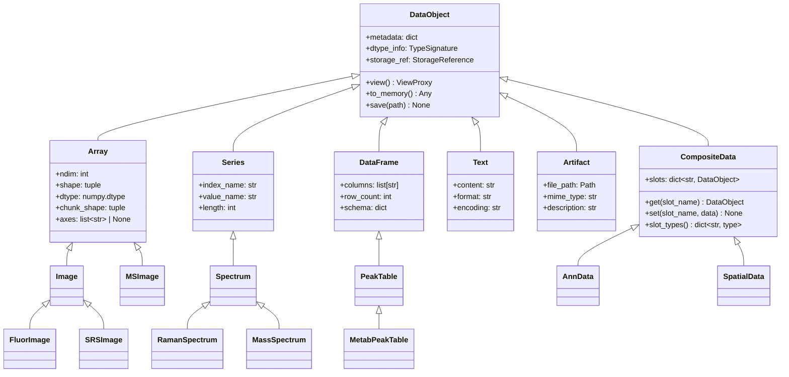
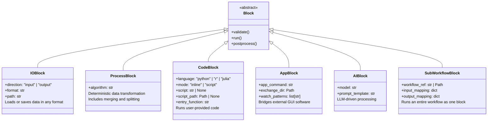

# SciEasy — Architecture Document

> **Status**: Draft v0.1  
> **Last updated**: 2026-04-02

---

## 1. Problem statement

Modern biomedical research increasingly generates multi-modal datasets — RNA/DNA sequencing, LC-MS metabolomics, spatial transcriptomics, immunofluorescence microscopy, SRS imaging, mass spectrometry imaging, and more. Each modality demands its own processing software, programming language, and data format. Researchers face two compounding problems:

1. **Fragmented processing**: tools are scattered across R scripts, Python notebooks, standalone GUI applications (ElMAVEN, Fiji, napari), and command-line pipelines. Exchanging intermediate results between these environments is manual, error-prone, and poorly documented.
2. **High barrier for non-developers**: researchers without strong programming backgrounds cannot efficiently chain together complex multi-step analyses, let alone integrate data across modalities.

## 2. Vision

A **modality-agnostic, building-block workflow framework** where:

- Every processing step is encapsulated as a **Block** with standardised inputs and outputs.
- All data flows through a small set of **base data types** that are extensible via inheritance.
- Users compose workflows visually by wiring blocks together on a canvas — no code required for standard pipelines.
- Existing tools are **included, not replaced**: users can embed R/Python scripts, launch GUI applications, or call CLI tools as blocks within the same workflow.
- Multiple data modalities coexist in a **single workflow graph**, enabling true cross-modal fusion analysis.
- The framework is **AI-native**: AI can generate blocks, synthesise workflows, and optimise parameters at runtime.

### 2.1 Design principles

| Principle | Implication |
|---|---|
| **Inclusive** | Never ask users to migrate. Wrap existing tools as blocks. |
| **Composable** | Small, single-purpose blocks that combine into complex workflows. |
| **Type-safe** | Port-level type checking prevents invalid connections at design time. |
| **Lazy by default** | Data objects hold references, not payloads. 100 GB datasets stay on disk until a block requests a specific slice. |
| **Checkpoint everything** | Workflow state is serialisable. Pause, resume, and recover from any point. |
| **Community-extensible** | Abstract base classes + plugin registry. Anyone can publish a block or data type. |

---

## 3. Layered architecture overview

The system is organised into six horizontal layers, from bottom to top. Each layer depends only on the layers below it.

```
┌─────────────────────────────────────────────────────────────┐
│  Layer 6: Frontend                                          │
│  ReactFlow canvas · block palette · monitoring dashboard    │
├─────────────────────────────────────────────────────────────┤
│  Layer 5: API                                               │
│  FastAPI REST · WebSocket (live status) · SSE (log stream)  │
├─────────────────────────────────────────────────────────────┤
│  Layer 4: AI services                                       │
│  Block generation · workflow synthesis · param optimisation  │
├─────────────────────────────────────────────────────────────┤
│  Layer 3: Execution engine                                  │
│  DAG scheduler · batch executor · process manager           │
├─────────────────────────────────────────────────────────────┤
│  Layer 2: Block system                                      │
│  Port typing · block registry · state machine · runners     │
├─────────────────────────────────────────────────────────────┤
│  Layer 1: Data foundation                                   │
│  Type hierarchy · storage backends · lazy loading · lineage │
├─────────────────────────────────────────────────────────────┤
│  Plugin ecosystem (cross-cutting)                           │
│  Community blocks · custom data types · external adapters   │
└─────────────────────────────────────────────────────────────┘
```

---

## 4. Layer 1 — Data foundation

### 4.1 Base type hierarchy

All data flowing between blocks is wrapped in a `DataObject` subclass. The framework provides six base types; users extend them for domain-specific needs.



**Why `CompositeData` exists**: Many real-world scientific data structures are inherently multi-modal containers rather than single-type objects. AnnData bundles a matrix (`.X` → Array), observation metadata (`.obs` → DataFrame), variable metadata (`.var` → DataFrame), and unstructured annotations (`.uns` → dict). SpatialData (Squidpy) combines images, coordinate tables, and region annotations. Forcing these into single-parent inheritance (e.g. AnnData as a DataFrame) loses critical structural semantics.

`CompositeData` models these as a named collection of heterogeneous `DataObject` slots:

```python
class CompositeData(DataObject):
    """A named collection of heterogeneous DataObjects."""

    def __init__(self, slots: dict[str, DataObject] = None, **kwargs):
        super().__init__(**kwargs)
        self._slots = slots or {}

    def get(self, slot_name: str) -> DataObject:
        """Retrieve a named slot (e.g. anndata.get('X') → Array)."""
        return self._slots[slot_name]

    def set(self, slot_name: str, data: DataObject) -> None:
        """Set or replace a named slot."""
        self._slots[slot_name] = data

    def slot_types(self) -> dict[str, type]:
        """Return {slot_name: DataObject subclass} for port constraint checking."""
        return {k: type(v) for k, v in self._slots.items()}

    @property
    def slot_names(self) -> list[str]:
        return list(self._slots.keys())
```

Domain-specific subclasses declare their expected slot structure:

```python
class AnnData(CompositeData):
    """Single-cell data: expression matrix + cell/gene metadata."""
    expected_slots = {
        "X": Array,           # expression matrix (cells × genes)
        "obs": DataFrame,     # cell-level metadata
        "var": DataFrame,     # gene-level metadata
        "uns": Artifact,      # unstructured annotations
    }

class SpatialData(CompositeData):
    """Spatial omics data: images + coordinates + annotations."""
    expected_slots = {
        "images": Array,
        "points": DataFrame,
        "shapes": DataFrame,
        "table": AnnData,     # CompositeData can nest CompositeData
    }
```

**Named axes on `Array`**: The `axes` field gives each dimension a semantic name, making dimension alignment explicit rather than positional. The base `Array` type leaves `axes = None` (unknown); domain subtypes declare their axis convention:

```python
class Image(Array):
    axes = ["y", "x"]                  # 2D, or ["y", "x", "channel"] for multi-channel

class MSImage(Array):
    axes = ["y", "x", "mz"]           # mass spectrometry imaging: spatial + m/z

class SRSImage(Array):
    axes = ["y", "x", "wavenumber"]   # SRS: spatial + spectral

class FluorImage(Image):
    axes = ["y", "x", "channel"]      # IF: spatial + fluorescence channel
```

Named axes serve three purposes: (1) port constraints can require specific axes instead of just ndim checks; (2) the broadcast utility (section 4.5) uses axis names to align low-dimensional data against high-dimensional data; (3) visualisation blocks can auto-assign axes to plot dimensions without config.

**Key fields on `DataObject`**:

- `metadata`: free-form dictionary for provenance info (source instrument, acquisition parameters, timestamps, user annotations).
- `dtype_info`: a `TypeSignature` object used by the port system for connection validation. Encodes the class hierarchy so that an `SRSImage` matches any port accepting `Image` or `Array`. For `CompositeData`, the signature additionally encodes the slot structure so that ports can require specific named slots of specific types.
- `storage_ref`: a `StorageReference` pointing to the backing store (Zarr path, Parquet file, plain file path). For `CompositeData`, this is a directory containing one storage ref per slot. The object itself is lightweight — typically a few KB regardless of the underlying data size.

### 4.2 Storage backends

Each base type maps to an optimal storage backend:

| Base type | Primary backend | Rationale |
|---|---|---|
| `Array` | **Zarr** (chunked, compressed, cloud-compatible) | Handles 100 GB+ MSI and hyperspectral data. Supports partial reads via chunk indexing. |
| `Series` | **Zarr** or **Parquet** (single-column) | Small enough to fit in memory for most cases; Zarr for very long series. |
| `DataFrame` | **Apache Arrow / Parquet** | Columnar format enables efficient filtering and aggregation. Memory-mappable via Arrow. |
| `Text` | **Filesystem** (plain text / JSON) | Trivially small. Stored as files for easy external access. |
| `Artifact` | **Filesystem** (original format preserved) | PDFs, images, reports. Kept as-is for interoperability. |
| `CompositeData` | **Directory of slot backends** | Each slot stored using the backend appropriate to its type. A manifest JSON maps slot names to storage refs. |

### 4.3 Lazy loading via ViewProxy

Blocks never receive raw data directly. Instead, the engine injects a `ViewProxy` that mediates access:

```python
class ViewProxy:
    """Lazy accessor that loads data on demand from the storage backend."""

    def __init__(self, storage_ref: StorageReference, dtype_info: TypeSignature):
        self._ref = storage_ref
        self._dtype = dtype_info
        self._cache = None

    def slice(self, *args) -> np.ndarray:
        """Read a specific slice from the backing store (Zarr chunk-aware)."""
        ...

    def to_memory(self) -> Any:
        """Load full data into memory. Use with caution on large datasets."""
        ...

    def iter_chunks(self, chunk_size: int) -> Iterator:
        """Iterate over data in fixed-size chunks for batch processing."""
        ...

    @property
    def shape(self) -> tuple:
        """Shape without loading data (read from Zarr/.zarray metadata)."""
        ...
```

When a block's `run()` is called, input ports deliver `ViewProxy` instances. Blocks that need the full array call `to_memory()`; blocks that can operate chunk-wise use `iter_chunks()` or `slice()`. This keeps memory usage bounded even for enormous datasets.

### 4.4 Data lineage

Every block execution produces a **lineage record**:

```
LineageRecord:
    input_hashes:  [hash(input_0), hash(input_1), ...]
    block_id:      "cellpose_segment_v2"
    block_config:  { diameter: 30, model: "cyto2", ... }
    block_version: "0.3.1"
    output_hashes: [hash(output_0)]
    timestamp:     "2026-04-02T14:32:00Z"
    duration_ms:   4521
    environment:   { python: "3.11.8", key_packages: { cellpose: "3.0.1", ... } }
    batch_info:    { total: 50, succeeded: 48, failed: 2, strategy: "skip" }
```

Records are stored in a local SQLite database within the project workspace. They form a provenance graph that supports reproducibility audits, debugging, and AI-driven parameter comparison.

### 4.5 Broadcast utility

Multi-modal workflows frequently need to apply a lower-dimensional object to a higher-dimensional one along named axes — for example, applying a 2D cell mask `(y, x)` to every channel of a 3D MSI dataset `(y, x, mz)`, or applying a baseline correction curve to each spectrum in a batch.

The framework provides an explicit broadcast helper in `scieasy.utils.broadcast`. This is **not** automatic broadcasting at the type system or port level — the block author decides when and how to use it. The rationale: shape alignment does not guarantee semantic alignment (e.g. an IF image and an MSI image must be spatially registered before broadcasting makes sense), so the framework provides the mechanism while the block encodes the domain logic.

```python
# scieasy/utils/broadcast.py

def broadcast_apply(
    source: Array,            # lower-dim, e.g. mask (y, x)
    target: Array,            # higher-dim, e.g. MSI (y, x, mz)
    func: Callable,           # applied per-slice: func(source_data, target_slice) → result
    over_axes: list[str],     # target axes to iterate over, e.g. ["mz"]
) -> list:
    """
    Apply a lower-dim Array to a higher-dim Array along named axes.

    Iterates over `over_axes` in the target, extracting slices that share
    the remaining axes with source, and calls `func` on each pair.

    Raises BroadcastError if source axes are not a subset of
    target axes minus over_axes.
    """
    shared = set(target.axes) - set(over_axes)
    if not shared.issubset(set(source.axes)):
        raise BroadcastError(
            f"Cannot broadcast: source axes {source.axes} do not cover "
            f"shared axes {shared} (target axes {target.axes} minus over_axes {over_axes})"
        )

    results = []
    for idx in iter_axis_slices(target, over_axes):
        target_slice = target.slice(idx)       # (y, x) at this m/z value
        results.append(func(source, target_slice))
    return results
```

**Usage in a block:**

```python
class ApplyMaskToMSI(ProcessBlock):
    name = "Apply mask to MSI"
    input_ports = [
        InputPort(name="mask", accepted_types=[Image]),
        InputPort(name="msi", accepted_types=[MSImage]),
    ]
    output_ports = [OutputPort(name="cell_spectra", accepted_types=[DataFrame])]

    def run(self, inputs, config):
        mask = inputs["mask"]
        msi = inputs["msi"]

        # Block author decides over_axes — this is domain knowledge
        per_channel = broadcast_apply(
            source=mask, target=msi,
            func=self._extract_cell_means,
            over_axes=["mz"],
        )
        # Assemble into cell × m/z DataFrame
        return {"cell_spectra": stack_to_dataframe(per_channel, msi.mz_axis)}
```

The broadcast utility is axis-name-aware (not position-based), integrates with `ViewProxy` for chunked iteration on large datasets, and raises clear errors when axes don't align. Blocks are never required to use it — it is a convenience for a common pattern.

---

## 5. Layer 2 — Block system

### 5.1 Block base class

```python
from abc import ABC, abstractmethod
from enum import Enum

class BlockState(Enum):
    IDLE = "idle"
    READY = "ready"
    RUNNING = "running"
    PAUSED = "paused"       # waiting for user (interactive/external)
    DONE = "done"
    ERROR = "error"

class ExecutionMode(Enum):
    AUTO = "auto"           # pure computation, no user intervention
    INTERACTIVE = "interactive"  # requires user action (e.g. napari review)
    EXTERNAL = "external"   # delegates to external application

class BatchMode(Enum):
    PARALLEL = "parallel"   # all items through this block concurrently
    SERIAL = "serial"       # one item at a time through full downstream
    ADAPTIVE = "adaptive"   # engine decides based on downstream blocks

class Block(ABC):
    """Abstract base class for all blocks."""

    # --- Class-level declarations (overridden by subclasses) ---
    name: str = "Unnamed Block"
    description: str = ""
    version: str = "0.1.0"
    input_ports: list[InputPort] = []
    output_ports: list[OutputPort] = []
    execution_mode: ExecutionMode = ExecutionMode.AUTO
    batch_mode: BatchMode = BatchMode.PARALLEL

    def __init__(self, config: dict = None):
        self.config = BlockConfig(config or {})
        self.state = BlockState.IDLE

    def validate(self, inputs: dict[str, ViewProxy]) -> bool:
        """Check that inputs are compatible before execution.
        Called by the engine before run(). Return False to abort."""
        return True

    @abstractmethod
    def run(self, inputs: dict[str, ViewProxy], config: BlockConfig) -> dict[str, DataObject]:
        """Core execution logic. Must return a dict mapping output port names to DataObjects."""
        ...

    def postprocess(self, outputs: dict[str, DataObject]) -> dict[str, DataObject]:
        """Optional hook for cleanup, logging, or output transformation."""
        return outputs
```

### 5.2 Port system

```python
class Port:
    """Connection endpoint on a block."""
    name: str
    accepted_types: list[type]  # e.g. [Image, Array] — accepts Image or any Array subclass
    description: str = ""
    required: bool = True

class InputPort(Port):
    default: DataObject | None = None   # optional default value

    # --- Runtime constraint (optional) ---
    constraint: Callable[[DataObject], bool] | None = None
    constraint_description: str = ""    # human-readable, shown in UI tooltip

class OutputPort(Port):
    pass
```

**Two-phase connection validation**:

1. **Design-time (fast)**: when the user draws a connection in ReactFlow, the frontend checks whether the source port's output type is in the target port's `accepted_types`, accounting for inheritance. Invalid connections are visually rejected. This check is purely structural — it only considers the class hierarchy.

2. **Pre-execution (precise)**: before a block runs, the engine calls the optional `constraint` function on each input, passing the actual `DataObject`. This catches semantic mismatches that type alone cannot express.

Example constraints:

```python
# A 2D convolution block needs spatial axes (using named axes)
InputPort(
    name="image",
    accepted_types=[Image],
    constraint=lambda img: img.axes is not None and {"y", "x"}.issubset(set(img.axes)),
    constraint_description="Image must have spatial axes (y, x)",
)

# A broadcast block needs the mask axes to be a subset of the target axes
InputPort(
    name="mask",
    accepted_types=[Image],
    constraint=lambda img: img.axes is not None and set(img.axes) == {"y", "x"},
    constraint_description="Mask must be 2D spatial (y, x) for broadcasting over target channels",
)

# A merge block needs two DataFrames with at least one shared column
InputPort(
    name="right",
    accepted_types=[DataFrame],
    constraint=lambda df: len(set(df.columns) & set(self._left_columns)) > 0,
    constraint_description="Must share at least one column with the left input",
)

# A port that accepts CompositeData with a required slot structure
InputPort(
    name="spatial_data",
    accepted_types=[CompositeData],
    constraint=lambda cd: "images" in cd.slot_names and "table" in cd.slot_names,
    constraint_description="Must contain 'images' (Array) and 'table' slots",
)
```

When a constraint fails, the engine reports the `constraint_description` to the user via WebSocket, and the block transitions to `ERROR` state with a clear diagnostic.

### 5.3 Block categories

The framework defines five concrete block categories plus one meta-category for composition. All other functionality is achieved through subclassing.



#### IOBlock

Handles all data ingress and egress. A single block type with a `direction` flag:

- **Input mode**: reads files from disk, URLs, cloud storage, or databases. Detects format from extension or explicit config. Produces `DataObject` instances on its output ports.
- **Output mode**: accepts `DataObject` on input ports. Serialises to the specified format and path. Supports common scientific formats (mzXML, TIFF, CSV, AnnData h5ad, Zarr, etc.) via pluggable format adapters.

#### ProcessBlock

The workhorse for data transformation. Covers:

- Single-input transforms (denoise, baseline correction, normalisation, segmentation).
- Multi-input operations (merge, register, concatenate, cross-modal fusion).
- Splitting / filtering (subset by condition, train/test split).

Each `ProcessBlock` subclass declares its input/output ports with specific type constraints. For example, a `CellposeSegment` block accepts `Image` on input and produces `Image` (mask) + `DataFrame` (cell properties) on output.

#### CodeBlock

Enables zero-friction integration of existing scripts. Supports two execution modes (inline, script) and three data delivery modes per input port.

##### Execution modes

**Inline mode** — for short scripts and quick operations:

The user writes code directly in the block's config panel. Input data is injected as variables matching port names; output variables are captured automatically.

```python
# Inline mode: user writes this in the config panel
# Variables `input_0` and `input_1` are auto-injected from input ports
merged = input_0.merge(input_1, on="cell_id")
output_0 = merged[merged["confidence"] > 0.8]
```

**Script mode** — for existing analysis scripts and complex pipelines:

The user points the block at an existing `.py`, `.R`, or `.jl` file (local path or Git repository). The script communicates with the framework through a **convention-based entry function**:

```python
# User's existing script: my_analysis.py
# Can import any libraries, define helper functions, span hundreds of lines.

import numpy as np
from scipy.signal import savgol_filter
from my_lab_utils import custom_baseline  # user's own modules work fine

def configure() -> dict:
    """Optional: declare config schema for the block's UI form."""
    return {
        "window_length": {"type": "int", "default": 11, "min": 3},
        "poly_order": {"type": "int", "default": 3},
        "baseline_method": {"type": "enum", "options": ["als", "snip", "custom"]},
    }

def run(inputs: dict, config: dict) -> dict:
    """Required: the entry point. Receives input data and config, returns outputs."""
    spectra = inputs["spectra"]           # numpy array from input port
    smoothed = savgol_filter(spectra, config["window_length"], config["poly_order"])
    baseline = custom_baseline(smoothed, method=config["baseline_method"])
    corrected = smoothed - baseline
    return {"output_0": corrected}        # maps to output port
```

```r
# User's existing script: deseq_analysis.R
# Full R script with all dependencies — runs as-is.

library(DESeq2)
library(tidyverse)

configure <- function() {
    list(alpha = list(type = "float", default = 0.05),
         lfc_threshold = list(type = "float", default = 1.0))
}

run <- function(inputs, config) {
    counts <- inputs$counts              # from input port "counts"
    metadata <- inputs$metadata          # from input port "metadata"
    dds <- DESeqDataSetFromMatrix(countData = counts,
                                  colData = metadata,
                                  design = ~ condition)
    dds <- DESeq(dds)
    res <- results(dds, alpha = config$alpha,
                   lfcThreshold = config$lfc_threshold)
    list(output_0 = as.data.frame(res))  # maps to output port
}
```

##### Input delivery modes

CodeBlock is the boundary between the framework (ViewProxy-based lazy loading) and user scripts (which expect native Python/R objects). The framework must decide **how** to deliver data from each input port to the user's code. This is controlled per-port via `InputDelivery`:

```python
class InputDelivery(Enum):
    MEMORY = "memory"       # to_memory() — full load as native object (numpy, pandas, etc.)
    PROXY = "proxy"         # pass ViewProxy directly — user controls slice/iter_chunks
    CHUNKED = "chunked"     # framework iterates chunks, calls run() once per chunk
```

**MEMORY (default)** — full load, maximum compatibility:

The input is fully loaded into memory as a native object. Compatible with any script — numpy, pandas, scipy, R, all just work. This is the correct default because 90% of CodeBlock usage involves small-to-medium data.

```python
# Inline mode: input_0 is a numpy array, just use it normally
result = savgol_filter(input_0, 11, 3)
output_0 = result
```

If an input exceeds a configurable threshold (default: 2 GB), the framework displays a warning in the block's config panel: *"Input 'msi' is 47 GB. Consider switching to proxy or chunked delivery in script mode."*

**PROXY** — lazy access for large data, user controls memory:

The input is delivered as a `ViewProxy` object. The user script decides what to load and when. Only available in script mode (inline scripts are too short to justify proxy manipulation).

```python
# large_msi_analysis.py

def configure():
    return {
        "input_delivery": {
            "msi": "proxy",             # I'll manage memory myself
            "cell_metadata": "memory",  # small table, load fully
        },
    }

def run(inputs, config):
    msi_proxy = inputs["msi"]               # ViewProxy, nothing loaded yet
    metadata = inputs["cell_metadata"]       # pandas DataFrame, already in memory

    # Only load one m/z channel at a time — memory stays bounded
    ion_image = msi_proxy.slice({"mz": 885.5})      # ~50 MB, not 100 GB
    cell_means = extract_per_cell(ion_image, metadata)
    return {"output_0": cell_means}
```

**CHUNKED** — framework-driven iteration, user writes single-chunk logic:

The user's `run()` function processes one chunk at a time. The framework handles iteration and result assembly. The user never sees the full dataset.

```python
# batch_spectral_smooth.py

def configure():
    return {
        "input_delivery": {"spectra": "chunked"},
        "chunk_size": 100,      # 100 spectra per chunk
        "window": {"type": "int", "default": 11},
    }

def run(inputs, config):
    # inputs["spectra"] is a small numpy array (100, n_wavelengths) — not the full dataset
    batch = inputs["spectra"]
    smoothed = savgol_filter(batch, config["window"], 3, axis=1)
    return {"output_0": smoothed}
    # Framework calls run() repeatedly for each chunk, concatenates results
```

##### Framework bridge implementation

```python
class CodeBlock(Block):
    def run(self, inputs, config):
        language = config["language"]
        runner = CodeRunnerRegistry.get(language)
        delivery_map = config.get("input_delivery", {})

        if config["mode"] == "inline":
            # Inline mode: always MEMORY (simple mental model)
            namespace = {name: proxy.to_memory() for name, proxy in inputs.items()}
            result = runner.execute_inline(config["script"], namespace)

        else:
            # Script mode: respect per-port delivery settings
            chunked_ports = {
                name: proxy for name, proxy in inputs.items()
                if delivery_map.get(name) == "chunked"
            }

            if chunked_ports:
                # CHUNKED path: framework drives iteration
                result = self._run_chunked(runner, inputs, config, chunked_ports)
            else:
                # MEMORY / PROXY path: single invocation
                input_data = {}
                for name, proxy in inputs.items():
                    delivery = delivery_map.get(name, "memory")
                    if delivery == "proxy":
                        input_data[name] = proxy           # pass ViewProxy as-is
                    else:
                        input_data[name] = proxy.to_memory()  # full load

                result = runner.execute_script(
                    script_path=config["script_path"],
                    entry_function=config.get("entry_function", "run"),
                    inputs=input_data,
                    config=config.get("script_config", {}),
                )

        return {name: wrap_as_dataobject(v) for name, v in result.items()}

    def _run_chunked(self, runner, inputs, config, chunked_ports):
        chunk_size = config.get("chunk_size", 1000)
        all_results = []

        # Build non-chunked inputs once (MEMORY or PROXY)
        static_inputs = {}
        delivery_map = config.get("input_delivery", {})
        for name, proxy in inputs.items():
            if name not in chunked_ports:
                delivery = delivery_map.get(name, "memory")
                static_inputs[name] = proxy if delivery == "proxy" else proxy.to_memory()

        # Iterate over chunks of the chunked port(s)
        # (For simplicity, one chunked port at a time; multiple chunked ports
        #  iterate in lockstep if they have the same length.)
        for name, proxy in chunked_ports.items():
            for chunk in proxy.iter_chunks(chunk_size):
                chunk_inputs = {**static_inputs, name: chunk}
                chunk_result = runner.execute_script(
                    script_path=config["script_path"],
                    entry_function=config.get("entry_function", "run"),
                    inputs=chunk_inputs,
                    config=config.get("script_config", {}),
                )
                all_results.append(chunk_result)

        return concatenate_results(all_results)
```

##### Script discovery and UI integration

The frontend provides a file picker for `.py` / `.R` / `.jl` files. When a script is selected, the framework introspects it — reads port names from the `run()` function signature, config schema and `input_delivery` declarations from `configure()` (if present) — and auto-populates the block's port declarations, config form, and per-port delivery dropdowns. The user's script does not need to be modified beyond adding the `run()` convention.

In the config panel, each input port shows a delivery mode selector (defaulting to MEMORY). For inline mode, delivery is locked to MEMORY and the selector is hidden.

**Code runners** are isolated execution environments:
- **Python**: in-process `exec()` with a sandboxed namespace (inline), or `subprocess` / `importlib` for script mode.
- **R**: via `rpy2` bridge or subprocess calling `Rscript`.
- **Julia**: via `juliacall` or subprocess.

#### AppBlock

Bridges external GUI applications (ElMAVEN, Fiji, napari, MestReNova, etc.) via a file-exchange protocol:

```
ExternalAppBridge protocol:

1. PREPARE: Serialise input data to exchange directory in app-native format
   (e.g., .mzXML for ElMAVEN, .tif for Fiji)

2. LAUNCH: Start external process via configured command
   (e.g., "ElMAVEN --input {exchange_dir}/data.mzXML")

3. PAUSE: Engine enters PAUSED state. Frontend shows "Waiting for external software..."
   User operates the external application normally.

4. WATCH: Monitor exchange directory for output files using filesystem watcher (watchdog).
   Configurable watch patterns (e.g., "*.csv", "*_peaks.tsv").

5. DETECT: When output files appear or are modified, trigger resume.

6. RESUME: Read output files, wrap as DataObject, continue workflow.
```

The `AppBlock` config includes:
- `app_command`: command template to launch the application.
- `exchange_dir`: temporary directory for file-based data exchange.
- `input_format` / `output_format`: serialisation format for each direction.
- `watch_patterns`: glob patterns for detecting completed output.
- `timeout`: optional max wait time before error.

#### AIBlock

LLM-powered processing for tasks that benefit from natural-language reasoning:

- **Classification**: label cells, annotate spectra, categorise pathology reports.
- **Summarisation**: generate text summaries of analysis results.
- **Parameter suggestion**: given intermediate results, suggest optimal parameters for downstream blocks.
- **Code generation**: dynamically write a `ProcessBlock` implementation based on a natural-language description.

The `AIBlock` sends data (or data summaries) + a prompt template to a configured LLM endpoint and parses structured output back into `DataObject` instances.

#### SubWorkflowBlock

A meta-block that encapsulates an entire workflow as a single reusable block. This enables hierarchical composition — complex pipelines become building blocks in larger workflows.

```python
class SubWorkflowBlock(Block):
    """Runs a complete workflow as a single block within a parent workflow."""

    def __init__(self, config: dict):
        super().__init__(config)
        self.workflow_ref = config["workflow_ref"]   # path or ID of the child workflow
        self.input_mapping = config["input_mapping"]  # parent port → child IOBlock
        self.output_mapping = config["output_mapping"] # child IOBlock → parent port

    def run(self, inputs, config):
        # 1. Load the child workflow definition
        child_workflow = WorkflowLoader.load(self.workflow_ref)

        # 2. Inject parent inputs into designated child IOBlocks
        for parent_port, child_io_id in self.input_mapping.items():
            child_workflow.inject_input(child_io_id, inputs[parent_port])

        # 3. Execute the child workflow with its own DAG scheduler
        child_engine = DAGScheduler(child_workflow)
        child_engine.execute()

        # 4. Extract designated child outputs as parent outputs
        return {
            parent_port: child_engine.get_output(child_io_id)
            for parent_port, child_io_id in self.output_mapping.items()
        }
```

**Use cases**:

- **Reusable sub-pipelines**: a lab's standard Raman preprocessing pipeline (load → denoise → baseline → normalise) becomes a single "Raman Prep" block that appears in the palette alongside primitive blocks.
- **Team collaboration**: one person builds and validates the LC-MS analysis workflow; another person uses it as a block in a larger multi-modal workflow without needing to understand the internals.
- **Recursive composition**: a SubWorkflowBlock's child workflow can itself contain SubWorkflowBlocks, enabling arbitrary nesting depth.
- **Sharing**: published workflows can be imported and used as blocks by the community, just like regular blocks.

**In the frontend**, a SubWorkflowBlock appears as a single node with a "drill-down" button. Clicking it opens the child workflow in a nested canvas view (similar to Figma's component editing or Unreal Engine's Blueprint sub-graphs). Input/output ports on the parent node correspond to designated IOBlocks in the child workflow.

### 5.4 Block and type distribution

Blocks and custom data types are discovered from two sources, merged into a unified registry. The design goal: a bench scientist adds a block by dropping a file; a community maintainer publishes a polished package via pip.

#### Tier 1 — Drop-in files (zero config)

Users place `.py` files in scan directories. The framework auto-discovers them on startup (and via a "Reload" button in the UI).

| Scope | Blocks | Types |
|---|---|---|
| **Project-local** (this project only) | `{project}/blocks/*.py` | `{project}/types/*.py` |
| **User-global** (all projects) | `~/.scieasy/blocks/*.py` | `~/.scieasy/types/*.py` |

For each `.py` file, the framework imports the module, finds all classes inheriting `Block` or `DataObject`, reads their class-level declarations, and registers them with `BlockRegistry` or `TypeRegistry` respectively.

**Minimal drop-in block example:**

```python
# my_project/blocks/raman_denoise.py
from scieasy.blocks.base import ProcessBlock, InputPort, OutputPort
from scieasy.core.types import Spectrum

class RamanDenoise(ProcessBlock):
    name = "Raman denoise"
    description = "Savitzky-Golay smoothing for Raman spectra"
    version = "0.1.0"
    category = "spectroscopy"

    input_ports = [InputPort(name="spectrum", accepted_types=[Spectrum])]
    output_ports = [OutputPort(name="smoothed", accepted_types=[Spectrum])]

    def run(self, inputs, config):
        from scipy.signal import savgol_filter
        data = inputs["spectrum"].to_memory()
        result = savgol_filter(data, config.get("window", 11), config.get("order", 3))
        return {"smoothed": result}
```

Save → click "Reload blocks" → appears in palette under "spectroscopy".

**Minimal drop-in type example:**

```python
# my_project/types/flow_data.py
from scieasy.core.types import CompositeData, Array, DataFrame

class FlowCytoData(CompositeData):
    name = "Flow cytometry data"
    expected_slots = {
        "events": DataFrame,               # events × channels
        "compensation_matrix": Array,       # channel × channel
    }

    def compensate(self) -> "FlowCytoData":
        """Apply compensation matrix to event data."""
        ...

    def gate(self, channel: str, threshold: float) -> "FlowCytoData":
        """Simple threshold gate on a channel."""
        ...
```

Save → the type is immediately available for port declarations in any block.

#### Tier 2 — pip install (for community packages)

When a block collection needs formal versioning, dependency management, and broad distribution, it is published as a standard Python package on PyPI. Users install with one command; blocks and types register automatically via entry_points.

**User installs:**

```bash
pip install scieasy-flowcyto
```

All blocks, types, and format adapters from the package appear in the palette immediately — no config needed.

**Package structure (what the community maintainer creates):**

```
scieasy-flowcyto/
├── pyproject.toml
└── src/
    └── scieasy_flowcyto/
        ├── __init__.py
        ├── types/
        │   └── flow_data.py          # FlowCytoData(CompositeData)
        ├── blocks/
        │   ├── fcs_loader.py         # IOBlock: load .fcs files
        │   ├── compensate.py         # ProcessBlock: compensation
        │   ├── gate.py               # ProcessBlock: gating
        │   ├── flowjo_bridge.py      # AppBlock: FlowJo integration
        │   └── clustering.py         # ProcessBlock: FlowSOM / Phenograph
        └── adapters/
            └── fcs_adapter.py        # FormatAdapter for .fcs extension
```

```toml
# pyproject.toml
[project]
name = "scieasy-flowcyto"
version = "1.0.0"
dependencies = ["scieasy>=0.1", "fcsparser>=0.2", "flowsom>=0.1"]

[project.entry-points."scieasy.blocks"]
fcs_loader   = "scieasy_flowcyto.blocks.fcs_loader:FCSLoader"
compensate   = "scieasy_flowcyto.blocks.compensate:CompensateBlock"
gate         = "scieasy_flowcyto.blocks.gate:GateBlock"
flowjo       = "scieasy_flowcyto.blocks.flowjo_bridge:FlowJoBridge"
clustering   = "scieasy_flowcyto.blocks.clustering:ClusteringBlock"

[project.entry-points."scieasy.types"]
flow_cyto_data = "scieasy_flowcyto.types.flow_data:FlowCytoData"

[project.entry-points."scieasy.adapters"]
fcs = "scieasy_flowcyto.adapters.fcs_adapter:FCSAdapter"
```

#### Registry implementation

```python
class BlockRegistry:
    """Unified block discovery across all sources."""

    def scan(self):
        # 1. Tier 1: scan drop-in directories
        for directory in self._scan_dirs:          # project/blocks/, ~/.scieasy/blocks/
            for py_file in directory.glob("*.py"):
                self._register_from_file(py_file)

        # 2. Tier 2: scan installed entry_points
        for ep in entry_points(group="scieasy.blocks"):
            self._register_from_entrypoint(ep)

        # Tier 2 blocks shadow Tier 1 blocks with the same name
        # (installed packages are considered authoritative)

    def hot_reload(self):
        """Re-scan Tier 1 directories only (fast, triggered by UI button)."""
        ...
```

`TypeRegistry` follows an identical pattern with `scieasy.types` entry_points and `{project}/types/` + `~/.scieasy/types/` scan directories.

Each registered block/type exposes to the palette:
- Name, description, version, author.
- Input/output port declarations with type constraints.
- Default config schema (JSON Schema, rendered as a form in the frontend).
- Icon and category (for palette organisation).
- Source indicator: "project", "user", or package name (shown as a badge in the UI).

---

## 6. Layer 3 — Execution engine

### 6.1 DAG scheduler

A workflow is a directed acyclic graph (DAG) of blocks connected by typed edges. The scheduler:

1. **Topological sort**: determines execution order respecting data dependencies.
2. **Readiness check**: a block becomes READY when all its required input ports have data.
3. **Dispatch**: ready blocks are dispatched to the appropriate executor (in-process, subprocess, or external).
4. **State propagation**: block state changes (RUNNING → PAUSED → DONE) are broadcast via WebSocket to the frontend.

```python
class DAGScheduler:
    def __init__(self, workflow: WorkflowDefinition):
        self.graph = build_dag(workflow)
        self.block_states: dict[str, BlockState] = {}
        self.checkpoints: list[WorkflowCheckpoint] = []

    async def execute(self):
        for block_id in topological_sort(self.graph):
            block = self.graph.nodes[block_id]
            inputs = gather_inputs(block, self.graph)

            self.set_state(block_id, BlockState.RUNNING)

            if block.execution_mode == ExecutionMode.EXTERNAL:
                result = await self.run_external(block, inputs)
            elif block.execution_mode == ExecutionMode.INTERACTIVE:
                result = await self.run_interactive(block, inputs)
            else:
                result = await self.run_auto(block, inputs)

            self.store_outputs(block_id, result)
            self.set_state(block_id, BlockState.DONE)
            self.save_checkpoint()
```

### 6.2 Batch execution

When an input port receives a **collection** of data items (e.g., 50 images), the engine consults the block's `batch_mode` to decide execution strategy:

```
┌──────────────────────────────────────────────────────────────────┐
│  PARALLEL MODE                                                   │
│                                                                  │
│  All items pass through block N concurrently, then block N+1.    │
│                                                                  │
│  Block 1 (denoise):   [img1, img2, img3, ..., img50]  ← parallel│
│       ↓                                                          │
│  Block 2 (segment):   [img1, img2, img3, ..., img50]  ← parallel│
│       ↓                                                          │
│  Block 3 (napari):    [img1, img2, img3, ..., img50]  ← problem!│
│                                                                  │
│  ✓ Fast for auto blocks. Ideal for automated pipelines.          │
│  ✗ Interactive blocks receive all items at once — impractical.   │
├──────────────────────────────────────────────────────────────────┤
│  SERIAL MODE                                                     │
│                                                                  │
│  Each item runs through the full sub-pipeline before the next.   │
│                                                                  │
│  img1 → denoise → segment → napari (review) → done              │
│  img2 → denoise → segment → napari (review) → done              │
│  img3 → denoise → segment → napari (review) → done              │
│                                                                  │
│  ✓ Interactive blocks see one item at a time — natural for       │
│    manual review / correction.                                   │
│  ✗ Slower. No cross-item parallelism.                            │
├──────────────────────────────────────────────────────────────────┤
│  ADAPTIVE MODE (recommended default)                             │
│                                                                  │
│  Engine performs look-ahead on the DAG:                           │
│  - If downstream contains any SERIAL or INTERACTIVE block →      │
│    run current block in SERIAL mode to avoid buffering.          │
│  - Otherwise → run in PARALLEL mode for throughput.              │
│                                                                  │
│  This gives the best of both worlds automatically.               │
└──────────────────────────────────────────────────────────────────┘
```

Implementation uses `concurrent.futures`:
- **CPU-bound blocks** (image processing, spectral analysis): `ProcessPoolExecutor`.
- **IO-bound blocks** (file loading, API calls): `ThreadPoolExecutor` or `asyncio`.
- **Interactive/external blocks**: always serial, one at a time.

### 6.3 Pause, resume, and checkpointing

The engine supports mid-workflow suspension via `WorkflowCheckpoint`:

```python
@dataclass
class WorkflowCheckpoint:
    workflow_id: str
    timestamp: datetime
    block_states: dict[str, BlockState]          # state of every block
    intermediate_refs: dict[str, StorageReference]  # outputs produced so far
    pending_block: str | None                     # block waiting for user action
    config_snapshot: dict                          # full config at checkpoint time
```

Checkpoints are saved to `{project}/checkpoints/` as JSON + references to Zarr/Parquet data. Resuming a workflow loads the latest checkpoint, skips completed blocks, and continues from the pending block.

This is critical for:
- **AppBlock**: user closes ElMAVEN, goes to lunch, comes back → workflow resumes.
- **Long pipelines**: crash recovery without re-running expensive blocks.
- **Collaborative workflows**: one person runs the automated steps, saves checkpoint, another person does the manual review steps.

### 6.4 Resource management

Parallel execution without resource awareness leads to GPU OOM and memory exhaustion. The engine includes a `ResourceManager` that throttles concurrency based on available resources.

```python
@dataclass
class ResourceRequest:
    """Declared by each block: what resources does one invocation need?"""
    requires_gpu: bool = False
    gpu_memory_gb: float = 0.0
    estimated_memory_gb: float = 0.5
    cpu_cores: int = 1

class ResourceManager:
    """Tracks available resources and gates block dispatch."""

    def __init__(self, config: ResourceConfig):
        self.gpu_slots = config.gpu_slots          # e.g. 1 (single GPU)
        self.max_cpu_workers = config.cpu_workers   # e.g. 8
        self.memory_budget_gb = config.memory_gb    # e.g. 32.0
        self._allocated = ResourceLedger()

    async def acquire(self, request: ResourceRequest) -> bool:
        """Try to reserve resources. Returns False if insufficient — caller waits."""
        ...

    def release(self, request: ResourceRequest) -> None:
        """Return resources to the pool after block completes."""
        ...

    @property
    def available(self) -> ResourceSnapshot:
        """Current free resources (for UI display and scheduler decisions)."""
        ...
```

Blocks declare their resource needs via a class-level attribute:

```python
class CellposeSegment(ProcessBlock):
    resource_request = ResourceRequest(requires_gpu=True, gpu_memory_gb=2.0, estimated_memory_gb=4.0)
```

The DAG scheduler consults the `ResourceManager` before dispatching each block in parallel mode. If 50 images are queued for GPU-based Cellpose but only 1 GPU slot is available, the scheduler runs them sequentially through that slot rather than spawning 50 competing processes. CPU-only blocks can still run at full parallelism up to `max_cpu_workers`.

### 6.5 Batch error handling

When processing a batch of items, partial failures are inevitable (corrupt files, edge-case inputs, numerical errors). The engine provides configurable error strategies:

```python
class BatchErrorStrategy(Enum):
    STOP = "stop"       # abort entire batch on first failure
    SKIP = "skip"       # skip failed item, continue rest, log warning
    RETRY = "retry"     # retry N times, then skip or stop
    PAUSE = "pause"     # pause workflow, let user decide per-item

@dataclass
class BatchResult:
    """Returned by the batch executor after processing a collection."""
    succeeded: list[tuple[int, DataObject]]   # (item_index, result)
    failed: list[tuple[int, Exception]]       # (item_index, error)
    skipped: list[int]                        # item indices skipped
```

Each block can declare a default `on_batch_error: BatchErrorStrategy`; users can override it per-block in the workflow config. The `BatchResult` is logged in lineage and surfaced in the frontend — the user sees which items succeeded, which failed, and can re-run only the failed items.

### 6.6 Environment snapshots for reproducibility

Lineage records (section 4.4) capture block version and config, but the same block version can produce different results under different package versions. Each lineage record includes an optional environment snapshot:

```python
@dataclass
class EnvironmentSnapshot:
    python_version: str                         # "3.11.8"
    platform: str                               # "linux-x86_64"
    key_packages: dict[str, str]                # {"scipy": "1.12.0", "cellpose": "3.0.1"}
    full_freeze: str | None = None              # optional: pip freeze output
    conda_env: str | None = None                # optional: conda env export
```

Blocks declare `key_dependencies: list[str]` — the package names whose versions matter for reproducibility. The engine auto-captures their versions at execution time. For strict reproducibility audits, the full pip freeze or conda environment can be attached.

### 6.7 Remote execution interface (future)

The current implementation is local-only, but the scheduler–runner interface is designed for location-agnostic execution:

```python
class BlockRunner(Protocol):
    """Abstract interface between the scheduler and the execution environment."""
    async def run(self, block: Block, inputs: dict, config: dict) -> dict: ...
    async def check_status(self, run_id: str) -> BlockState: ...
    async def cancel(self, run_id: str) -> None: ...

class LocalRunner(BlockRunner):
    """Runs blocks in-process or as local subprocesses. Default implementation."""
    ...

# Future implementations (not in v1):
# class SSHRunner(BlockRunner):     # run on remote machine via SSH
# class SlurmRunner(BlockRunner):   # submit to HPC cluster
# class CloudRunner(BlockRunner):   # run on cloud compute (AWS Batch, GCP, etc.)
```

The DAG scheduler interacts only with the `BlockRunner` protocol. Adding remote execution in the future means implementing a new runner — no changes to the scheduler, block system, or frontend.

---

## 7. Layer 4 — AI services

Four tiers of AI integration, from generation to autonomous optimisation:

### 7.1 Block and data type generation

AI can generate **any of the five block categories** as well as **new DataObject subtypes**. The user provides a natural-language description; the AI produces validated, ready-to-use code that plugs directly into the framework.

#### Generating blocks

The AI infers which block category to subclass based on the user's intent:

```
┌─────────────────────────────────────────────────────────────────────────────┐
│ ProcessBlock generation                                                     │
│                                                                             │
│ User: "I need a block that performs Savitzky-Golay smoothing on Raman       │
│        spectra with configurable window length and polynomial order."        │
│                                                                             │
│ AI generates:                                                               │
│   - Class inheriting ProcessBlock                                           │
│   - Input port: Spectrum (or Series)                                        │
│   - Output port: Spectrum                                                   │
│   - Config schema: { window_length: int, poly_order: int }                  │
│   - run() using scipy.signal.savgol_filter                                  │
│   - Unit tests with synthetic spectrum data                                 │
├─────────────────────────────────────────────────────────────────────────────┤
│ IOBlock generation                                                          │
│                                                                             │
│ User: "I need a loader for Bruker .d mass spectrometry folders that         │
│        extracts the profile spectra as a DataFrame."                        │
│                                                                             │
│ AI generates:                                                               │
│   - Class inheriting IOBlock                                                │
│   - direction: "input", format: "bruker_d"                                  │
│   - Output port: DataFrame (or PeakTable)                                   │
│   - run() using pyopenms or custom Bruker reader                            │
│   - FormatAdapter registration for ".d" extension                           │
├─────────────────────────────────────────────────────────────────────────────┤
│ CodeBlock generation                                                        │
│                                                                             │
│ User: "Wrap my existing R script for DESeq2 differential expression.        │
│        It takes a count matrix and a sample metadata table."                │
│                                                                             │
│ AI generates:                                                               │
│   - Class inheriting CodeBlock                                              │
│   - language: "r"                                                           │
│   - Input ports: DataFrame (counts), DataFrame (metadata)                   │
│   - Output port: DataFrame (DESeq2 results)                                 │
│   - Pre-populated script with variable injection for input_0, input_1       │
│   - Config: { alpha: float, lfc_threshold: float }                          │
├─────────────────────────────────────────────────────────────────────────────┤
│ AppBlock generation                                                         │
│                                                                             │
│ User: "I use MestReNova for NMR processing. I want to send FID files in,    │
│        process them manually, and get the phased spectrum back."             │
│                                                                             │
│ AI generates:                                                               │
│   - Class inheriting AppBlock                                               │
│   - app_command template for MestReNova CLI                                 │
│   - Input format: ".fid", output format: ".csv" or ".jdx"                   │
│   - watch_patterns for MestReNova's default export directory                │
│   - Serialisation logic: Array → .fid on input, .csv → Spectrum on output   │
├─────────────────────────────────────────────────────────────────────────────┤
│ AIBlock generation                                                          │
│                                                                             │
│ User: "I want a block that looks at H&E pathology images and classifies     │
│        tissue regions as tumour, stroma, or necrosis."                      │
│                                                                             │
│ AI generates:                                                               │
│   - Class inheriting AIBlock                                                │
│   - Input port: Image                                                       │
│   - Output port: DataFrame (region_id, classification, confidence)          │
│   - prompt_template with image description + classification instructions    │
│   - Optional: vision model config for multimodal LLM                        │
│   - Structured output parser for consistent DataFrame schema                │
└─────────────────────────────────────────────────────────────────────────────┘
```

#### Generating data types

AI can also extend the type hierarchy when existing types don't capture the user's data semantics:

```
┌─────────────────────────────────────────────────────────────────────────────┐
│ DataObject subtype generation                                               │
│                                                                             │
│ User: "I work with MALDI imaging data. Each pixel has a full mass           │
│        spectrum. I need a data type that knows about x/y coordinates         │
│        and m/z axis, and can return a single-pixel spectrum or a             │
│        single-m/z ion image."                                               │
│                                                                             │
│ AI generates:                                                               │
│   - Class MALDIImage inheriting Array (3D: x, y, m/z)                       │
│   - Additional fields: mz_axis (array), pixel_size_um (float),              │
│     spatial_shape (tuple)                                                   │
│   - Helper methods:                                                         │
│       .spectrum_at(x, y) → MassSpectrum                                     │
│       .ion_image(mz, tolerance) → Image                                     │
│       .tic_image() → Image                                                  │
│   - Storage hint: Zarr with chunks aligned to spatial tiles                  │
│   - TypeSignature registration so ports accepting Array or Image             │
│     also accept MALDIImage                                                  │
│   - Suggested companion blocks: MALDILoader (IOBlock),                      │
│     MALDIPeakPick (ProcessBlock)                                            │
├─────────────────────────────────────────────────────────────────────────────┤
│ User: "I have flow cytometry FCS files with multi-channel fluorescence       │
│        per event."                                                          │
│                                                                             │
│ AI generates:                                                               │
│   - Class FlowCytoData inheriting DataFrame                                 │
│   - Additional fields: channels (list[str]), compensation_matrix (Array)    │
│   - Helper methods:                                                         │
│       .compensate() → FlowCytoData                                          │
│       .gate(channel, threshold) → FlowCytoData                              │
│       .to_anndata() → AnnData                                               │
│   - FormatAdapter for .fcs files                                            │
│   - TypeSignature: compatible with DataFrame ports                           │
└─────────────────────────────────────────────────────────────────────────────┘
```

#### Validation pipeline

All AI-generated code (blocks and data types) passes through an automated validation pipeline before being added to the user's local library:

```
Natural-language description
    │
    ▼
┌────────────────────┐
│ 1. Code generation │  AI produces class definition, ports, config, tests
└────────┬───────────┘
         ▼
┌────────────────────┐
│ 2. Static analysis │  Type-check with mypy/pyright, lint, verify base class
└────────┬───────────┘
         ▼
┌────────────────────┐
│ 3. Dry run         │  Execute with synthetic data matching declared port types
└────────┬───────────┘
         ▼
┌────────────────────┐
│ 4. Port contract   │  Verify output types match declared output port signatures
└────────┬───────────┘
         ▼
┌────────────────────┐
│ 5. User review     │  Show generated code + test results for approval
└────────┬───────────┘
         ▼
  Added to local block library / type registry
```

If any step fails, the AI receives the error and iterates automatically (up to a configurable retry limit) before escalating to the user.

### 7.2 Workflow synthesis

Given a description of available data and the analysis goal, AI proposes a complete workflow DAG:

```
User: "I have LC-MS mzXML files, Raman CSV spectra, and IF TIFF images.
       I want to identify metabolites, characterise spectral signatures per cell type,
       and correlate metabolite abundance with cell-type spatial distribution."

AI produces:
    - IOBlock (load mzXML) → AppBlock (ElMAVEN) → CodeBlock (R: peak annotation)
    - IOBlock (load Raman CSV) → ProcessBlock (baseline correction) → ProcessBlock (PCA)
    - IOBlock (load IF TIFF) → ProcessBlock (Cellpose) → ProcessBlock (cell typing)
    - ProcessBlock (merge: cell types + Raman clusters + metabolite table)
    - ProcessBlock (correlation analysis) → IOBlock (export results)
```

### 7.3 Runtime parameter optimisation

An AI agent monitors intermediate outputs during workflow execution and suggests (or auto-applies) parameter adjustments:

- Observes Cellpose segmentation results → suggests adjusting `diameter` parameter.
- Observes baseline correction output → recommends switching algorithm.
- Runs a hyperparameter sweep across a user-defined search space while the workflow loops.

---

## 8. Layer 5 — API

### 8.1 FastAPI backend

The backend exposes three communication channels:

| Channel | Protocol | Purpose |
|---|---|---|
| REST | HTTP | Workflow CRUD, block registry, project management, file upload/download |
| WebSocket | WS | Real-time block state changes, progress updates, interactive block signals |
| SSE | HTTP streaming | Log streaming from block execution, long-running task progress |

### 8.2 Key REST endpoints

```
# Workflow management
POST   /api/workflows                  Create a new workflow
GET    /api/workflows/{id}             Get workflow definition
PUT    /api/workflows/{id}             Update workflow (add/remove/rewire blocks)
DELETE /api/workflows/{id}             Delete workflow
POST   /api/workflows/{id}/execute     Start execution
POST   /api/workflows/{id}/pause       Pause at current block
POST   /api/workflows/{id}/resume      Resume from checkpoint

# Block registry
GET    /api/blocks                     List all available blocks (with search/filter)
GET    /api/blocks/{type}              Get block schema (ports, config, description)
POST   /api/blocks/validate-connection Validate a proposed port connection

# Data management
POST   /api/data/upload                Upload data files
GET    /api/data/{ref}                 Get data object metadata
GET    /api/data/{ref}/preview         Get a lightweight preview (thumbnail, first N rows)

# AI services
POST   /api/ai/generate-block          Generate a block from natural-language description
POST   /api/ai/suggest-workflow         Suggest a workflow for given data + goal
POST   /api/ai/optimize-params          Run parameter optimisation on a block
```

### 8.3 WebSocket protocol

```json
// Server → Client: block state change
{
  "type": "block_state",
  "block_id": "cellpose_001",
  "state": "running",
  "progress": 0.45,
  "message": "Processing image 23/50"
}

// Server → Client: interactive block waiting
{
  "type": "interactive_prompt",
  "block_id": "napari_review_001",
  "prompt": "Review segmentation mask. Click 'Done' when finished.",
  "app_url": "napari://..."
}

// Client → Server: user completes interactive step
{
  "type": "interactive_complete",
  "block_id": "napari_review_001"
}
```

---

## 9. Layer 6 — Frontend

### 9.1 Technology stack

| Component | Technology | Rationale |
|---|---|---|
| Workflow canvas | **ReactFlow** | Mature node-graph editor with drag-drop, zoom, minimap |
| State management | **Zustand** | Lightweight, works well with ReactFlow |
| UI components | **shadcn/ui** + Tailwind | Clean, accessible, customisable |
| Data previews | **Plotly.js** (charts), embedded viewers | Interactive data exploration inline |
| Block palette | Searchable sidebar with categories | Drag blocks onto canvas |

### 9.2 Canvas interaction model

```
┌─────────────────────────────────────────────────────────┐
│ ┌──────────┐                              ┌───────────┐ │
│ │  Block    │                              │  Block    │ │
│ │  Palette  │    ┌──────────────────────┐  │  Config   │ │
│ │           │    │                      │  │  Panel    │ │
│ │  [Search] │    │   ReactFlow Canvas   │  │           │ │
│ │           │    │                      │  │  (shown   │ │
│ │  ▸ IO     │    │   ┌─────┐  ┌─────┐  │  │   when a  │ │
│ │  ▸ Process│    │   │ Blk ├──▶ Blk │  │  │   block   │ │
│ │  ▸ Code   │    │   └─────┘  └──┬──┘  │  │   is      │ │
│ │  ▸ App    │    │               │      │  │  selected)│ │
│ │  ▸ AI     │    │            ┌──▼──┐   │  │           │ │
│ │           │    │            │ Blk │   │  │  [params] │ │
│ │           │    │            └─────┘   │  │  [ports]  │ │
│ │           │    │                      │  │  [status] │ │
│ │           │    └──────────────────────┘  │           │ │
│ └──────────┘                              └───────────┘ │
│ ┌─────────────────────────────────────────────────────┐ │
│ │  Status Bar: execution progress, logs, checkpoints  │ │
│ └─────────────────────────────────────────────────────┘ │
└─────────────────────────────────────────────────────────┘
```

Each block node on the canvas displays:
- Block name and icon.
- Input/output port handles (colour-coded by data type).
- State badge (idle / running / paused / done / error).
- Progress indicator during execution.

Connections are drawn between ports. Invalid type-mismatches are rejected with a visual indicator. The config panel on the right shows the selected block's parameters as an auto-generated form (from JSON Schema).

---

## 10. Project workspace structure

Each project is a self-contained directory:

```
my_project/
├── project.yaml              # Project metadata, default settings
├── workflows/
│   ├── main_analysis.yaml    # Workflow DAG definition (portable, version-controllable)
│   └── preprocessing.yaml
├── data/
│   ├── raw/                  # Original uploaded files (read-only after import)
│   ├── zarr/                 # Zarr stores for Array-type data
│   ├── parquet/              # Parquet files for DataFrame-type data
│   └── artifacts/            # PDFs, reports, images, other files
├── blocks/                   # ← Tier 1 drop-in: .py files auto-discovered
│   ├── raman_denoise.py      #   project-local blocks
│   └── custom_merge.py
├── types/                    # ← Tier 1 drop-in: .py files auto-discovered
│   └── maldi_image.py        #   project-local data types
├── checkpoints/
│   └── main_analysis/        # Serialised workflow states for pause/resume
├── lineage/
│   └── lineage.db            # SQLite database of lineage records
└── logs/
    └── execution.log         # Timestamped execution logs
```

User-global drop-in directory (shared across all projects):
```
~/.scieasy/
├── blocks/                   # User-global custom blocks
└── types/                    # User-global custom data types
```

### 10.1 Workflow definition format

Workflows are serialised as YAML, decoupled from the ReactFlow frontend state:

```yaml
workflow:
  id: "multimodal-cell-analysis"
  version: "1.0.0"
  description: "Integrated LC-MS, Raman, IF, and SRS analysis"

  nodes:
    - id: "load_lcms"
      block_type: "IOBlock"
      config:
        direction: "input"
        format: "mzXML"
        path: "data/raw/sample_001.mzXML"

    - id: "elmaven"
      block_type: "AppBlock"
      config:
        app_command: "ElMAVEN --input {exchange_dir}/data.mzXML"
        input_format: "mzXML"
        output_format: "csv"
        watch_patterns: ["*_peaks.csv"]
      execution_mode: "external"
      batch_mode: "serial"

    - id: "r_annotation"
      block_type: "CodeBlock"
      config:
        language: "r"
        script: |
          library(MetaboAnalystR)
          peak_table <- input_0
          annotated <- annotate_peaks(peak_table)
          output_0 <- annotated

    - id: "load_raman"
      block_type: "IOBlock"
      config:
        direction: "input"
        format: "csv"
        path: "data/raw/raman_spectra/"
        batch: true

    - id: "raman_preprocess"
      block_type: "ProcessBlock"
      config:
        algorithm: "raman_pipeline"
        params:
          baseline_method: "als"
          smoothing_window: 11
      batch_mode: "parallel"

    - id: "load_if_images"
      block_type: "IOBlock"
      config:
        direction: "input"
        format: "tif"
        path: "data/raw/IF_images/"
        batch: true

    - id: "cellpose_segment"
      block_type: "ProcessBlock"
      config:
        algorithm: "cellpose"
        params:
          model: "cyto2"
          diameter: 30
      batch_mode: "parallel"

    - id: "napari_review"
      block_type: "AppBlock"
      config:
        app_command: "napari"
      execution_mode: "interactive"
      batch_mode: "serial"

    - id: "srs_extract"
      block_type: "ProcessBlock"
      config:
        algorithm: "mask_spectral_extraction"
        description: "Apply IF-derived cell masks to registered SRS hyperspectral images"

    - id: "cross_modal_merge"
      block_type: "ProcessBlock"
      config:
        algorithm: "multimodal_merge"
        join_on: "cell_id"

    - id: "export_results"
      block_type: "IOBlock"
      config:
        direction: "output"
        format: "h5ad"
        path: "data/results/integrated.h5ad"

  edges:
    - source: "load_lcms:output_0"
      target: "elmaven:input_0"
    - source: "elmaven:output_0"
      target: "r_annotation:input_0"
    - source: "load_raman:output_0"
      target: "raman_preprocess:input_0"
    - source: "load_if_images:output_0"
      target: "cellpose_segment:input_0"
    - source: "cellpose_segment:output_0"
      target: "napari_review:input_0"
    - source: "napari_review:output_0"
      target: "srs_extract:input_mask"
    - source: "r_annotation:output_0"
      target: "cross_modal_merge:input_metabolites"
    - source: "raman_preprocess:output_0"
      target: "cross_modal_merge:input_spectra"
    - source: "srs_extract:output_0"
      target: "cross_modal_merge:input_spatial"
    - source: "cross_modal_merge:output_0"
      target: "export_results:input_0"
```

---

## 11. Technology stack summary

| Layer | Technology | Version / Notes |
|---|---|---|
| Language | Python 3.11+ | Core framework |
| Web framework | FastAPI | REST + WebSocket + SSE |
| Data validation | Pydantic v2 | Config schemas, API models |
| Array storage | Zarr v3 | Chunked, compressed, cloud-ready |
| Tabular storage | Apache Arrow / Parquet | Via `pyarrow` |
| Metadata DB | SQLite | Lineage records, project metadata |
| Process management | `subprocess` + `watchdog` | External app lifecycle |
| Concurrency | `concurrent.futures` + `asyncio` | Batch execution |
| Frontend framework | React 18 + TypeScript | |
| Workflow canvas | ReactFlow | Node-graph editor |
| State management | Zustand | Lightweight, React-native |
| UI toolkit | shadcn/ui + Tailwind CSS | |
| Data visualisation | Plotly.js | Inline previews |
| AI integration | Anthropic / OpenAI API | Block generation, workflow synthesis |
| Package format | PyPI (`pip install`) | Block distribution via `scieasy.*` entry_points |

---

## 12. Extension points

The framework is designed for community extensibility at every layer:

| What to extend | How |
|---|---|
| **New data type** | Subclass any base type. Drop `.py` in `{project}/types/` (Tier 1) or publish as pip package with `scieasy.types` entry_point (Tier 2). |
| **New block** | Subclass one of the five block categories. Drop `.py` in `{project}/blocks/` (Tier 1) or publish as pip package with `scieasy.blocks` entry_point (Tier 2). |
| **Reusable sub-pipeline** | Build a workflow, then use it as a `SubWorkflowBlock` in other workflows. Publish as a shareable workflow YAML. |
| **New storage backend** | Implement the `StorageBackend` protocol (read, write, slice, iter_chunks). Register for a data type. |
| **New code runner** | Implement the `CodeRunner` protocol (execute script with namespace injection). Register for a language identifier. |
| **New app bridge** | Configure `AppBlock` with the application's CLI, input/output formats, and watch patterns. |
| **New format adapter** | Implement `FormatAdapter` (read file → DataObject, write DataObject → file). Register via `scieasy.adapters` entry_point. |
| **New block runner** | Implement the `BlockRunner` protocol for remote/cluster execution environments. |

---

## Appendix A: Concrete example walkthrough

**Scenario**: Jiazhen has LC-MS data, Raman spectra, IF images, and SRS hyperspectral images. The goal is to integrate all four modalities at the single-cell level.

```
                    ┌───────────┐
                    │ Load mzXML│ (IOBlock)
                    └─────┬─────┘
                          │ DataFrame
                    ┌─────▼─────┐
                    │  ElMAVEN  │ (AppBlock, external)
                    └─────┬─────┘
                          │ PeakTable
                    ┌─────▼─────┐
                    │  R script │ (CodeBlock)
                    └─────┬─────┘
                          │ MetabPeakTable
                          │
┌───────────┐       ┌─────▼─────────────────────────┐       ┌────────────┐
│ Load Raman│──────▶│                               │◀──────│ Load IF    │
│  (IOBlock)│ Spec  │    Cross-modal merge           │ Image │  (IOBlock) │
└───────────┘  ↓    │    (ProcessBlock)              │   ↓   └────────────┘
         ┌─────┐    │                               │ ┌──────┐
         │Baseline│  └──────────────┬────────────────┘ │Cellpose│
         │correct │                 │                  │segment │
         │(Proc.) │                 │                  │(Proc.) │
         └───┬───┘                  │                  └───┬───┘
             │ Spectrum             │ DataFrame             │ Image (mask)
         ┌───▼───┐                  │                  ┌───▼───┐
         │  PCA  │                  │                  │napari │ (AppBlock,
         │(Proc.)│                  │                  │review │  interactive)
         └───┬───┘                  │                  └───┬───┘
             │                      │                      │
             └──────────────────────┼──────────────────────┘
                                    │
                              ┌─────▼─────┐
                              │ SRS mask  │ (ProcessBlock)
                              │ extraction│
                              └─────┬─────┘
                                    │
                              ┌─────▼─────┐
                              │  Export   │ (IOBlock)
                              │  h5ad    │
                              └───────────┘
```

Execution flow:
1. Three IOBlocks load data in parallel (independent branches).
2. LC-MS branch: ElMAVEN opens (workflow pauses), user picks peaks, saves CSV → workflow resumes → R script annotates peaks.
3. Raman branch: baseline correction + PCA run in parallel batch mode across all spectra.
4. IF branch: Cellpose segments all images in parallel → napari opens one-by-one in serial mode for manual review.
5. SRS extraction applies reviewed IF masks to registered SRS hyperspectral images.
6. Cross-modal merge joins all branches by cell ID.
7. Export saves integrated AnnData object.

---

## Appendix B: Glossary

| Term | Definition |
|---|---|
| **Block** | A self-contained processing unit with typed input/output ports and a configuration schema. |
| **Port** | A connection endpoint on a block, with a declared set of accepted data types and optional runtime constraints. |
| **DataObject** | A lightweight wrapper around scientific data, holding metadata and a storage reference. |
| **CompositeData** | A DataObject subclass that bundles multiple heterogeneous DataObjects as named slots. Used for multi-modal container types like AnnData and SpatialData. |
| **ViewProxy** | A lazy-loading accessor that mediates between blocks and the storage backend. |
| **DAG** | Directed acyclic graph — the execution topology of a workflow. |
| **Checkpoint** | A serialised snapshot of workflow state, enabling pause/resume/recovery. |
| **Lineage record** | An immutable log entry recording inputs, config, outputs, and environment of a single block execution. |
| **Exchange directory** | A temporary folder where AppBlock writes input files and watches for output files. |
| **Block registry** | The catalogue of all available blocks, populated from installed Python packages via entry_points. |
| **Format adapter** | A plugin that converts between a file format and a DataObject subclass. |
| **SubWorkflowBlock** | A meta-block that encapsulates an entire workflow as a single reusable node in a parent workflow. |
| **ResourceManager** | Engine component that tracks GPU/CPU/memory availability and throttles parallel dispatch accordingly. |

---

## Appendix C: Future considerations

Design decisions that are **not in v1** but whose interfaces are deliberately left open:

### C.1 Streaming / pipelined data transfer

The current model is store-and-forward: block A writes its full output to storage, block B reads it. For very large sequential data (e.g. streaming a 50 GB CSV row-by-row), buffering the entire intermediate result is wasteful.

**Reserved interface**: a `StreamPort` variant of `Port` that yields `DataObject` items one at a time. The engine would connect a StreamOutputPort to a StreamInputPort via an async queue rather than via storage. This requires no changes to the current `Port` or `Block` base classes — `StreamPort` would be a parallel subclass. Not implementing in v1 because it adds significant complexity to the scheduler (backpressure, partial failure mid-stream) and most scientific workflows are batch-oriented.

### C.2 ReactFlow layout persistence

Workflow YAML is decoupled from the frontend (by design — portability). But when reopening a workflow, node positions need to be restored.

**Approach**: store an optional `layout` field per node in the workflow YAML:

```yaml
nodes:
  - id: "cellpose"
    block_type: "ProcessBlock"
    config: { ... }
    layout: { x: 420, y: 300 }   # optional, frontend-only
```

If absent, the frontend auto-layouts using dagre or elkjs. If present, positions are restored exactly. The backend ignores this field entirely.

### C.3 Sandbox policy for CodeBlock and AppBlock

CodeBlock executes arbitrary user code; AppBlock launches arbitrary processes. In a single-user local deployment this is acceptable, but any future multi-user or cloud scenario requires sandboxing.

**Reserved interface**: a `sandbox_policy` field on Block:

```python
class SandboxPolicy(Enum):
    NONE = "none"               # current default — full trust
    SUBPROCESS = "subprocess"   # run in isolated subprocess with resource limits
    CONTAINER = "container"     # run in a Docker/Podman container
    WASM = "wasm"               # run in WebAssembly sandbox (future)
```

Not implementing in v1 — the target audience is single-user local installations. But the field exists in the Block base class so that security policies can be enforced later without changing the block API.
